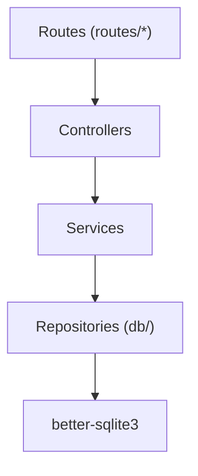
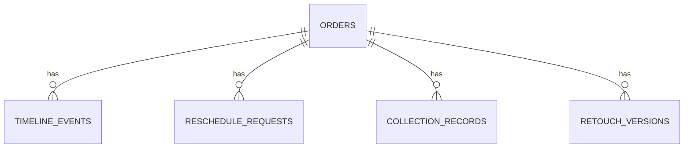

# 《婚纱影楼-尾款催收与改期协商》技术架构文档

## 1. 架构设计

```mermaid
flowchart LR
  subgraph 前端
    A["React 18 + Vite + TS"] --> B["角色切换 Context"]
    A --> C["日历视图 CalendarView"]
    A --> D["订单线索 OrderTimeline"]
    A --> E["改期面板 ReschedulePanel"]
    A --> F["催收面板 CollectionPanel"]
  end
  subgraph 后端
    G["Node.js + Express + TS"] --> H["/orders /timeline /reschedule /collection /notes"]
  end
  subgraph 数据层
    I["better-sqlite3"]
  end
  A --"fetch/JSON --> G
  G --> I
```

## 2. 技术说明
- 前端：React 18 + TypeScript + Vite + TailwindCSS v3
- UI：原生 React （避免引入额外 UI 库，组件手写以保持定制化视觉
- 后端：Node.js + Express + TypeScript
- 数据库：better-sqlite3（单文件轻量，适合本地方便演示）
- 数据初始化：首次启动建表 + seed 演示数据（含多个订单的 Timeline、改期申请、催收记录、备注）
- 演示登录：无真实鉴权，前端传 `X-Role` 头部模拟角色，后端按 header 做权限判断

## 3. 路由定义
| 前端路由 | 用途 |
| --- | --- |
| `/` | 联动日历视图首页 |
| `/orders/:id` | 订单线索页（Timeline） |

| 后端路由 | 方法 | 用途 |
| --- | --- | --- |
| `/api/orders` | GET | 订单列表（支持日期范围、状态、关键字筛选） |
| `/api/orders/:id` | GET | 订单详情 |
| `/api/orders/:id/timeline` | GET | 订单 Timeline |
| `/api/orders/:id/notes` | POST | 添加备注 |
| `/api/reschedule` | POST | 发起改期申请 |
| `/api/reschedule/:id` | PATCH | 店长审批（确认/驳回） |
| `/api/collection` | POST | 发起一次催收 |
| `/api/collection/:id` | PATCH | 更新催收结果/结清 |
| `/api/roles` | GET | 可用角色列表（店长/选片师/客服管家） |

## 4. API 定义（TypeScript 类型）

```ts
type Role = 'manager' | 'selector' | 'butler';

interface Order {
  id: string;
  customerName: string;
  orderNo: string;
  shootDate: string;
  selectDate: string;
  totalAmount: number;
  paidAmount: number;
  status: 'scheduled' | 'selected' | 'awaiting_payment' | 'completed' | 'overdue' | 'rescheduling' | 'cancelled';
  latestCollectionLevel: 0 | 1 | 2 | 3;
  currentRescheduleId?: string;
}

interface TimelineEvent {
  id: string;
  orderId: string;
  type: 'status' | 'reschedule' | 'collection' | 'note' | 'retouch';
  actorRole: Role;
  actorName: string;
  at: string;
  payload: any;
}

interface RescheduleRequest {
  id: string;
  orderId: string;
  suggestedFrom: string;
  suggestedTo: string;
  reason: string;
  status: 'pending' | 'approved' | 'rejected';
  approverRole?: Role;
  approverName?: string;
  approvedAt?: string;
  rejectReason?: string;
  createdAt: string;
}

interface CollectionRecord {
  id: string;
  orderId: string;
  method: 'auto' | 'phone' | 'wechat';
  result: 'pending' | 'contacted' | 'responded' | 'paid' | 'escalated';
  remark: string;
  createdAt: string;
  actorRole: Role;
  actorName: string;
}
```

## 5. 服务端架构



- 分层：routes → controller → service → repository（每个订单/改期/催收模块独立，共用 Timeline 服务统一写留痕。
- 所有写操作（改期发起、催收、备注）均通过 `timelineService.record(event)` 统一写入事件。

## 6. 数据模型



### 6.1 建表 DDL（SQLite）

```sql
CREATE TABLE orders (
  id TEXT PRIMARY KEY,
  customer_name TEXT NOT NULL,
  order_no TEXT NOT NULL UNIQUE,
  shoot_date TEXT NOT NULL,
  select_date TEXT,
  total_amount REAL NOT NULL,
  paid_amount REAL NOT NULL DEFAULT 0,
  status TEXT NOT NULL DEFAULT 'scheduled',
  collection_level INTEGER NOT NULL DEFAULT 0,
  current_reschedule_id TEXT,
  created_at TEXT NOT NULL,
  updated_at TEXT NOT NULL
);

CREATE TABLE timeline_events (
  id TEXT PRIMARY KEY,
  order_id TEXT NOT NULL,
  type TEXT NOT NULL,
  actor_role TEXT NOT NULL,
  actor_name TEXT NOT NULL,
  at TEXT NOT NULL,
  payload TEXT NOT NULL,
  FOREIGN KEY(order_id) REFERENCES orders(id)
);

CREATE TABLE reschedule_requests (
  id TEXT PRIMARY KEY,
  order_id TEXT NOT NULL,
  suggested_from TEXT NOT NULL,
  suggested_to TEXT NOT NULL,
  reason TEXT NOT NULL,
  status TEXT NOT NULL DEFAULT 'pending',
  approver_role TEXT,
  approver_name TEXT,
  approved_at TEXT,
  reject_reason TEXT,
  created_at TEXT NOT NULL
);

CREATE TABLE collection_records (
  id TEXT PRIMARY KEY,
  order_id TEXT NOT NULL,
  method TEXT NOT NULL,
  result TEXT NOT NULL,
  remark TEXT,
  actor_role TEXT NOT NULL,
  actor_name TEXT NOT NULL,
  created_at TEXT NOT NULL
);

CREATE TABLE retouch_versions (
  id TEXT PRIMARY KEY,
  order_id TEXT NOT NULL,
  version_no INTEGER NOT NULL,
  remark TEXT,
  created_at TEXT NOT NULL,
  actor_role TEXT NOT NULL,
  actor_name TEXT NOT NULL
);

CREATE INDEX idx_timeline_order ON timeline_events(order_id);
CREATE INDEX idx_reschedule_order ON reschedule_requests(order_id);
CREATE INDEX idx_collection_order ON collection_records(order_id);
CREATE INDEX idx_orders_status ON orders(status);
CREATE INDEX idx_orders_shoot ON orders(shoot_date);
```

### 6.2 种子数据（演示）
- 6 条订单，覆盖：待尾款、改期申请中、已驳回、已结清、逾期 3 天等状态。
- 每个订单至少 5 条 Timeline 事件，跨越 3 角色混合操作。
- 1 条含驳回改期被驳回 + 再次发起的完整链路。
- 1 条含催收升级到店长的链路。
