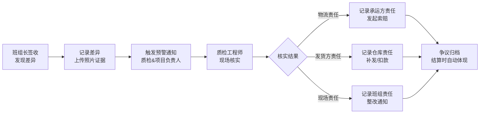
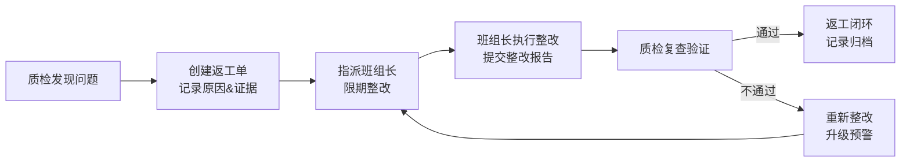

# 地坪施工-材料发货与回单核验系统 PRD

## 1. 产品概述

地坪施工行业材料管理协作平台，解决材料发货、回单核验、返工追踪、结算争议等业务断层问题。

- 核心问题：材料去向不明、返工原因留不住、结算争议总在最后爆发、责任归属不清晰
- 目标用户：项目负责人、质检工程师、班组长
- 产品价值：通过角色化协作和连续处理流，实现材料全链路可追溯、责任清晰、争议前置

## 2. 核心功能

### 2.1 用户角色

| 角色 | 说明 | 核心权限 |
|------|------|----------|
| 项目负责人 | 项目决策人，统筹全局 | 查看汇总看板、审批发货单、裁定争议、查看所有数据 |
| 质检工程师 | 现场执行，质量管控 | 创建发货单、回单核验、记录返工、发起整改 |
| 班组长 | 现场复核，材料接收 | 确认收货、签收回单、反馈差异、整改执行 |

### 2.2 功能模块

1. **总览看板**：可下钻汇总仪表盘、项目概览、预警中心
2. **材料发货管理**：发货单创建、审核、发货追踪、材料溯源
3. **回单核验**：回单签收、差异处理、责任归属判定、时间线记录
4. **返工追踪**：返工原因记录、整改流程、复查闭环、知识库
5. **结算预警**：争议预警、对账单、纠纷处理流程

### 2.3 页面详情

| 页面名称 | 模块名称 | 功能描述 |
|----------|----------|----------|
| 总览看板 | 汇总仪表盘 | 项目进度、材料状态、预警数量、待办事项，支持下钻 |
| 总览看板 | 角色切换器 | 一键切换不同角色视角，展示差异化界面和权限 |
| 总览看板 | 预警中心 | 材料差异、返工超期、结算风险等预警，支持快速处理 |
| 材料发货 | 发货单列表 | 发货单查询、筛选、状态追踪，支持批量操作 |
| 材料发货 | 发货单详情 | 发货单创建/编辑、材料明细、审批流程、操作日志 |
| 回单核验 | 回单列表 | 待签收、已签收、有差异回单分类展示 |
| 回单核验 | 回单详情 | 回单签收、差异记录、责任判定、证据上传 |
| 返工追踪 | 返工列表 | 返工单状态、原因分类、整改进度 |
| 返工追踪 | 返工详情 | 原因记录、整改方案、复查记录、闭环确认 |
| 结算中心 | 争议预警 | 结算风险识别、争议工单、对账单对比 |
| 结算中心 | 争议处理 | 责任裁定、协商记录、解决方案 |

## 3. 核心流程

### 3.1 正常材料流程

### 3.2 差异问题处理流程

### 3.3 返工闭环流程

## 4. 用户界面设计

### 4.1 设计风格

- **主色调**：工业蓝 (#1E40AF) - 专业、可靠，符合工程建设行业特性
- **辅助色**：警示橙 (#F97316) - 预警状态，成功绿 (#10B981) - 正常状态，危险红 (#EF4444) - 问题状态
- **中性色**：深灰 (#1F2937)、中灰 (#6B7280)、浅灰 (#F3F4F6) - 信息层级清晰
- **按钮风格**：直角微圆角 (4px)，工业感强，强调实用性
- **字体**：Noto Sans SC - 中文友好，专业清晰
- **布局风格**：卡片式模块化布局，顶部导航+左侧菜单+内容区
- **图标风格**：线性图标，简洁专业，避免过度装饰

### 4.2 页面设计概述

| 页面名称 | 模块名称 | UI 元素 |
|----------|----------|---------|
| 总览看板 | 汇总仪表盘 | 数据卡片网格、趋势图表、进度条、状态徽章、可下钻交互 |
| 总览看板 | 角色切换器 | 顶部右侧下拉切换，切换后界面元素、颜色、权限即时变化 |
| 总览看板 | 预警中心 | 时间线布局，图标+状态色，支持快速操作按钮 |
| 列表页面 | 数据表格 | 固定表头、筛选栏、批量操作、行悬浮效果、状态标签列 |
| 详情页面 | 流程面板 | 步骤条时间线、当前状态高亮、操作按钮组 |
| 详情页面 | 信息卡片 | 分组展示、可折叠面板、附件预览区 |
| 详情页面 | 操作日志 | 时间轴布局、操作人头像、操作内容、时间戳 |

### 4.3 响应式设计

- **桌面优先**：针对工程管理场景，主要在桌面端使用
- **平板适配**：1024px 断点，菜单折叠，表格横向滚动
- **移动端**：768px 断点，底部导航，卡片式列表，简化操作

### 4.4 交互与动效

- **角色切换动效**：平滑过渡，界面元素渐入渐出
- **下钻交互**：点击卡片时，详情面板从右侧滑入
- **状态变更**：状态标签颜色变化时带轻微缩放动效
- **流程推进**：步骤条进度动画，显示当前步骤高亮
- **预警通知**：顶部滑入通知，支持点击跳转

## 5. 数据样例要求

### 5.1 正常流样例

- 项目 A-001：地坪施工一期，材料发货 5 批次，全部正常签收，回单核验通过，无返工
- 发货单 FH20240501-001：环氧树脂 1000kg，正常发出，班组长签收，回单一致

### 5.2 问题流样例

- 发货单 FH20240515-003：固化剂 500kg，签收时少 50kg，判定物流责任，已发起索赔
- 返工单 RG20240520-001：基层处理不达标，原因：班组工艺问题，已整改复查通过
- 结算争议 JY20240525-001：材料用量差异 8%，待项目负责人裁定
