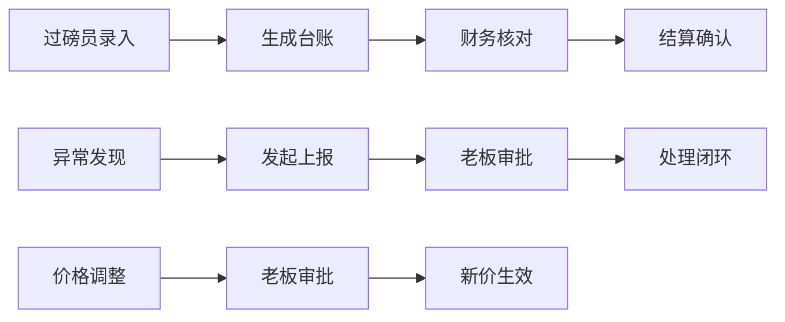

## 1. 产品概述

废品回收站环保台账与异常上报管理系统，解决传统半手工管理模式下的效率问题，实现回收、分拣、结算全流程数字化。通过角色差异化视图和完整工作流机制，确保价格调整有依据、账款可核对、环保台账及时完整。

- 核心目标：替代纸质磅单、现金记录和堆场照片的半手工管理方式
- 目标用户：站点老板、过磅员、财务人员
- 关键价值：明确责任归属、保留操作痕迹、实现可追溯的业务闭环

## 2. 核心功能

### 2.1 用户角色

| 角色 | 登录方式 | 核心权限 |
|------|----------|----------|
| 站点老板 | 角色切换 | 全局数据看板、异常审批、价格调整审批、查看完整台账 |
| 过磅员 | 角色切换 | 录入回收记录、发起异常上报、上传磅单照片、查看个人台账 |
| 财务 | 角色切换 | 账款核对、结算确认、价格调整申请、财务报表导出 |

### 2.2 功能模块

1. **汇总看板**：数据概览、可下钻统计图表、待办提醒
2. **环保台账**：回收记录管理、分拣记录、环保数据填报、历史追溯
3. **异常上报**：异常发起、审批流程、驳回备注、状态追踪
4. **价格管理**：价格调整申请、审批留痕、历史价格查询
5. **账款管理**：应收应付、对账记录、结算确认
6. **角色切换**：一键切换角色、视图差异化、权限隔离

### 2.3 页面详情

| 页面名称 | 模块名称 | 功能描述 |
|----------|----------|----------|
| 汇总看板 | 数据概览 | 今日回收量、待处理异常、账款余额关键指标展示 |
| 汇总看板 | 趋势图表 | 近7/30天回收趋势、异常类型分布、可下钻到明细 |
| 汇总看板 | 待办提醒 | 待审批异常、待核对账款、超期未填报台账提醒 |
| 环保台账 | 记录列表 | 回收/分拣记录、筛选搜索、分页展示 |
| 环保台账 | 详情下钻 | 磅单照片、分拣明细、操作日志、历史备注 |
| 环保台账 | 新建记录 | 过磅录入、照片上传、品类选择、重量金额计算 |
| 异常上报 | 异常列表 | 按状态筛选、责任人过滤、时间范围查询 |
| 异常上报 | 发起异常 | 异常类型选择、现场照片、问题描述、责任方指定 |
| 异常上报 | 审批流程 | 通过/驳回操作、备注填写、状态流转记录 |
| 价格管理 | 价格列表 | 当前价格、历史价格、调整记录 |
| 价格管理 | 价格调整 | 调整申请、原因说明、审批流转 |
| 账款管理 | 账款概览 | 应收应付统计、对账进度、结算记录 |
| 账款管理 | 对账明细 | 笔笔核对、差异标注、备注说明 |

## 3. 核心流程

### 3.1 环保台账录入流程
过磅员登录 → 新建回收记录 → 填写品类/重量/价格 → 上传磅单照片 → 提交生成台账 → 系统自动计算金额 → 财务对账确认

### 3.2 异常上报审批流程
发现异常 → 过磅员发起上报 → 选择异常类型（环保/设备/质量/安全）→ 上传现场照片 → 填写描述和建议 → 提交 → 站点老板审批 → 同意/驳回并填写备注 → 状态更新并通知相关人 → 处理完成后闭环

### 3.3 价格调整流程
财务发起价格调整申请 → 填写调整品类、新旧价格、生效时间、调整原因 → 提交 → 站点老板审批 → 同意则新价格生效并记录历史 → 驳回则备注原因退回

## 4. 用户界面设计

### 4.1 设计风格
- **主色调**：深绿 #1B5E20（环保主题）、橙红 #E64A19（异常警示）
- **辅助色**：深蓝 #1565C0（财务）、琥珀 #FF8F00（提醒）
- **按钮风格**：圆角8px、轻微悬浮效果、点击反馈
- **字体**：标题使用 Noto Sans SC Bold，正文使用 Noto Sans SC Regular
- **布局风格**：左侧导航 + 顶部状态栏 + 内容卡片化布局
- **图标风格**：线性图标，统一24px尺寸

### 4.2 页面设计概览

| 页面名称 | 模块名称 | UI 元素 |
|----------|----------|---------|
| 汇总看板 | 数据概览 | 大数字卡片、趋势小图表、颜色区分指标类型 |
| 汇总看板 | 待办列表 | 红色角标提醒、悬停高亮、点击跳转详情 |
| 环保台账 | 记录列表 | 斑马纹表格、状态标签、操作按钮组 |
| 环保台账 | 详情抽屉 | 左右分栏、时间线操作日志、图片预览 |
| 异常上报 | 流程卡片 | 状态进度条、审批人头像、备注气泡 |
| 角色切换 | 下拉选择 | 当前角色高亮、权限提示图标 |

### 4.3 响应式
- Desktop-first 设计，适配 1440px 及以上
- 平板端：左侧导航收起为图标
- 移动端：底部导航、卡片堆叠

### 4.4 动效设计
- 页面加载：卡片渐入 + 轻微上移动画
- 数据更新：数字滚动动画
- 状态变更：进度条平滑过渡
- 模态框：缩放 + 淡入效果
