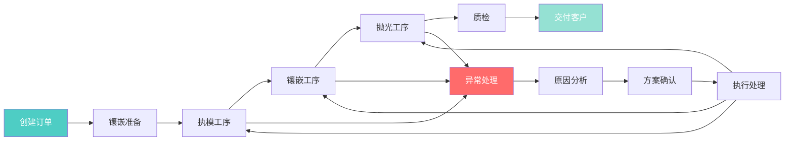

## 1. 产品概述

珠宝门店定制订单与镶嵌进度管理系统，解决传统纸单、微信沟通导致的订单追踪困难、异常处理混乱、交接留痕不足等问题。面向店长、导购和售后专员三类角色，提供一体化的订单管理、进度追踪、异常处理和交接留痕功能。

## 2. 核心功能

### 2.1 用户角色

| 角色 | 登录方式 | 核心权限 |
|------|----------|----------|
| 店长 | 账号密码登录 | 查看全局数据看板、订单统计分析、所有订单详情 |
| 导购 | 账号密码登录 | 订单创建/编辑、客户跟进、日常订单处理、镶嵌进度更新 |
| 售后专员 | 账号密码登录 | 异常订单处理、返修管理、交接记录审核、历史回查 |

### 2.2 功能模块

1. **仪表盘页面**：数据概览、订单统计、异常预警、待办事项
2. **订单列表页**：多维度筛选、搜索、排序、批量操作、双栏详情
3. **订单详情页**：完整订单信息、进度时间线、操作记录、改款历史
4. **镶嵌进度追踪**：工序节点管理、实时状态更新、异常标注
5. **异常处理中心**：异常订单列表、处理流程、赔付计算、审批记录
6. **交接管理**：货品交接记录、签名确认、照片留痕、溯源查询

### 2.3 页面详情

| 页面名称 | 模块名称 | 功能描述 |
|---------|----------|----------|
| 仪表盘 | 数据概览卡片 | 今日订单、待处理、异常数、完成率统计 |
| 仪表盘 | 进度趋势图 | 近7天订单量、完成率趋势图表 |
| 仪表盘 | 待办事项列表 | 优先处理的订单和异常提醒 |
| 订单列表 | 筛选工具栏 | 按状态、类型、时间、客户等多维度筛选 |
| 订单列表 | 订单表格 | 订单号、客户、类型、状态、进度、操作列 |
| 订单列表 | 双栏详情面板 | 右侧展开显示订单详情、时间线、快速操作 |
| 订单详情 | 基本信息卡 | 客户信息、货品信息、定制要求、价格明细 |
| 订单详情 | 进度时间线 | 各工序节点、时间记录、负责人、状态标记 |
| 订单详情 | 操作历史 | 所有操作记录、修改前后对比、操作人 |
| 订单详情 | 改款记录 | 改款原因、内容、价格变动、审批状态 |
| 异常处理 | 异常列表 | 异常类型、等级、处理状态、超时标记 |
| 异常处理 | 处理流程 | 异常登记→原因分析→方案确认→执行→结案 |
| 交接管理 | 交接记录 | 交接双方、货品清单、照片、签名、时间戳 |

## 3. 核心流程

导购在系统中创建定制订单，录入客户信息和定制要求。订单进入镶嵌工序流程，每完成一个节点更新进度。如遇异常（ stones 缺货、工艺问题、客户改款），触发异常处理流程。售后专员跟进异常处理，记录原因和方案。高值货品交接时必须在系统中登记并留痕。店长通过仪表盘监控整体运营情况。

## 4. 用户界面设计

### 4.1 设计风格

- **主色调**：深香槟金 (#B8860B) - 体现珠宝行业的奢华与品质
- **辅助色**：墨蓝 (#1a365d) - 专业稳重，作为导航和标题背景
- **强调色**：珊瑚红 (#E63946) - 异常状态、重要提醒
- **成功色**：森林绿 (#2D6A4F) - 完成状态、通过
- **中性色**：米白、暖灰系列 - 营造高端质感
- **按钮风格**：微圆角、金色描边、悬停有轻微上浮效果
- **字体**：标题使用 Playfair Display（衬线奢华），正文使用 Inter（现代易读）
- **布局风格**：卡片式布局、精致阴影、金色分隔线、双栏详情台
- **图标风格**：线性图标、金色填充、精致细节

### 4.2 页面设计概述

| 页面名称 | 模块名称 | UI 元素 |
|---------|----------|---------|
| 仪表盘 | 数据概览 | 金色渐变卡片、大数字展示、趋势箭头、微动画 |
| 仪表盘 | 趋势图表 | 平滑折线图、金色渐变填充、悬浮 tooltip |
| 订单列表 | 筛选栏 | 胶囊式筛选标签、下拉选择器、搜索框带金色边框 |
| 订单列表 | 表格 | 斑马纹浅金、悬停高亮、状态标签带渐变背景 |
| 订单列表 | 双栏详情 | 右侧滑入面板、深色半透明背景、金色标题栏 |
| 订单详情 | 时间线 | 垂直时间线、金色节点圆点、工序卡片、异常标记 |
| 异常处理 | 异常卡片 | 红色边框、警告图标、优先级标记、处理进度条 |

### 4.3 响应式

- 桌面端优先设计，双栏布局充分利用宽屏
- 平板端自适应调整列数，详情面板改为底部弹出
- 移动端精简列表列数，详情采用全屏滑动
- 触摸操作优化，按钮最小 44px，增加点击热区

### 4.4 交互动效

- 页面加载：卡片渐入+轻微上浮，按顺序延迟出现
- 双栏切换：平滑滑动过渡，背景模糊效果
- 状态变更：进度节点发光脉冲动画
- 按钮交互：悬停轻微放大+阴影加深，点击下沉效果
- 异常提醒：呼吸灯效果吸引注意力
