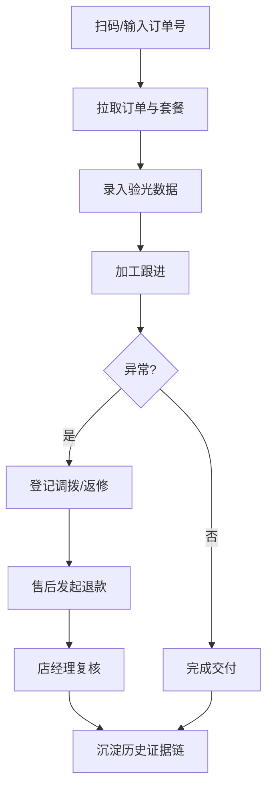

# 眼镜连锁：套餐核销与退款复核（PRD）

## 1. 产品概述
面向眼镜连锁门店的日常业务桌面控制台，解决"同一件事要在验光单、加工群、库存导表里反复找"的问题。一次打通套餐核销与退款复核链路，让店经理、验光师、加工跟单、售后专员在同一界面按角色看到各自关心的信息，同时把历史备注、状态变化、责任人完整留在证据链里。

- 目标用户：店经理、验光师、加工跟单、售后专员、店长/复核人
- 目标价值：用一个工作台替代多个群/表，形成可回看的业务证据链，减少重复沟通与错误；为后续接 Tauri 打包成桌面端打基础

## 2. 核心功能

### 2.1 用户角色
| 角色 | 登录方式 | 核心权限 |
|------|----------|----------|
| 店经理 | 顶栏角色切换（演示） | 查看全链路、退款复核、异常仲裁 |
| 验光师 | 顶栏角色切换（演示） | 扫码核销套餐、录入验光数据、追加备注 |
| 加工跟单 | 顶栏角色切换（演示） | 查看加工进度、处理镜片调拨/返修 |
| 售后专员 | 顶栏角色切换（演示） | 发起退款复核、上传证据、跟踪结果 |

### 2.2 功能模块
1. **工作台首页**：今日概览、待处理异常、最近链路摘要
2. **套餐核销页**：扫码（模拟）、套餐与订单信息、验光录入、历史备注侧栏
3. **加工与返修页**：加工进度、镜片调拨登记、返修进度登记、证据附件
4. **退款复核页**：退款申请列表、前因后果证据链、复核结论与驳回说明
5. **历史回看页**：按订单/顾客聚合的时间线、责任人、备注、附件
6. **角色切换**：顶栏一键切换，界面根据角色突出不同模块

### 2.3 页面详情
| 页面名称 | 模块名称 | 功能描述 |
|----------|----------|----------|
| 工作台首页 | 今日概览卡 | 今日核销数、待复核退款、异常数、积压时长 |
| 工作台首页 | 待处理异常条 | 镜片调拨丢失、返修卡单、退款超期 |
| 套餐核销页 | 扫码录入 | 扫码枪/手动输入订单号，一键拉取订单与套餐 |
| 套餐核销页 | 验光数据卡 | 左右眼度数、散光、轴位、瞳距；可补录说明 |
| 套餐核销页 | 历史备注侧栏 | 该订单所有备注、驳回原因、补录说明按时间线 |
| 加工与返修页 | 加工进度条 | 待加工→加工中→待质检→已完成 |
| 加工与返修页 | 镜片调拨登记 | 来源店、目标店、物流、签收、丢失标记 |
| 加工与返修页 | 返修进度 | 原因分类、责任归属、预计返还时间 |
| 退款复核页 | 申请列表 | 申请人、金额、前因摘要、状态 |
| 退款复核页 | 证据链侧栏 | 关联订单/验光/加工/返修记录、附件、责任人 |
| 退款复核页 | 复核操作 | 通过/驳回、驳回原因、补录说明、签字 |
| 历史回看页 | 时间线 | 订单全生命周期、角色标签、责任人、附件 |

## 3. 核心流程
验光师扫码→核销套餐→录入验光数据→加工跟单跟进→若出现镜片调拨/返修→在对应页面登记并上传证据→售后发起退款→店经理复核（查看完整证据链）→通过/驳回→结果沉淀入历史回看。

## 4. 用户界面设计

### 4.1 设计风格
- 主色：墨绿 #1f6b5a；辅色：琥珀金 #c98b2e；中性：石板灰 #2f353f
- 按钮：圆角中等、浅阴影、hover 有微抬升
- 字体：标题 Noto Serif SC；正文 PingFang SC/系统等宽
- 布局：左侧导航 + 顶部角色切换 + 主内容三栏（列表/详情/侧栏证据链）
- 图标：lucide（Vue 版本）
- 色调：偏冷深底，局部暖点缀，强调"证据感"和"秩序感"

### 4.2 页面设计总览
| 页面名称 | 模块名称 | UI 要素 |
|----------|----------|---------|
| 工作台首页 | 今日概览 | 卡片网格 + 数字大字 + 小趋势 |
| 套餐核销页 | 扫码录入 | 大号扫描框 + 手动输入 + 最近订单 |
| 退款复核页 | 证据链侧栏 | 时间线 + 附件缩略 + 角色标签 |
| 历史回看页 | 时间线 | 竖向时间轴 + 颜色编码角色 |

### 4.3 响应式
桌面优先（≥1280），侧栏可折叠到 960；不做移动端重度适配。
