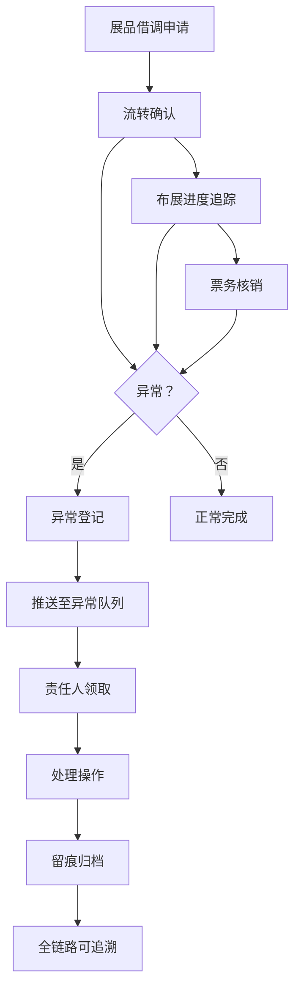

# 美术馆运营管理系统 PRD

## 1. 产品概述

美术馆展品借调与布展进度管理系统，整合展品台账、票务核销、会员活动三大业务模块，解决多业务协同断层、异常处理依赖人工记忆、追溯审计困难等痛点。

- **核心问题**：展品流转缺确认、活动核销不准、投诉回看无线索
- **目标用户**：馆务经理、票务专员、活动执行
- **产品价值**：将业务动作沉淀到系统，实现全链路留痕与异常闭环

## 2. 核心功能

### 2.1 用户角色

| 角色 | 注册方式 | 核心权限 |
|------|----------|----------|
| 馆务经理 | 管理员分配 | 全局概览、进度看板、跨模块统计、审批决策 |
| 票务专员 | 管理员分配 | 票务明细处理、核销操作、出入库确认 |
| 活动执行 | 管理员分配 | 异常处理、回查追溯、活动现场调度 |

### 2.2 功能模块

1. **运营看板**：全局进度概览、展品状态分布、异常告警统计
2. **展品借调管理**：借调申请、流转确认、台账查询、布展进度追踪
3. **票务核销中心**：票务明细、核销操作、核销异常处理
4. **异常处理中心**：异常抽屉、异常分配、处理留痕、追溯回查

### 2.3 页面详情

| 页面名称 | 模块名称 | 功能描述 |
|-----------|-------------|---------------------|
| 运营看板 | 数据概览卡片 | KPI指标展示、进度条可视化、异常告警红点提示 |
| 运营看板 | 展品状态分布 | 环形图展示各状态展品数量、点击下钻明细 |
| 运营看板 | 异常处理队列 | 优先级排序的异常列表、一键跳转处理 |
| 展品借调 | 借调列表 | 多维度筛选、状态标签、操作入口聚合 |
| 展品借调 | 布展进度 | 时间线展示、节点确认、里程碑标记 |
| 票务核销 | 核销工作台 | 批量核销、扫码模拟、核销状态实时更新 |
| 异常中心 | 异常抽屉 | 右侧滑出、异常详情、处理记录时间线、操作按钮区 |
| 异常中心 | 追溯回查 | 关联单据跳转、全链路操作日志、导出审计 |

## 3. 核心流程

### 主业务流程描述：
1. 展品借调申请 → 多级确认流转 → 布展进度追踪 → 活动现场核销
2. 任一环节触发异常 → 异常自动/手动登记 → 推送至处理队列 → 责任人领取处理 → 留痕归档 → 异常链路可追溯

## 4. 用户界面设计

### 4.1 设计风格

- **主色调**：深墨绿 #1A3A3A 代表艺术与专业
- **辅助色**：暖金 #D4A853 强调与品牌感
- **告警色**：珊瑚红 #E07050 异常提示、深橙 #F0A660 警告、苔绿 #5A8A6C 正常
- **中性色**：冷灰系列，保证内容可读性

- **按钮风格**：圆角8px，强调按钮用深墨绿配暖金描边，悬停有细微浮起效果
- **字体**：标题用 Noto Serif SC 体现艺术感，正文用 Inter 保证易读性
- **布局风格**：左右分栏卡片式，左侧导航固定，右侧内容区卡片错落排布
- **图标风格**：线性图标，统一2px描边，关键状态用彩色填充区分

### 4.2 页面设计概览

| 页面名称 | 模块名称 | UI元素 |
|-----------|-------------|-------------|
| 运营看板 | 概览卡片 | 阴影层次感、数据动效入场、告警脉冲动画 |
| 展品借调 | 列表卡片 | 状态标签悬浮高亮、进度条渐变填充、hover浮起 |
| 异常抽屉 | 右侧滑出 | 滑入动画、时间线连接点、处理记录块引用样式 |
| 核销中心 | 工作台 | 表格斑马纹、批量操作工具栏、核销状态徽标 |

### 4.3 响应式

- 桌面端优先设计，适配1440px及以上
- 平板端自适应，抽屉改为模态框
- 异常处理区域保证触控区域48px最小尺寸

## 5. 演示数据规范

### 5.1 数据要求

- **借调单数据**：至少8条，覆盖全部状态（待确认、流转中、布展中、已完成、异常）
- **异常数据**：至少5条可直接触发的异常场景：
  1. 展品逾期未归还
  2. 核销数量与台账不符
  3. 会员活动签到率异常低
  4. 展品状态与实际位置不符
  5. 紧急插单导致进度冲突

### 5.2 简化说明

- 省略用户登录认证模块，使用角色切换模拟权限
- 省略后端API对接，使用前端Mock数据模拟
- 省略消息推送模块，页面内红点提示代替
- 省略导出报表的文件生成功能
