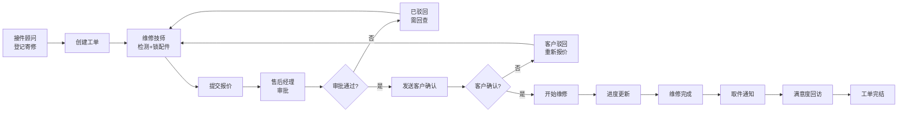

## 1. 产品概述

钟表售后管理系统是一套针对钟表维修行业的报价审批与客户确认流程管理系统，解决寄修、报价、取件信息分散、流程追溯困难、多人协作效率低下的问题。通过统一的协作平台，实现售后经理、接件顾问、维修技师的高效协同作业。

- 核心目标：建立完整可追溯的售后处理链条，消除信息孤岛
- 目标用户：售后经理、接件顾问、维修技师

## 2. 核心功能

### 2.1 用户角色

| 角色 | 登录方式 | 核心权限 |
|------|----------|----------|
| 售后经理 | 账号登录 | 审批报价、查看全局数据、导出报表、满意度回访 |
| 接件顾问 | 账号登录 | 登记寄修、录入客户信息、提交报价、跟进客户确认 |
| 维修技师 | 账号登录 | 查看维修任务、锁定配件、更新维修进度、完成维修 |

### 2.2 功能模块

1. **首页仪表盘**：待处理任务统计、已驳回列表、需回查提醒、今日概览
2. **寄修工单管理**：工单列表、双栏详情台、筛选搜索、状态流转
3. **报价审批流程**：报价提交、经理审批、客户确认、状态追踪
4. **配件库存管理**：配件锁定、库存查询、锁定释放
5. **维修进度追踪**：技师更新进度、多口径统一、历史回溯
6. **客户回执管理**：回执记录、满意度回访、取件通知

### 2.3 页面详情

| 页面名称 | 模块名称 | 功能描述 |
|----------|----------|----------|
| 首页 | 数据概览卡片 | 展示待处理、已驳回、需回查、今日新增统计 |
| 首页 | 快捷操作区 | 快速新建工单、待我审批、待我处理入口 |
| 首页 | 任务列表 | 按角色展示当前用户相关任务 |
| 工单列表 | 筛选栏 | 多维度筛选（状态、日期、角色、优先级） |
| 工单列表 | 工单列表 | 支持排序、批量操作、分页 |
| 工单详情 | 双栏详情台 | 左侧列表、右侧详情，无需跳转 |
| 工单详情 | 操作工具栏 | 按角色权限显示对应操作按钮 |
| 工单详情 | 时间线 | 完整流程追溯，所有操作留痕 |
| 角色切换 | 角色选择器 | 顶部快速切换角色，体验不同视角 |
| 通用组件 | 空态页 | 无数据时的友好提示与引导 |
| 通用组件 | 错误态 | 异常处理与重试机制 |
| 通用组件 | 加载态 | 骨架屏与进度提示 |

## 3. 核心流程

接件顾问登记寄修信息 → 系统自动创建工单 → 维修技师检测并锁定配件 → 提交报价单 → 售后经理审批报价 → 接件顾问发送客户确认 → 客户确认/驳回 → 维修技师执行维修 → 进度更新 → 取件通知 → 满意度回访 → 工单完结

## 4. 用户界面设计

### 4.1 设计风格

- **主色调**：深蓝 #1e3a5f（专业、稳重）
- **辅助色**：金色 #d4af37（体现钟表行业品质感）
- **强调色**：青绿 #10b981（通过）、珊瑚红 #ef4444（驳回）、琥珀橙 #f59e0b（待处理）
- **按钮风格**：圆角 8px，细微阴影，悬停微动画
- **字体**：Inter + Noto Sans SC（现代无衬线，确保中文可读性）
- **布局风格**：双栏卡片式布局，左侧列表 + 右侧详情，最大化信息密度
- **图标风格**：线性图标，统一 24px 尺寸，轻微圆角

### 4.2 页面设计概述

| 页面名称 | 模块名称 | UI 元素 |
|----------|----------|---------|
| 首页 | 数据概览 | 渐变卡片、统计数字、趋势箭头、快捷入口 |
| 首页 | 任务列表 | 分组标签、状态徽章、时间戳、优先级标识 |
| 工单列表 | 筛选栏 | 标签切换、下拉筛选、搜索框、重置按钮 |
| 工单详情 | 双栏布局 | 左侧可滚动列表、右侧详情面板、联动高亮 |
| 工单详情 | 操作栏 | 角色感知按钮组、操作确认弹窗 |
| 工单详情 | 时间线 | 垂直时间轴、头像、操作内容、时间戳 |
| 通用 | 空态/错误态 | 插画、标题、描述、主操作按钮 |

### 4.3 响应式

- 桌面优先设计（≥ 1280px）
- 平板适配（768px - 1279px）：双栏保持，缩小间距
- 手机适配（< 768px）：单栏布局，详情浮层展示
- 触摸优化：按钮最小 44px，触控区域放大

### 4.4 动画与交互

- 页面加载：骨架屏渐入 → 内容淡入
- 列表切换：选中项平滑滚动高亮
- 操作反馈：按钮点击缩放、提交成功动效
- 状态变更：徽章颜色渐变过渡
- 时间线：新条目从下方滑入
