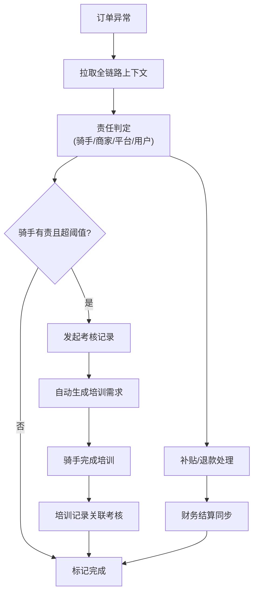

## 1. 产品概述

跑腿平台骑手考核与培训记录系统，旨在解决当前订单后台、补贴表、申诉截图三者割裂导致的业务处理效率低下问题。通过整合派单、申诉、补贴、考核、培训全链路数据，为不同角色提供差异化的连续处理界面，实现从问题发现→责任判定→考核记录→培训跟进的完整闭环。

- **核心问题**：派单、申诉、补贴数据分散，处理时需反复切换上下文查找前后文；考核与培训脱节，责任归属和时间顺序模糊；角色入口同质化导致业务仍依赖口头协作
- **目标用户**：运营经理、调度专员、客服专员
- **核心价值**：将分散数据串联为可连续处理的业务流，让系统真正承载业务流程而非仅记录数据

---

## 2. 核心功能

### 2.1 用户角色

| 角色 | 注册方式 | 核心权限 |
|------|----------|----------|
| 运营经理 | 系统分配 | 全局看板、考核规则配置、培训计划管理、跨角色协调、数据汇总分析 |
| 调度专员 | 系统分配 | 派单异常处理、超时原因判定、补贴初审、骑手考核发起 |
| 客服专员 | 系统分配 | 用户退款处理、商家结算核对、申诉记录登记、问题转派跟踪 |

### 2.2 功能模块

1. **角色工作台**：根据角色差异化呈现待办、快捷入口、数据视角
2. **可下钻汇总看板**：多层级钻取（全局→问题类型→单条订单→关联申诉/补贴/考核/培训）
3. **连续处理工作区**：单页内展示订单-申诉-补贴-考核-培训完整链路，支持连续操作无需跳转
4. **骑手考核管理**：考核标准配置、自动考核触发、人工考核录入、考核结果分级
5. **培训记录管理**：培训需求自动生成、培训计划推送、培训完成记录、效果追踪
6. **责任归属引擎**：基于时间线和业务规则自动判定责任方（骑手/商家/平台/用户）
7. **异常问题库**：超时原因分类、结算错误类型、退款场景标签，支持知识沉淀

### 2.3 页面详情

| 页面名称 | 模块名称 | 功能描述 |
|----------|----------|----------|
| 角色工作台 | 待办事项卡 | 按优先级展示待处理事项，一键进入连续处理工作区 |
| 角色工作台 | 角色数据概览 | 差异化指标：运营看全局，调度看派单异常，客服看申诉退款 |
| 角色工作台 | 快捷操作区 | 常用功能入口，支持自定义 |
| 汇总看板 | 多维度筛选 | 时间、区域、问题类型、责任方、骑手等多维度过滤 |
| 汇总看板 | 分层钻取 | 指标卡片→列表→详情→关联数据的逐层下钻 |
| 连续处理工作区 | 时间线视图 | 订单全链路事件按时间排序展示，清晰呈现因果关系 |
| 连续处理工作区 | 上下文面板 | 左侧订单详情，右侧申诉/补贴/考核/培训联动切换 |
| 连续处理工作区 | 连续操作流 | 判定超时→计算补贴→发起考核→生成培训，一键衔接 |
| 骑手考核页 | 考核标准配置 | 可配置的扣分/罚款规则，支持分级处理 |
| 骑手考核页 | 考核记录列表 | 支持批量处理、审核、申诉 |
| 培训记录页 | 培训需求池 | 考核触发的自动培训需求 + 手动添加 |
| 培训记录页 | 培训完成追踪 | 培训状态、完成时间、考核结果关联 |
| 骑手档案页 | 完整时间线 | 该骑手所有订单、申诉、考核、培训的时间轴视图 |
| 骑手档案页 | 责任分布 | 按责任方分类的问题统计，识别系统性问题 |

---

## 3. 核心流程

### 3.1 正常处理流（超时订单）
调度专员发现超时订单 → 系统自动拉取关联的派单记录、骑手轨迹、商家出餐时间 → 专员判定超时原因（骑手延误/商家出餐慢/路况异常）→ 系统自动计算补贴金额 → 专员确认补贴 → 若判定为骑手责任且超阈值，自动发起考核 → 系统生成对应培训需求 → 骑手完成培训 → 培训记录关联到考核记录 → 闭环完成。

### 3.2 问题处理流（用户退款+结算错误）
客服接收用户退款申请 → 关联订单展示派单/送达/申诉记录 → 客服核对退款原因 → 若涉及商家结算错误，标记后转派给运营 → 运营复核结算数据 → 修正结算并同步给财务 → 若判定骑手有责，发起考核 → 生成培训 → 培训完成后标记整个链路为已闭环。

### 3.3 跨角色协作文档
客服登记申诉 → 转派调度专员判定责任 → 调度判定后若需考核 → 自动通知运营经理审核 → 运营审核通过 → 考核生效并生成培训 → 客服可查看处理进度并回复用户。

---

## 4. 用户界面设计

### 4.1 设计风格

- **主色调**：深蓝 `#1e3a5f`（专业、稳重），辅以琥珀橙 `#f59e0b`（待办提醒）、翠绿 `#10b981`（已完成）、玫红 `#ef4444`（异常）
- **按钮风格**：微圆角 4px，轻量阴影，主按钮深蓝填充，次要按钮描边，危险按钮红色系
- **字体**：标题用 `Noto Sans SC Bold`，正文用 `Noto Sans SC Regular`，数字和时间用 `JetBrains Mono` 等宽字体
- **布局风格**：三栏布局为主（左侧导航+中间工作区+右侧详情面板），卡片式分组，充足留白
- **交互风格**：时间线贯穿核心页面，强调事件的先后顺序和因果关联；悬停微动效，状态切换平滑过渡

### 4.2 页面设计概览

| 页面名称 | 模块名称 | UI元素 |
|----------|----------|--------|
| 角色工作台 | 待办事项卡 | 带优先级标签、快捷操作按钮、悬停展开预览 |
| 角色工作台 | 数据概览 | 大数字卡片+趋势小图，点击下钻到对应列表 |
| 汇总看板 | 筛选区 | 横向标签式筛选，支持多条件组合 |
| 汇总看板 | 数据表格 | 固定表头，可排序，行悬停高亮，点击展开关联数据 |
| 连续处理工作区 | 时间线 | 左侧垂直时间轴，右侧事件卡片，当前处理项高亮 |
| 连续处理工作区 | 操作面板 | 底部固定操作栏，支持连续操作的下一步按钮 |
| 骑手档案页 | 时间线 | 横向时间轴，可缩放，不同类型事件用不同颜色标记 |
| 骑手档案页 | 责任分布图 | 环形图+列表，点击筛选对应类型记录 |

### 4.3 响应式

桌面端优先设计，核心工作区最小支持 1280px 宽度；次要页面适配平板；不考虑移动端。

---

## 5. 关键业务规则

### 5.1 责任归属判定优先级
1. 有申诉且申诉成立 → 按申诉结论判定
2. 无申诉但有超时 → 比较「商家出餐时长」vs「骑手配送时长」，取占比超 60% 的一方
3. 用户退款 → 核查退款原因与聊天记录，区分商家餐品问题 vs 配送问题
4. 结算错误 → 对比系统自动计算与人工修改记录，定位错误环节

### 5.2 考核→培训触发规则
- 单次扣分项 ≥ 5分 → 强制培训
- 月度累计扣分 ≥ 12分 → 强制培训 + 试用期观察
- 同一问题重复出现 3次以上 → 针对性专项培训
- 培训完成前，该骑手的派单优先级降低

### 5.3 数据可见性规则
- 调度专员仅可见自己负责区域的订单和骑手
- 客服专员仅可见自己处理的申诉和退款
- 运营经理可见全部数据，可配置各角色的数据权限边界
