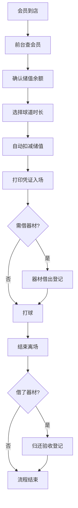

## 1. 产品概述

高尔夫练习场会员储值与消耗对账系统，解决球道预约、储值扣减、器材借还信息分散导致的对账困难、交接班卡壳、投诉回查无依据等核心痛点。面向场馆经理、教练主管、前台三类角色，实现储值消耗全链路可追溯、对账口径一致、过程留痕可回查。

## 2. 核心功能

### 2.1 用户角色

| 角色 | 登录方式 | 核心权限 |
|------|----------|----------|
| 场馆经理 | 账号密码登录 | 全局数据概览、对账报表、消耗口径配置、异常处理审批、操作日志审计 |
| 教练主管 | 账号密码登录 | 学员预约管理、课时消耗确认、教学器材借还、个人绩效统计 |
| 前台 | 账号密码登录 | 会员储值充值、球道预约登记、散客结算、器材出入库、交接班对账 |

### 2.2 功能模块

1. **登录页**：角色身份认证、会话管理
2. **前台工作台**：储值管理、球道预约、器材借还、当班结算
3. **教练主管工作台**：预约日历、课时消耗、器材管理、绩效统计
4. **场馆经理工作台**：数据概览、对账中心、口径配置、异常处理、操作日志
5. **会员详情页**：储值流水、消耗记录、预约历史、器材借用全链路视图

### 2.3 页面详情

| 页面名称 | 模块名称 | 功能描述 |
|-----------|-------------|---------------------|
| 登录页 | 登录表单 | 账号密码登录、角色自动识别、登录态持久化 |
| 前台工作台 | 储值管理 | 会员储值充值、余额查询、储值流水、赠送规则配置 |
| 前台工作台 | 球道预约 | 球道状态看板、预约登记、临时加场、到场核销 |
| 前台工作台 | 器材借还 | 器材库存、借出登记、归还验收、损坏记录 |
| 前台工作台 | 当班结算 | 当班流水、交接班对账、现金/储值/扫码收款统计 |
| 教练主管工作台 | 预约日历 | 按天/周查看学员预约、课时确认、签到标记 |
| 教练主管工作台 | 课时消耗 | 课时扣减记录、教学备注、学员进度跟踪 |
| 教练主管工作台 | 器材管理 | 教学器材借还、损耗上报、个人领用记录 |
| 场馆经理工作台 | 数据概览 | 营收趋势、储值余额、球道利用率、器材周转率 |
| 场馆经理工作台 | 对账中心 | 储值消耗对账、多条件筛选、对账差异标记、调账审批 |
| 场馆经理工作台 | 口径配置 | 消耗规则定义、扣减优先级、节假日系数、赠送金处理规则 |
| 场馆经理工作台 | 异常处理 | 投诉工单、异常流水标记、审批留痕 |
| 场馆经理工作台 | 操作日志 | 全量操作审计、按人/时间/类型筛选、操作回查 |
| 会员详情页 | 全链路视图 | 储值记录、消耗明细、预约历史、器材借用、投诉记录时间线 |

## 3. 核心流程

### 3.1 正常流程（会员到店打球）

会员到店 → 前台查询会员信息 → 确认储值余额 → 选择球道/时长 → 系统自动扣减储值 → 打印消费凭证 → 会员入场 → 如需借杆 → 器材借出登记 → 打完归还 → 器材验收登记 → 当班结束 → 前台交接班对账 → 场馆经理日终对账

### 3.2 对账流程

每日凌晨 → 系统自动汇总昨日流水 → 储值充值 vs 消耗对比 → 预约 vs 实际到场核销 → 器材借出 vs 归还 → 生成对账报告 → 标记差异项 → 场馆经理审核 → 确认/调账 → 对账完成留痕

### 3.3 异常处理流程（投诉回查）

会员投诉消费异常 → 前台登记工单 → 关联会员ID和交易流水 → 系统自动拉出该会员全链路时间线 → 包含储值记录、消费扣减、预约签到、器材借还、操作人、操作时间 → 场馆经理核查 → 处理结果记录 → 反馈会员 → 全流程留痕

## 4. 用户界面设计

### 4.1 设计风格

- **主色调**：深绿色(#14532D)代表高尔夫草坪，搭配香槟金(#B8860B)点缀体现高端运动属性
- **辅助色**：白色背景、浅灰分隔、红色(#DC2626)标记异常、绿色(#16A34A)标记正常、黄色(#EAB308)标记待处理
- **按钮风格**：圆角8px，主色填充配白色文字，悬停有轻微上浮和阴影变化
- **字体**：标题使用"Noto Serif SC"体现稳重，正文使用"Noto Sans SC"保证可读性
- **布局风格**：左侧导航+右侧内容区，卡片式模块布局，重要数据使用大字号+粗体突出
- **图标风格**：使用 Lucide 图标库，统一线性风格，大小16-20px

### 4.2 页面设计要点

| 页面名称 | 模块名称 | UI 设计要点 |
|-----------|-------------|-------------|
| 登录页 | 登录表单 | 居中卡片布局，背景为高尔夫球场虚化图，左侧品牌区展示Logo和Slogan，右侧登录表单 |
| 前台工作台 | 主体布局 | 顶部搜索会员栏+左侧快捷操作区+右侧球道状态看板+底部当班流水 |
| 前台工作台 | 球道看板 | 24条球道网格布局，颜色区分状态（绿色空闲/蓝色已预约/黄色使用中/红色维护），悬停显示详情 |
| 对账中心 | 筛选区 | 多条件筛选条固定在顶部，包含：时间范围、会员类型、消费类型、金额区间、操作人、是否异常，支持组合筛选和一键重置 |
| 对账中心 | 数据表格 | 斑马纹表格，重要列固定，支持排序、列宽拖拽、行点击展开详情，差异行高亮显示 |
| 会员详情 | 时间线 | 左侧垂直时间线，右侧按时间倒序展示储值、消费、预约、借还、投诉全链路记录，每条记录可展开查看操作人、备注、截图上传记录 |
| 操作日志 | 筛选结果 | 支持按操作人、时间范围、操作类型（增删改查）、操作模块多维度筛选，结果展示操作前后数据对比 |

### 4.3 响应式

- 桌面端优先设计，适配1920×1080及以上分辨率
- 平板端（≥768px）：左侧导航收起为图标，内容区自适应
- 移动端：暂不支持，核心操作场景在前台PC和经理办公室PC

### 4.4 动效设计

- 页面加载：骨架屏占位，数据返回后渐入显示
- 筛选操作：筛选条件变更时表格数据平滑过渡
- 状态变化：球道状态变更时有颜色渐变动画
- 异常提醒：新异常产生时有右上角通知滑入，带轻微震动提示
- 操作留痕：每次重要操作提交后有"操作已记录，日志ID: xxx"的确认提示
