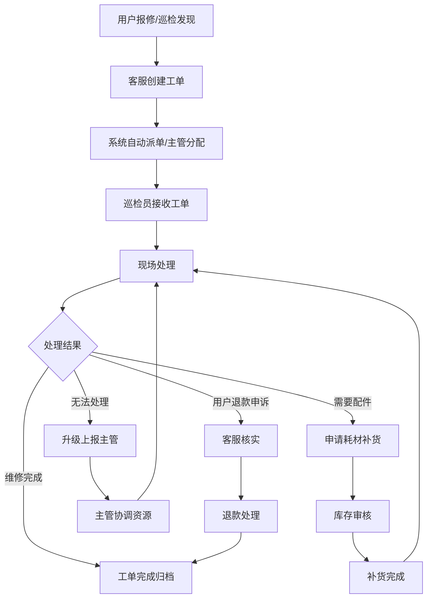

## 1. 产品概述

自助洗车场站巡检与故障报修协同系统，解决设备故障、套餐核销和耗材补货信息割裂的问题，让运营主管、巡检员、客服在同一条链路中高效接力。

## 2. 核心功能

### 2.1 用户角色

| 角色 | 登录方式 | 核心权限 |
|------|----------|----------|
| 巡检员 | 账号密码登录 | 执行巡检任务、上报设备故障、处理简单维修、查看个人待办 |
| 客服 | 账号密码登录 | 受理用户报修、创建工单、跟进退款申诉、与用户沟通 |
| 运营主管 | 账号密码登录 | 全局监控、工单分配、异常升级处理、数据统计、超时预警 |

### 2.2 功能模块

1. **工作台**：个人待办清单、超时预警、今日统计概览
2. **场站巡检**：巡检任务列表、巡检打卡、异常上报、巡检记录
3. **故障报修**：工单列表、工单详情、工单流转、附件管理
4. **站点管理**：设备档案、耗材库存、站点照片、套餐核销记录
5. **侧边处理台**：快捷处理面板、实时对话、操作日志

### 2.3 页面详情

| 页面名称 | 模块名称 | 功能描述 |
|----------|----------|----------|
| 登录页 | 身份选择 | 角色切换登录、记住登录状态 |
| 工作台 | 待办中心 | 按优先级展示待处理事项、超时红色高亮、退回工单醒目标记 |
| 工作台 | 数据概览 | 今日巡检数、待处理工单数、超时工单数、耗材预警数 |
| 巡检任务 | 任务列表 | 展示分配的巡检任务、状态筛选、一键开始巡检 |
| 巡检任务 | 巡检表单 | 设备状态勾选、异常拍照、备注说明、提交巡检结果 |
| 工单中心 | 工单列表 | 多维度筛选（状态/优先级/站点/时间）、批量操作 |
| 工单中心 | 工单详情 | 完整工单信息、流转记录、附件预览、处理操作 |
| 站点档案 | 设备列表 | 设备基础信息、运行状态、维修历史、耗材余量 |
| 侧边处理台 | 快捷面板 | 无需跳转即可处理工单、添加备注、变更状态 |

## 3. 核心流程

## 4. 用户界面设计

### 4.1 设计风格

- **主色调**：深靛蓝 #1E3A5F，代表专业与可信赖
- **辅助色**：橙色 #F59E0B 用于预警、红色 #EF4444 用于超时/异常、绿色 #10B981 用于正常完成
- **字体**：标题使用思源黑体 Bold，正文使用思源宋体 Regular，数字使用等宽字体
- **布局**：左侧固定导航 + 主内容区 + 右侧可折叠处理台的三栏布局
- **交互**：卡片悬浮效果、平滑过渡动画、工单拖拽流转

### 4.2 页面设计概览

| 页面名称 | 模块名称 | UI 元素 |
|----------|----------|---------|
| 登录页 | 身份选择 | 大卡片式角色选择、渐变背景、微动效 |
| 工作台 | 待办中心 | 时间轴式待办列表、优先级色标、状态徽章 |
| 工单中心 | 工单列表 | 看板视图/列表视图切换、彩色状态标签、快捷操作按钮 |
| 工单详情 | 信息展示 | 分区块信息组织、时间线流转记录、附件缩略图 |
| 侧边处理台 | 快捷面板 | 毛玻璃效果、悬浮展开、实时操作反馈 |

### 4.3 响应式

- 桌面端优先设计，1440px 为基准宽度
- 平板端（1024px）自动隐藏侧边处理台，改为底部抽屉
- 移动端（768px）简化导航，核心功能优先展示

## 5. 演示数据说明

### 5.1 测试账号

| 角色 | 账号 | 密码 |
|------|------|------|
| 运营主管 | admin | 123456 |
| 巡检员 | inspector01 | 123456 |
| 客服 | service01 | 123456 |

### 5.2 异常场景数据

1. **超时未处理工单**：高压水泵故障，已超时 2 小时 30 分
2. **被退回工单**：泡沫枪故障，因缺少配件被退回
3. **退款申诉工单**：用户支付后设备故障，要求退款并赔偿
4. **耗材预警**：A 站点洗车液库存不足 10%
5. **升级工单**：主板烧毁，需要协调第三方维修
