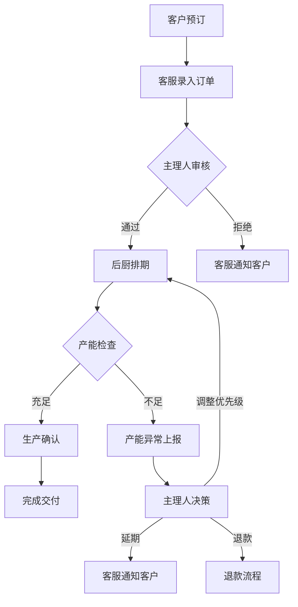

# 手作烘焙坊 - 预订接单与产能排期系统 PRD

## 1. 产品概述

手作烘焙坊预订接单与产能排期系统，解决门店日常运营中预订、排产、退款、改单等业务链路断裂问题，实现门店主理人、后厨负责人、客服三角色协同作业。

- **核心问题**：接单、排产、补做之间链路断裂，业务依赖聊天工具，信息易遗漏
- **目标用户**：门店主理人、后厨负责人、客服
- **产品价值**：统一工作平台，减少沟通成本，降低原料损耗，提升客户满意度

## 2. 核心功能

### 2.1 用户角色

| 角色 | 登录方式 | 核心权限 |
|------|----------|----------|
| 门店主理人 | 账号密码 | 全局概览、订单审核、产能配置、数据复盘 |
| 后厨负责人 | 账号密码 | 产能排期、生产确认、原料损耗记录、异常上报 |
| 客服 | 账号密码 | 订单录入、改单处理、退款申请、客户沟通记录 |

### 2.2 功能模块

1. **工作台首页**：待办事项、超时预警、今日概览
2. **订单管理**：订单列表、订单详情、改单记录、退款管理
3. **产能排期**：排期日历、产能配置、生产任务、异常处理
4. **侧边处理台**：订单快速操作、沟通记录、附件上传
5. **数据复盘**：原料损耗统计、退款原因分析、改单频率统计

### 2.3 页面详情

| 页面名称 | 模块名称 | 功能描述 |
|-----------|-------------|---------------------|
| 工作台首页 | 待办卡片 | 按角色展示待处理事项，支持一键跳转 |
| 工作台首页 | 超时预警 | 红色高亮显示超时订单，标注超时原因 |
| 工作台首页 | 今日概览 | 今日接单量、生产量、退款量统计卡片 |
| 订单管理 | 订单列表 | 多维度筛选、状态标签、批量操作 |
| 订单管理 | 订单详情 | 完整订单信息、改单历史、操作时间线 |
| 产能排期 | 排期日历 | 按日期查看产能分配、拖拽调整排期 |
| 产能排期 | 异常处理 | 产能不足、原料短缺、订单超时的处理流程 |
| 侧边处理台 | 快速操作 | 改单、退款、确认生产的快捷操作面板 |
| 侧边处理台 | 沟通记录 | 内部沟通与客户沟通的统一记录 |

## 3. 核心流程

### 3.1 正常订单流程

客户预订 → 客服录入订单 → 主理人审核 → 后厨排期 → 生产确认 → 完成交付

### 3.2 改单流程

客户申请改单 → 客服接收 → 记录改单原因 → 通知后厨 → 调整排期 → 双方确认

### 3.3 退款流程

客户申请退款 → 客服核实 → 记录退款原因 → 主理人审批 → 通知后厨取消排期 → 完成退款

### 3.4 产能异常流程

后厨发现产能不足 → 上报异常 → 主理人决策（优先级调整/延期/分流）→ 客服通知客户 → 执行调整

## 4. 用户界面设计

### 4.1 设计风格

- **主色调**：暖棕色系 (#8B5A2B)，传递烘焙的温暖感
- **辅助色**：奶油黄 (#F5E6D3)、抹茶绿 (#7BA05B)、警示红 (#C2410C)
- **按钮风格**：圆润边角（8px），悬停有轻微上浮效果
- **字体**：标题使用 Playfair Display，正文使用 Lato
- **布局风格**：三栏布局（左侧导航 + 中间主内容 + 右侧处理台）
- **图标风格**：线性图标，统一 24px 尺寸

### 4.2 页面设计概述

| 页面名称 | 模块名称 | UI 元素 |
|-----------|-------------|-------------|
| 工作台首页 | 待办卡片 | 渐变背景、数字徽章、悬停动画、状态图标 |
| 订单管理 | 订单列表 | 斑马纹表格、状态色标、展开详情动画 |
| 产能排期 | 排期日历 | 时间轴视图、颜色编码产能条、拖拽交互 |
| 侧边处理台 | 操作面板 | 毛玻璃效果、步骤指示器、实时更新提示 |

### 4.3 响应式设计

- 桌面端优先设计（1440px）
- 平板端：右侧处理台可折叠
- 移动端：垂直堆叠布局，底部导航

### 4.4 交互与动画

- 页面加载：内容从上到下渐入，延迟交错显示
- 侧边处理台：滑入滑出动效，宽度可拖拽调整
- 状态变更：闪烁提示 + Toast 通知
- 异常状态：红色边框脉冲动画吸引注意
