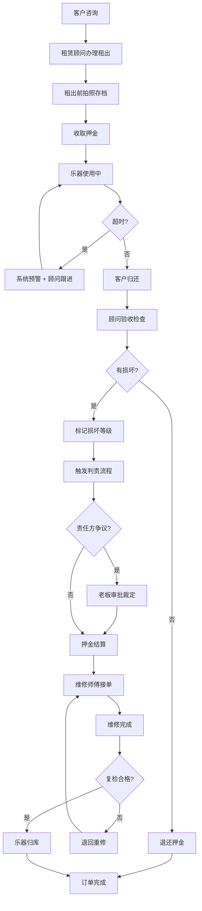

## 1. 产品概述

乐器租赁订单租出与归还验收链路追踪系统——将原本散落在租出表、押金本和维修记录中的信息串联为一条可双向追踪的完整链路，解决"租出→使用→归还→维修→结算"之间的人为断层。目标用户为乐器租赁门店的三类核心角色：门店老板、租赁顾问、维修师傅。

核心价值：消除信息断层，让每笔订单从租出到归还验收的每一步都有据可查、有人负责、有时限约束，尤其解决损坏判责无依据、押金结算口径乱、学校合作回款不稳三大痛点。

## 2. 核心功能

### 2.1 用户角色

| 角色 | 进入方式 | 核心权限 |
|------|----------|----------|
| 门店老板 | 账号：boss / 密码：boss123 | 查看全局数据、异常预警、超时监控、押金结算审批、学校回款追踪 |
| 租赁顾问 | 账号：consultant / 密码：consult123 | 租出办理、归还验收、客户沟通、押金收取/退还操作 |
| 维修师傅 | 账号：repair / 密码：repair123 | 接收维修任务、损坏判定、维修完成确认、维修照片上传 |

### 2.2 功能模块

1. **工作台**：角色感知的今日待办看板、异常预警、超时订单、退回通知
2. **订单链路**：从租出到归还验收的全链路追踪视图，时间线展示每步状态与操作人
3. **租出办理**：新建租出订单，录入乐器信息、客户信息、押金、租期
4. **归还验收**：归还验收流程，含乐器状况检查、损坏判定、押金结算触发
5. **维修管理**：维修任务看板，含接单、判定、完成、退回全流程
6. **押金结算**：押金扣款明细、结算审批、争议记录
7. **侧边处理台**：全局可唤起的订单操作面板，按角色与订单状态动态展示操作项

### 2.3 页面详情

| 页面名称 | 模块名称 | 功能描述 |
|----------|----------|----------|
| 工作台 | 今日待办 | 根据角色显示当日需处理的订单：老板看异常/超时/回款，顾问看待租出/待验收/待沟通，师傅看待维修/维修中 |
| 工作台 | 异常预警 | 高亮超时未还、损坏争议、维修退回、押金争议等异常订单 |
| 工作台 | 数据概览 | 本月租出/归还/维修/结算统计，学校合作回款进度 |
| 订单链路 | 链路时间线 | 订单全生命周期时间线：租出→使用中→归还→验收→（维修）→结算→完成，每步标注操作人、时间、状态 |
| 订单链路 | 状态筛选 | 按订单状态筛选：全部/租出中/待验收/维修中/待结算/已完成/异常 |
| 订单链路 | 快速搜索 | 按订单号、客户名、乐器名搜索 |
| 租出办理 | 乐器选择 | 选择可租乐器，显示乐器详情与当前状态 |
| 租出办理 | 客户信息 | 录入/选择客户，学校客户标记 |
| 租出办理 | 租期与押金 | 设置租期、押金金额，学校合作批量订单特殊处理 |
| 租出办理 | 乐器拍照 | 租出前乐器状况拍照存档（判责依据） |
| 归还验收 | 乐器检查 | 逐项检查乐器状况，对照租出时照片 |
| 归还验收 | 损坏判定 | 标记损坏项，选择损坏等级（轻微/中度/严重），触发判责流程 |
| 归还验收 | 押金处理 | 根据损坏情况自动计算扣款，支持手动调整与争议标记 |
| 维修管理 | 维修看板 | 按状态分栏：待接单/维修中/待复检/已完成/已退回 |
| 维修管理 | 损坏判定 | 维修师傅判定损坏原因与责任方（客户/自然损耗/质量问题） |
| 维修管理 | 维修记录 | 维修过程记录、费用记录、完成照片 |
| 押金结算 | 结算列表 | 待结算/已结算/争议中订单列表 |
| 押金结算 | 扣款明细 | 押金扣款项逐一列出：租金/损坏赔偿/维修费/其他 |
| 押金结算 | 审批流程 | 门店老板审批超额扣款或争议扣款 |
| 侧边处理台 | 订单摘要 | 当前订单关键信息速览 |
| 侧边处理台 | 操作按钮 | 根据角色+状态动态展示可用操作 |
| 侧边处理台 | 操作日志 | 本订单所有操作记录时间线 |
| 侧边处理台 | 快捷备注 | 添加备注，@相关人员 |

## 3. 核心流程

主流程：客户咨询 → 租赁顾问办理租出（拍照存档+收押金）→ 乐器使用中 → 客户归还 → 租赁顾问验收 → 
  → 无损坏：退还押金 → 订单完成
  → 有损坏：标记损坏等级 → 触发判责 → 维修师傅判定责任方 → 押金结算（扣款/争议）→ 维修 → 乐器归库

异常分支：
- 超时未还：系统自动预警 → 顾问跟进 → 老板可见
- 归还损坏争议：顾问标记 → 客户异议 → 老板审批裁定
- 维修退回：师傅完成维修 → 顾问复检不合格 → 退回重修
- 学校批量订单：特殊押金规则 → 分期回款 → 回款逾期预警

## 4. 用户界面设计

### 4.1 设计风格

- **主色调**：深灰 #1a1a2e 为底色，暖琥珀 #e8a838 为强调色——兼顾专业感与乐器行业的温暖质感
- **辅助色**：状态色系统——绿色 #22c55e（正常/完成）、琥珀 #f59e0b（预警/待处理）、红色 #ef4444（异常/超时）、蓝色 #3b82f6（信息/进行中）
- **按钮风格**：圆角 8px，填充按钮用于主操作，描边按钮用于次操作，文字按钮用于辅助操作
- **字体**：标题用 Noto Serif SC（衬线体，呼应乐器古典感），正文用 Noto Sans SC
- **布局**：左侧固定导航栏 + 主内容区 + 右侧可收起侧边处理台
- **图标**：Lucide 图标库，线条风格
- **卡片风格**：微圆角 + 细边框 + 悬浮阴影，区分不同信息层级

### 4.2 页面设计概览

| 页面名称 | 模块名称 | UI 要素 |
|----------|----------|---------|
| 工作台 | 今日待办 | 左侧角色切换标签，中间卡片列表，右侧统计数字，异常卡片红色左边框+脉冲动画 |
| 工作台 | 异常预警 | 顶部横幅式预警条，可展开详情，预警级别用颜色区分 |
| 订单链路 | 链路时间线 | 左侧垂直时间线，右侧卡片流，当前步骤高亮，异常步骤红点标记，节点可点击展开 |
| 租出办理 | 办理表单 | 步骤式表单（3步），顶部进度条，每步有校验，拍照区域网格布局 |
| 归还验收 | 验收检查 | 左右对照布局（租出照片 vs 当前状态），损坏项可圈注标记，底部押金计算器 |
| 维修管理 | 维修看板 | 四列看板布局（待接单/维修中/待复检/已完成），卡片拖拽排列，退回标记黄色警示 |
| 押金结算 | 结算列表 | 表格布局，争议行高亮，审批弹窗含扣款明细 |
| 侧边处理台 | 全局面板 | 右侧滑出面板，宽度 400px，顶部订单摘要，中部操作按钮组，底部操作日志 |

### 4.3 响应式

桌面优先设计，最低支持 1280px 宽度。侧边处理台在小屏幕下覆盖主内容区。

### 4.4 交互状态

- **加载态**：骨架屏占位，数据加载完成后淡入
- **空状态**：插图 + 引导文案
- **操作确认**：关键操作（扣款、退回、争议标记）二次确认弹窗
- **成功反馈**：右上角 Toast 通知，2秒自动消失
- **异常态**：网络错误重试提示，操作失败红色 Toast
- **角色差异**：不同角色看到的操作按钮、数据字段、预警内容不同
