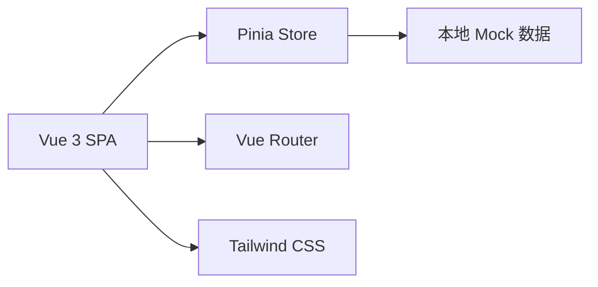
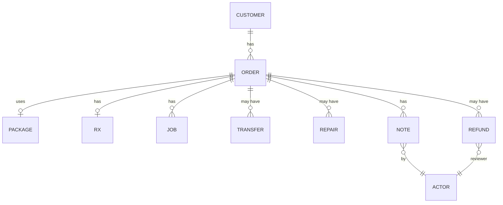

# 技术架构文档

## 1. 架构设计
前端单页应用（Vue 3 + TS + Vite + Tailwind），数据全部使用本地 mock（可在未来接入 Tauri 后端或云 API）。按角色切换的界面通过一个全局 store 控制，各页面按"列表-详情-证据侧栏"三栏结构组织。

## 2. 技术说明
- 前端：Vue 3 + TypeScript + Vite + Vue Router + Pinia + Tailwind CSS 3 + lucide-vue-next
- 初始化模板：vue-ts（自带 vue-router、tailwind）
- 后端：无（演示数据走 mock）
- 数据库：无（内存 + localStorage 可选持久化）
- 打包：后续可接 Tauri（本次前端先跑通）

## 3. 路由定义
| 路由 | 用途 |
|------|------|
| / | 工作台首页（今日概览 + 待处理异常） |
| /redeem | 套餐核销（扫码 + 验光录入 + 历史备注侧栏） |
| /workshop | 加工与返修（进度条 + 调拨登记 + 返修登记） |
| /refund | 退款复核（申请列表 + 证据链 + 复核操作） |
| /history | 历史回看（按订单聚合的时间线） |

## 4. API 定义
无后端，使用 TypeScript 定义的 mock 数据层 `src/data/mock.ts`，由 Pinia store 暴露为 reactive 状态。

## 5. 服务器架构
不适用。

## 6. 数据模型

### 6.1 数据模型定义

### 6.2 数据定义语言（Mock 结构）
- Customer：{ id, name, phone, memberNo }
- Package：{ id, name, price, lensType, frameIncluded }
- Order：{ id, customerId, packageId, createdAt, status, store }
- Rx：{ orderId, os, od, pd, note }，os/od 含 sphere/cylinder/axis/add
- Job：{ orderId, stage, updatedAt, assignee }
- Transfer：{ id, orderId, fromStore, toStore, logistics, status, lost }
- Repair：{ id, orderId, reason, owner, eta, status }
- Refund：{ id, orderId, amount, reason, status, reviewer, reviewedAt }
- Note：{ id, orderId, role, actor, content, createdAt, attach? }
- Actor：{ id, name, role, store }
