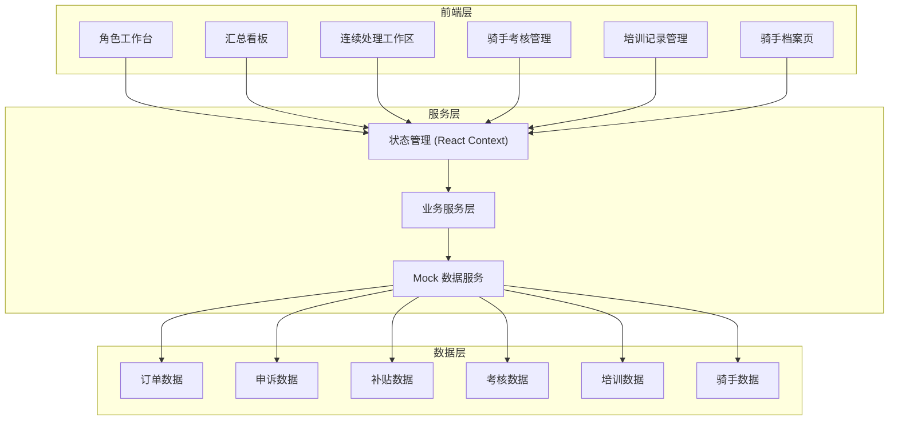
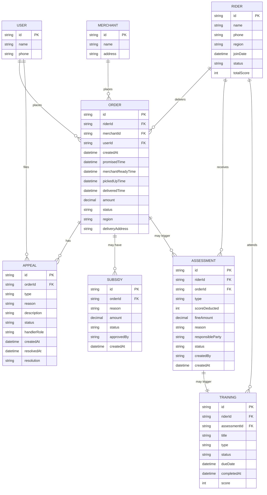

## 1. 架构设计



---

## 2. 技术描述

- **前端**：React@18 + TypeScript + TailwindCSS@3 + Vite
- **状态管理**：React Context + useReducer（业务流状态集中管理）
- **路由**：React Router v6（角色路由守卫 + 动态路由）
- **图表**：Recharts（轻量、React 友好）
- **UI 组件**：Lucide React 图标 + 自定义业务组件
- **数据**：Mock 数据 + 本地 Service 层模拟后端，数据结构按真实业务设计
- **初始化工具**：Vite

---

## 3. 路由定义

| 路由 | 权限角色 | 用途 |
|------|----------|------|
| `/login` | - | 角色选择登录页 |
| `/dashboard` | 全部（差异化展示） | 角色工作台 |
| `/orders` | 调度、运营 | 订单列表与汇总看板 |
| `/orders/:id/process` | 调度、运营、客服 | 连续处理工作区（核心） |
| `/appeals` | 客服、运营 | 申诉列表 |
| `/subsidies` | 调度、运营 | 补贴列表 |
| `/assessments` | 运营、调度 | 考核记录管理 |
| `/training` | 运营 | 培训记录管理 |
| `/riders` | 运营、调度 | 骑手列表 |
| `/riders/:id` | 运营、调度 | 骑手档案页 |
| `/settings` | 运营 | 考核规则配置 |

---

## 4. 数据模型

### 4.1 实体关系图



### 4.2 TypeScript 类型定义

```typescript
// 订单
interface Order {
  id: string;
  riderId: string;
  merchantId: string;
  userId: string;
  merchantName: string;
  userName: string;
  riderName: string;
  createdAt: string;
  promisedTime: string;
  merchantReadyTime: string;
  pickedUpTime: string;
  deliveredTime: string;
  amount: number;
  status: 'pending' | 'picked_up' | 'delivered' | 'cancelled' | 'exception';
  region: string;
  deliveryAddress: string;
  items: OrderItem[];
  hasAppeal: boolean;
  hasSubsidy: boolean;
  hasAssessment: boolean;
  hasTraining: boolean;
}

// 申诉
interface Appeal {
  id: string;
  orderId: string;
  type: 'timeout' | 'refund' | 'settlement_error' | 'complaint' | 'other';
  reason: string;
  description: string;
  evidenceUrls: string[];
  status: 'pending' | 'processing' | 'resolved' | 'rejected';
  handlerRole: 'customer_service' | 'dispatcher' | 'manager' | null;
  handlerName: string | null;
  createdAt: string;
  resolvedAt: string | null;
  resolution: string | null;
  responsibleParty: 'rider' | 'merchant' | 'platform' | 'user' | 'unclear' | null;
}

// 补贴
interface Subsidy {
  id: string;
  orderId: string;
  reason: string;
  amount: number;
  status: 'pending' | 'approved' | 'rejected';
  approvedBy: string | null;
  createdAt: string;
  approvedAt: string | null;
}

// 考核
interface Assessment {
  id: string;
  riderId: string;
  orderId: string;
  type: 'timeout' | 'complaint' | 'violation' | 'service_issue';
  scoreDeducted: number;
  fineAmount: number;
  reason: string;
  responsibleParty: 'rider' | 'merchant' | 'platform' | 'user';
  status: 'draft' | 'pending_approval' | 'approved' | 'appealed' | 'rejected';
  createdBy: string;
  createdAt: string;
  approvedBy: string | null;
  approvedAt: string | null;
  requiresTraining: boolean;
  trainingId: string | null;
}

// 培训
interface Training {
  id: string;
  riderId: string;
  assessmentId: string | null;
  title: string;
  type: 'mandatory' | 'remedial' | 'onboarding' | 'refresh';
  content: string;
  status: 'pending' | 'in_progress' | 'completed' | 'overdue';
  dueDate: string;
  completedAt: string | null;
  score: number | null;
  createdAt: string;
}

// 骑手
interface Rider {
  id: string;
  name: string;
  phone: string;
  avatar: string;
  region: string;
  joinDate: string;
  status: 'active' | 'probation' | 'suspended' | 'inactive';
  totalScore: number;
  totalDeliveries: number;
  currentMonthScore: number;
  trainingCount: {
    pending: number;
    completed: number;
    overdue: number;
  };
}

// 事件时间线
interface TimelineEvent {
  id: string;
  type: 'order' | 'appeal' | 'subsidy' | 'assessment' | 'training' | 'status_change';
  timestamp: string;
  title: string;
  description: string;
  data: any;
}

// 角色
type UserRole = 'manager' | 'dispatcher' | 'customer_service';
```

---

## 5. 核心模块设计

### 5.1 业务服务层

```typescript
// services/order.service.ts - 订单服务
// services/appeal.service.ts - 申诉服务
// services/subsidy.service.ts - 补贴服务
// services/assessment.service.ts - 考核服务
// services/training.service.ts - 培训服务
// services/rider.service.ts - 骑手服务
// services/timeline.service.ts - 时间线聚合服务
```

### 5.2 状态管理

```typescript
// context/AppContext.tsx - 全局应用状态（用户、角色）
// context/OrderProcessContext.tsx - 连续处理工作区状态
// context/DashboardContext.tsx - 看板状态
```

### 5.3 组件层级

```
src/
├── components/
│   ├── layout/              # 布局组件（Sidebar, Header, RoleSwitcher）
│   ├── dashboard/           # 看板组件（StatCard, OrderTable, FilterBar）
│   ├── timeline/            # 时间线组件（VerticalTimeline, TimelineEventCard）
│   ├── process/             # 连续处理工作区组件
│   │   ├── OrderDetailPanel.tsx
│   │   ├── AppealPanel.tsx
│   │   ├── SubsidyPanel.tsx
│   │   ├── AssessmentPanel.tsx
│   │   ├── TrainingPanel.tsx
│   │   └── ProcessActionBar.tsx
│   ├── assessment/          # 考核相关组件
│   ├── training/            # 培训相关组件
│   ├── rider/               # 骑手相关组件
│   └── common/              # 通用组件（Button, Modal, Tag, StatusBadge）
├── pages/                   # 页面组件
├── services/                # 业务服务
├── context/                 # 状态管理
├── types/                   # TypeScript 类型定义
├── mock/                    # Mock 数据
│   ├── orders.ts
│   ├── appeals.ts
│   ├── subsidies.ts
│   ├── assessments.ts
│   ├── trainings.ts
│   └── riders.ts
├── utils/                   # 工具函数
│   ├── date.ts
│   ├── responsibility.ts    # 责任归属判定逻辑
│   ├── assessmentRules.ts   # 考核规则引擎
│   └── trainingTrigger.ts   # 培训触发规则
└── hooks/                   # 自定义 Hooks
```

---

## 6. 关键实现点

### 6.1 连续处理工作区状态机

```typescript
type ProcessStep = 'review' | 'appeal' | 'subsidy' | 'assessment' | 'training' | 'complete';

interface ProcessState {
  orderId: string;
  currentStep: ProcessStep;
  completedSteps: ProcessStep[];
  appealDecision: Appeal | null;
  subsidyDecision: Subsidy | null;
  assessmentDecision: Assessment | null;
  autoTriggeredTraining: boolean;
}
```

### 6.2 责任归属判定引擎

```typescript
// utils/responsibility.ts
function determineResponsibility(order: Order, appeal?: Appeal): 'rider' | 'merchant' | 'platform' | 'user' | 'unclear' {
  // 1. 有申诉且已判定 → 按申诉结论
  // 2. 超时判定 → 比较出餐时长 vs 配送时长占比
  // 3. 退款判定 → 分析退款原因与聊天记录标签
  // 4. 结算错误 → 对比系统计算与人工修改记录
}
```

### 6.3 考核→培训自动触发

```typescript
// utils/trainingTrigger.ts
function shouldTriggerTraining(assessment: Assessment, rider: Rider): {
  shouldTrigger: boolean;
  trainingType: Training['type'];
  reason: string;
} {
  // 单次扣分 ≥ 5 → 强制培训
  // 月度累计 ≥ 12 → 强制 + 观察
  // 同一问题 ≥ 3次 → 专项培训
}
```

---

## 7. Mock 数据设计

提供 4 组完整样例，覆盖正常流和问题流：

1. **样例 A：正常超时订单流**（骑手责任，正常考核→培训）
2. **样例 B：商家出餐慢导致超时**（商家责任，补贴骑手，无考核）
3. **样例 C：用户退款+结算错误复合问题**（多角色协作，跨系统核对）
4. **样例 D：骑手反复超时，触发专项培训**（历史数据关联，累计规则触发）

每组样例包含完整的订单、申诉、补贴、考核、培训关联数据，可直接用于演示。
