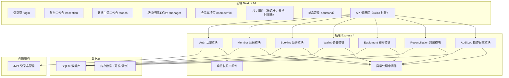
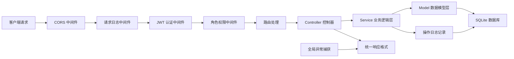
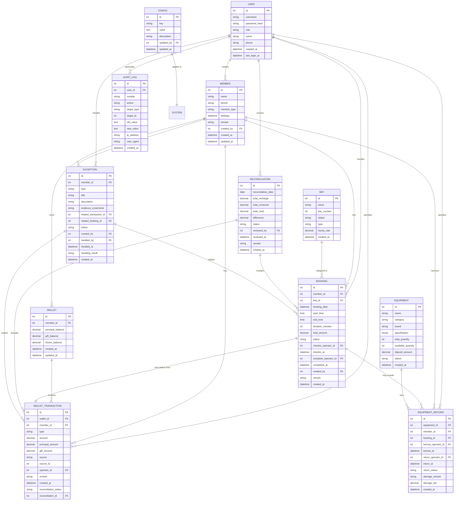

## 1. 架构设计



## 2. 技术描述

- **前端**：Next.js 14 (App Router) + TypeScript + TailwindCSS 3 + Zustand + Axios + Lucide React
- **后端**：Node.js + Express 4 + TypeScript + JWT + bcryptjs + CORS
- **数据库**：SQLite + better-sqlite3（轻量部署，适合单机场馆场景）
- **构建工具**：Vite（前端）+ ts-node-dev（后端开发）
- **代码规范**：ESLint + Prettier

## 3. 目录结构

```
trae-test-5/
├── client/                    # Next.js 前端
│   ├── app/
│   │   ├── login/            # 登录页
│   │   ├── reception/        # 前台工作台
│   │   ├── coach/            # 教练主管工作台
│   │   ├── manager/          # 场馆经理工作台
│   │   │   ├── dashboard/    # 数据概览
│   │   │   ├── reconciliation/ # 对账中心
│   │   │   ├── config/       # 口径配置
│   │   │   ├── exceptions/   # 异常处理
│   │   │   └── audit-logs/   # 操作日志
│   │   └── member/[id]/      # 会员详情
│   ├── components/           # 共享组件
│   │   ├── layout/          # 布局组件
│   │   ├── filters/         # 多条件筛选组件
│   │   ├── tables/          # 数据表格组件
│   │   └── timeline/        # 时间线组件
│   ├── store/               # Zustand 状态管理
│   ├── services/            # API 服务层
│   ├── types/               # TypeScript 类型定义
│   └── utils/               # 工具函数
│
├── server/                   # Express 后端
│   ├── src/
│   │   ├── controllers/     # 控制器层
│   │   ├── services/        # 业务逻辑层
│   │   ├── models/          # 数据模型层
│   │   ├── middleware/      # 中间件
│   │   ├── routes/          # 路由定义
│   │   ├── db/              # 数据库连接和初始化
│   │   ├── types/           # 类型定义
│   │   ├── utils/           # 工具函数
│   │   └── index.ts         # 应用入口
│   └── data/                # 初始数据和样例数据
│
└── docs/                     # 项目文档（取舍点、扩展说明）
```

## 4. 路由定义

### 前端路由

| 路由 | 页面 | 权限角色 |
|-------|------|----------|
| /login | 登录页 | 公开 |
| /reception | 前台工作台 | 前台 |
| /coach | 教练主管工作台 | 教练主管 |
| /manager/dashboard | 数据概览 | 场馆经理 |
| /manager/reconciliation | 对账中心 | 场馆经理 |
| /manager/config | 口径配置 | 场馆经理 |
| /manager/exceptions | 异常处理 | 场馆经理 |
| /manager/audit-logs | 操作日志 | 场馆经理 |
| /member/:id | 会员详情 | 所有登录用户 |

### 后端 API 路由

| Method | Route | 模块 | 说明 |
|--------|-------|------|------|
| POST | /api/auth/login | Auth | 用户登录 |
| POST | /api/auth/logout | Auth | 用户登出 |
| GET | /api/auth/me | Auth | 获取当前用户信息 |
| GET | /api/members | Member | 会员列表（支持多条件筛选） |
| GET | /api/members/:id | Member | 会员详情及全链路数据 |
| POST | /api/members | Member | 新增会员 |
| GET | /api/members/:id/timeline | Member | 会员时间线数据 |
| POST | /api/wallet/recharge | Wallet | 储值充值 |
| POST | /api/wallet/deduct | Wallet | 储值扣减 |
| GET | /api/wallet/transactions | Wallet | 储值流水（支持多条件筛选） |
| GET | /api/bookings | Booking | 预约列表（支持多条件筛选） |
| POST | /api/bookings | Booking | 创建预约 |
| PUT | /api/bookings/:id/checkin | Booking | 到场核销 |
| PUT | /api/bookings/:id/complete | Booking | 完成预约 |
| GET | /api/equipment | Equipment | 器材列表 |
| POST | /api/equipment/borrow | Equipment | 器材借出 |
| POST | /api/equipment/return | Equipment | 器材归还验收 |
| GET | /api/equipment/records | Equipment | 器材借还记录（支持筛选） |
| GET | /api/reconciliation/daily | Reconciliation | 日对账数据 |
| GET | /api/reconciliation/details | Reconciliation | 对账明细（支持多条件筛选） |
| POST | /api/reconciliation/adjust | Reconciliation | 调账审批 |
| GET | /api/reconciliation/statistics | Reconciliation | 对账统计数据 |
| GET | /api/audit-logs | AuditLog | 操作日志（支持多条件筛选） |
| POST | /api/audit-logs | AuditLog | 记录操作日志（内部调用） |
| GET | /api/exceptions | Exception | 异常工单列表 |
| POST | /api/exceptions | Exception | 创建异常工单 |
| PUT | /api/exceptions/:id/process | Exception | 处理异常工单 |
| GET | /api/config/rules | Config | 获取消耗口径配置 |
| PUT | /api/config/rules | Config | 更新消耗口径配置 |
| GET | /api/dashboard/overview | Dashboard | 概览统计数据 |
| GET | /api/dashboard/trends | Dashboard | 趋势数据 |

## 5. 服务器架构



## 6. 数据模型

### 6.1 ER 图



### 6.2 关键表初始化 DDL

```sql
-- 用户表
CREATE TABLE IF NOT EXISTS users (
    id INTEGER PRIMARY KEY AUTOINCREMENT,
    username VARCHAR(50) UNIQUE NOT NULL,
    password_hash VARCHAR(255) NOT NULL,
    role VARCHAR(20) NOT NULL CHECK (role IN ('manager', 'coach', 'reception')),
    name VARCHAR(50) NOT NULL,
    phone VARCHAR(20),
    created_at DATETIME DEFAULT CURRENT_TIMESTAMP,
    last_login_at DATETIME
);

-- 会员表
CREATE TABLE IF NOT EXISTS members (
    id INTEGER PRIMARY KEY AUTOINCREMENT,
    name VARCHAR(50) NOT NULL,
    phone VARCHAR(20) UNIQUE NOT NULL,
    member_type VARCHAR(20) NOT NULL DEFAULT 'normal' CHECK (member_type IN ('normal', 'silver', 'gold', 'diamond')),
    birthday DATE,
    remark TEXT,
    created_by INTEGER REFERENCES users(id),
    created_at DATETIME DEFAULT CURRENT_TIMESTAMP,
    updated_at DATETIME DEFAULT CURRENT_TIMESTAMP
);

-- 储值账户表
CREATE TABLE IF NOT EXISTS wallets (
    id INTEGER PRIMARY KEY AUTOINCREMENT,
    member_id INTEGER UNIQUE NOT NULL REFERENCES members(id),
    principal_balance DECIMAL(10,2) NOT NULL DEFAULT 0.00,
    gift_balance DECIMAL(10,2) NOT NULL DEFAULT 0.00,
    frozen_balance DECIMAL(10,2) NOT NULL DEFAULT 0.00,
    created_at DATETIME DEFAULT CURRENT_TIMESTAMP,
    updated_at DATETIME DEFAULT CURRENT_TIMESTAMP
);

-- 储值流水表
CREATE TABLE IF NOT EXISTS wallet_transactions (
    id INTEGER PRIMARY KEY AUTOINCREMENT,
    wallet_id INTEGER NOT NULL REFERENCES wallets(id),
    member_id INTEGER NOT NULL REFERENCES members(id),
    type VARCHAR(20) NOT NULL CHECK (type IN ('recharge', 'consume', 'refund', 'adjust')),
    amount DECIMAL(10,2) NOT NULL,
    principal_amount DECIMAL(10,2) NOT NULL DEFAULT 0.00,
    gift_amount DECIMAL(10,2) NOT NULL DEFAULT 0.00,
    source VARCHAR(30) NOT NULL,
    source_id INTEGER,
    operator_id INTEGER NOT NULL REFERENCES users(id),
    remark TEXT,
    created_at DATETIME DEFAULT CURRENT_TIMESTAMP,
    reconciliation_status VARCHAR(20) NOT NULL DEFAULT 'pending' CHECK (reconciliation_status IN ('pending', 'matched', 'mismatched', 'adjusted')),
    reconciliation_id INTEGER REFERENCES reconciliations(id)
);

-- 球道表
CREATE TABLE IF NOT EXISTS bays (
    id INTEGER PRIMARY KEY AUTOINCREMENT,
    name VARCHAR(50) NOT NULL,
    bay_number INTEGER UNIQUE NOT NULL,
    status VARCHAR(20) NOT NULL DEFAULT 'available' CHECK (status IN ('available', 'maintenance', 'closed')),
    type VARCHAR(20) NOT NULL DEFAULT 'normal' CHECK (type IN ('normal', 'vip', 'coach')),
    hourly_rate DECIMAL(10,2) NOT NULL,
    created_at DATETIME DEFAULT CURRENT_TIMESTAMP
);

-- 预约表
CREATE TABLE IF NOT EXISTS bookings (
    id INTEGER PRIMARY KEY AUTOINCREMENT,
    member_id INTEGER REFERENCES members(id),
    bay_id INTEGER NOT NULL REFERENCES bays(id),
    booking_date DATE NOT NULL,
    start_time TIME NOT NULL,
    end_time TIME NOT NULL,
    duration_minutes INTEGER NOT NULL,
    total_amount DECIMAL(10,2) NOT NULL,
    status VARCHAR(20) NOT NULL DEFAULT 'booked' CHECK (status IN ('booked', 'checked_in', 'completed', 'cancelled', 'no_show')),
    checkin_operator_id INTEGER REFERENCES users(id),
    checkin_at DATETIME,
    complete_operator_id INTEGER REFERENCES users(id),
    completed_at DATETIME,
    created_by INTEGER NOT NULL REFERENCES users(id),
    remark TEXT,
    created_at DATETIME DEFAULT CURRENT_TIMESTAMP
);

-- 器材表
CREATE TABLE IF NOT EXISTS equipments (
    id INTEGER PRIMARY KEY AUTOINCREMENT,
    name VARCHAR(100) NOT NULL,
    category VARCHAR(50) NOT NULL,
    brand VARCHAR(50),
    specification VARCHAR(100),
    total_quantity INTEGER NOT NULL DEFAULT 0,
    available_quantity INTEGER NOT NULL DEFAULT 0,
    deposit_amount DECIMAL(10,2) NOT NULL DEFAULT 0.00,
    status VARCHAR(20) NOT NULL DEFAULT 'active' CHECK (status IN ('active', 'maintenance', 'retired')),
    created_at DATETIME DEFAULT CURRENT_TIMESTAMP
);

-- 器材借还记录表
CREATE TABLE IF NOT EXISTS equipment_records (
    id INTEGER PRIMARY KEY AUTOINCREMENT,
    equipment_id INTEGER NOT NULL REFERENCES equipments(id),
    member_id INTEGER NOT NULL REFERENCES members(id),
    booking_id INTEGER REFERENCES bookings(id),
    borrow_operator_id INTEGER NOT NULL REFERENCES users(id),
    borrow_at DATETIME NOT NULL DEFAULT CURRENT_TIMESTAMP,
    return_operator_id INTEGER REFERENCES users(id),
    return_at DATETIME,
    return_status VARCHAR(20) CHECK (return_status IN ('normal', 'damaged', 'lost')),
    damage_remark TEXT,
    damage_fee DECIMAL(10,2) DEFAULT 0.00,
    created_at DATETIME DEFAULT CURRENT_TIMESTAMP
);

-- 对账单表
CREATE TABLE IF NOT EXISTS reconciliations (
    id INTEGER PRIMARY KEY AUTOINCREMENT,
    reconciliation_date DATE UNIQUE NOT NULL,
    total_recharge DECIMAL(10,2) NOT NULL DEFAULT 0.00,
    total_consume DECIMAL(10,2) NOT NULL DEFAULT 0.00,
    total_cash DECIMAL(10,2) NOT NULL DEFAULT 0.00,
    difference DECIMAL(10,2) NOT NULL DEFAULT 0.00,
    status VARCHAR(20) NOT NULL DEFAULT 'pending' CHECK (status IN ('pending', 'reviewing', 'approved', 'adjusted')),
    reviewed_by INTEGER REFERENCES users(id),
    reviewed_at DATETIME,
    remark TEXT,
    created_at DATETIME DEFAULT CURRENT_TIMESTAMP
);

-- 异常工单表
CREATE TABLE IF NOT EXISTS exceptions (
    id INTEGER PRIMARY KEY AUTOINCREMENT,
    member_id INTEGER REFERENCES members(id),
    type VARCHAR(30) NOT NULL,
    title VARCHAR(200) NOT NULL,
    description TEXT NOT NULL,
    evidence_screenshot TEXT,
    related_transaction_id INTEGER REFERENCES wallet_transactions(id),
    related_booking_id INTEGER REFERENCES bookings(id),
    status VARCHAR(20) NOT NULL DEFAULT 'pending' CHECK (status IN ('pending', 'processing', 'resolved', 'closed')),
    created_by INTEGER NOT NULL REFERENCES users(id),
    handled_by INTEGER REFERENCES users(id),
    handled_at DATETIME,
    handling_result TEXT,
    created_at DATETIME DEFAULT CURRENT_TIMESTAMP
);

-- 操作日志表
CREATE TABLE IF NOT EXISTS audit_logs (
    id INTEGER PRIMARY KEY AUTOINCREMENT,
    user_id INTEGER NOT NULL REFERENCES users(id),
    module VARCHAR(50) NOT NULL,
    action VARCHAR(20) NOT NULL,
    target_type VARCHAR(50) NOT NULL,
    target_id INTEGER NOT NULL,
    old_value TEXT,
    new_value TEXT,
    ip_address VARCHAR(50),
    user_agent TEXT,
    created_at DATETIME DEFAULT CURRENT_TIMESTAMP
);

-- 系统配置表
CREATE TABLE IF NOT EXISTS configs (
    id INTEGER PRIMARY KEY AUTOINCREMENT,
    key VARCHAR(100) UNIQUE NOT NULL,
    value TEXT NOT NULL,
    description TEXT,
    updated_by INTEGER REFERENCES users(id),
    updated_at DATETIME DEFAULT CURRENT_TIMESTAMP
);

-- 索引
CREATE INDEX IF NOT EXISTS idx_member_phone ON members(phone);
CREATE INDEX IF NOT EXISTS idx_transaction_member ON wallet_transactions(member_id);
CREATE INDEX IF NOT EXISTS idx_transaction_created ON wallet_transactions(created_at);
CREATE INDEX IF NOT EXISTS idx_booking_date ON bookings(booking_date);
CREATE INDEX IF NOT EXISTS idx_booking_member ON bookings(member_id);
CREATE INDEX IF NOT EXISTS idx_equipment_record_member ON equipment_records(member_id);
CREATE INDEX IF NOT EXISTS idx_audit_log_user ON audit_logs(user_id);
CREATE INDEX IF NOT EXISTS idx_audit_log_created ON audit_logs(created_at);
```

## 7. 关键技术实现点

### 7.1 登录态管理
- 使用 JWT（JSON Web Token）实现无状态认证
- Token 有效期：2小时，支持自动刷新
- 前端封装 Axios 拦截器自动附加 Token
- 后端中间件统一校验 Token 和角色权限

### 7.2 角色权限控制
- 基于 RBAC 模型，在路由层面进行权限校验
- 权限中间件根据用户角色拦截未授权请求
- 前端根据角色动态渲染菜单和按钮

### 7.3 多条件筛选实现
- 统一筛选组件，支持：时间范围、下拉选择、输入框、区间选择
- 后端动态构建 SQL 查询条件，防止 SQL 注入
- 筛选条件支持持久化到 URL 查询参数，方便分享链接

### 7.4 操作留痕机制
- 关键操作（增删改、调账、审批）自动记录操作日志
- 记录操作前后数据对比（JSON 格式）
- 支持按模块、操作人、时间范围筛选回查

### 7.5 储值扣减口径
- 先扣减赠送金，再扣减本金（可配置）
- 支持节假日费率系数
- 扣减时冻结金额，完成后正式扣减
- 每笔扣减关联预约单，确保消耗可追溯
