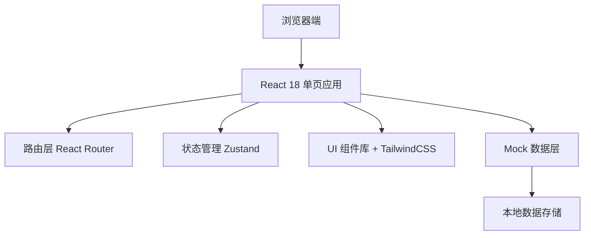
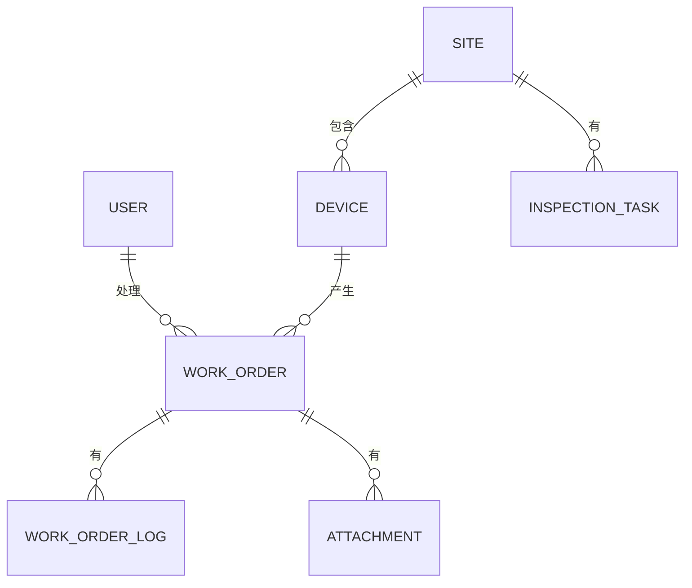

## 1. 架构设计



## 2. 技术描述

- **前端框架**: React@18 + TypeScript
- **构建工具**: Vite@5
- **路由**: React Router@6
- **状态管理**: Zustand
- **样式方案**: TailwindCSS@3
- **图标**: Lucide React
- **数据层**: 本地 Mock 数据 + localStorage 持久化
- **图表**: Recharts

## 3. 路由定义

| 路由 | 页面 | 权限 |
|------|------|------|
| /login | 登录页 | 公开 |
| /dashboard | 工作台 | 所有角色 |
| /inspection | 巡检任务 | 巡检员、主管 |
| /workorders | 工单中心 | 所有角色 |
| /workorders/:id | 工单详情 | 所有角色 |
| /sites | 站点管理 | 主管、客服 |
| /sites/:id | 站点详情 | 主管、客服 |

## 4. 数据模型

### 4.1 实体关系图



### 4.2 核心类型定义

```typescript
// 用户
interface User {
  id: string;
  name: string;
  role: 'admin' | 'inspector' | 'service';
  avatar: string;
  phone: string;
}

// 站点
interface Site {
  id: string;
  name: string;
  address: string;
  status: 'normal' | 'warning' | 'error';
  deviceCount: number;
  lastInspection: string;
}

// 设备
interface Device {
  id: string;
  siteId: string;
  name: string;
  type: 'washer' | 'pump' | 'gun' | 'dryer' | 'other';
  status: 'normal' | 'warning' | 'error' | 'maintenance';
  lastMaintenance: string;
  consumables: Consumable[];
}

// 耗材
interface Consumable {
  id: string;
  name: string;
  stock: number;
  threshold: number;
  unit: string;
}

// 工单
interface WorkOrder {
  id: string;
  title: string;
  description: string;
  type: 'repair' | 'refund' | 'consumable' | 'other';
  priority: 'low' | 'medium' | 'high' | 'urgent';
  status: 'pending' | 'assigned' | 'processing' | 'returned' | 'escalated' | 'completed' | 'closed';
  siteId: string;
  deviceId?: string;
  reporterId: string;
  assigneeId?: string;
  createdAt: string;
  deadline?: string;
  refundAmount?: number;
  logs: WorkOrderLog[];
  attachments: Attachment[];
}

// 工单日志
interface WorkOrderLog {
  id: string;
  workOrderId: string;
  operatorId: string;
  action: string;
  remark?: string;
  createdAt: string;
}

// 附件
interface Attachment {
  id: string;
  name: string;
  url: string;
  type: 'image' | 'video' | 'file';
  uploadedAt: string;
}

// 巡检任务
interface InspectionTask {
  id: string;
  siteId: string;
  inspectorId: string;
  scheduledDate: string;
  status: 'pending' | 'in_progress' | 'completed';
  items: InspectionItem[];
  startedAt?: string;
  completedAt?: string;
}

// 巡检项
interface InspectionItem {
  id: string;
  name: string;
  status: 'normal' | 'abnormal' | 'skip';
  remark?: string;
  photoUrl?: string;
}
```

## 5. 目录结构

```
src/
├── components/         # 公共组件
│   ├── Layout/        # 布局组件
│   ├── Sidebar/       # 侧边栏
│   ├── WorkPanel/     # 右侧处理台
│   ├── WorkOrderCard/ # 工单卡片
│   └── StatusBadge/   # 状态标签
├── pages/             # 页面组件
│   ├── Login/
│   ├── Dashboard/
│   ├── Inspection/
│   ├── WorkOrder/
│   └── Site/
├── store/             # 状态管理
│   ├── useAuthStore.ts
│   ├── useWorkOrderStore.ts
│   └── useSiteStore.ts
├── mock/              # Mock 数据
│   ├── users.ts
│   ├── sites.ts
│   ├── devices.ts
│   ├── workorders.ts
│   └── inspections.ts
├── types/             # TypeScript 类型
│   └── index.ts
├── utils/             # 工具函数
│   ├── format.ts
│   └── mock.ts
├── App.tsx
├── main.tsx
└── index.css
```

## 6. 状态管理设计

### 6.1 认证状态

```typescript
interface AuthState {
  user: User | null;
  login: (username: string, password: string) => Promise<boolean>;
  logout: () => void;
  switchRole: (role: User['role']) => void;
}
```

### 6.2 工单状态

```typescript
interface WorkOrderState {
  workOrders: WorkOrder[];
  loading: boolean;
  fetchWorkOrders: (filters?) => Promise<void>;
  getWorkOrder: (id) => WorkOrder | undefined;
  updateWorkOrder: (id, data) => Promise<void>;
  createWorkOrder: (data) => Promise<WorkOrder>;
  escalateWorkOrder: (id, reason) => Promise<void>;
  returnWorkOrder: (id, reason) => Promise<void>;
}
```
