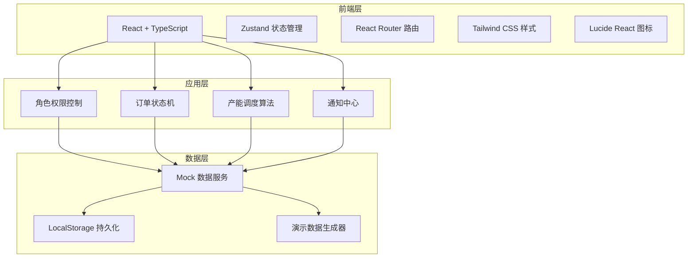
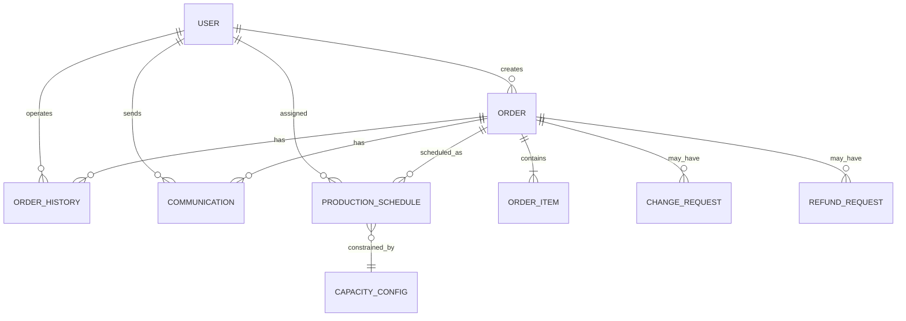

# 手作烘焙坊 - 技术架构文档

## 1. 架构设计



## 2. 技术选型说明

- **前端框架**: React@18 + TypeScript@5
- **构建工具**: Vite@5
- **状态管理**: Zustand@4
- **路由**: React Router DOM@6
- **样式**: Tailwind CSS@3
- **图标库**: Lucide React
- **后端**: 无后端，使用 Mock 数据 + LocalStorage 持久化
- **数据库**: LocalStorage 浏览器存储

## 3. 路由定义

| 路由路径 | 页面名称 | 权限要求 |
|-----------|----------|----------|
| `/login` | 登录页 | 公开 |
| `/dashboard` | 工作台首页 | 所有角色 |
| `/orders` | 订单管理 | 所有角色 |
| `/orders/:id` | 订单详情 | 所有角色 |
| `/schedule` | 产能排期 | 主理人/后厨 |
| `/analytics` | 数据复盘 | 主理人 |
| `/settings` | 系统设置 | 主理人 |

## 4. 数据模型

### 4.1 核心数据结构

```typescript
// 用户角色
type UserRole = 'manager' | 'chef' | 'customer_service';

interface User {
  id: string;
  name: string;
  role: UserRole;
  avatar: string;
}

// 订单状态
type OrderStatus = 
  | 'pending_review'      // 待审核
  | 'reviewed'            // 已审核
  | 'scheduled'           // 已排期
  | 'in_production'       // 生产中
  | 'completed'           // 已完成
  | 'change_requested'    // 申请改单
  | 'refund_requested'    // 申请退款
  | 'refunded'            // 已退款
  | 'cancelled';          // 已取消

interface Order {
  id: string;
  orderNo: string;
  customerName: string;
  customerPhone: string;
  items: OrderItem[];
  totalAmount: number;
  deposit: number;
  pickupTime: Date;
  status: OrderStatus;
  createdAt: Date;
  updatedAt: Date;
  createdBy: string;
  assignedChef?: string;
  notes: string;
  history: OrderHistory[];
  isUrgent: boolean;
  isOverdue: boolean;
}

interface OrderItem {
  id: string;
  productName: string;
  quantity: number;
  unitPrice: number;
  specifications: string;
}

interface OrderHistory {
  id: string;
  orderId: string;
  action: string;
  operator: string;
  operatorRole: UserRole;
  timestamp: Date;
  remarks: string;
}

// 产能排期
interface ProductionSchedule {
  id: string;
  date: string;
  orderId: string;
  chefId: string;
  startTime: string;
  endTime: string;
  status: 'scheduled' | 'in_progress' | 'completed';
}

interface CapacityConfig {
  date: string;
  maxDailyOrders: number;
  chefCapacities: Record<string, number>;
}

// 沟通记录
interface Communication {
  id: string;
  orderId: string;
  sender: string;
  senderRole: UserRole;
  content: string;
  timestamp: Date;
  type: 'internal' | 'customer';
  attachments?: string[];
}
```

### 4.2 数据关系图



## 5. 状态管理设计

使用 Zustand 管理全局状态：

```typescript
// useAuthStore - 认证状态
interface AuthState {
  user: User | null;
  login: (username: string, password: string) => boolean;
  logout: () => void;
}

// useOrderStore - 订单状态
interface OrderState {
  orders: Order[];
  selectedOrder: Order | null;
  filters: OrderFilters;
  loadOrders: () => void;
  selectOrder: (id: string) => void;
  updateOrderStatus: (id: string, status: OrderStatus) => void;
  applyFilters: (filters: Partial<OrderFilters>) => void;
}

// useScheduleStore - 排期状态
interface ScheduleState {
  schedules: ProductionSchedule[];
  capacityConfig: CapacityConfig[];
  loadSchedules: (date: string) => void;
  createSchedule: (schedule: Omit<ProductionSchedule, 'id'>) => void;
  checkCapacity: (date: string) => CapacityInfo;
}

// useNotificationStore - 通知状态
interface NotificationState {
  notifications: Notification[];
  addNotification: (notification: Omit<Notification, 'id' | 'read'>) => void;
  markAsRead: (id: string) => void;
}
```

## 6. 组件架构

```
src/
├── components/
│   ├── layout/
│   │   ├── Sidebar.tsx          # 左侧导航
│   │   ├── Header.tsx           # 顶部栏
│   │   └── ProcessingPanel.tsx  # 右侧处理台
│   ├── order/
│   │   ├── OrderCard.tsx        # 订单卡片
│   │   ├── OrderList.tsx        # 订单列表
│   │   ├── OrderDetail.tsx      # 订单详情
│   │   ├── OrderTimeline.tsx    # 操作时间线
│   │   ├── ChangeOrderForm.tsx  # 改单表单
│   │   └── RefundForm.tsx       # 退款表单
│   ├── schedule/
│   │   ├── ScheduleCalendar.tsx # 排期日历
│   │   ├── CapacityBar.tsx      # 产能条
│   │   └── ExceptionPanel.tsx   # 异常处理面板
│   ├── dashboard/
│   │   ├── TodoCard.tsx         # 待办卡片
│   │   ├── AlertBadge.tsx       # 预警徽章
│   │   └── StatCard.tsx         # 统计卡片
│   └── common/
│       ├── StatusBadge.tsx      # 状态标签
│       ├── Avatar.tsx           # 头像
│       ├── Button.tsx           # 按钮
│       └── Modal.tsx            # 模态框
├── pages/
│   ├── Login.tsx
│   ├── Dashboard.tsx
│   ├── Orders.tsx
│   ├── OrderDetail.tsx
│   ├── Schedule.tsx
│   └── Analytics.tsx
├── store/
│   ├── useAuthStore.ts
│   ├── useOrderStore.ts
│   ├── useScheduleStore.ts
│   └── useNotificationStore.ts
├── hooks/
│   ├── useRolePermission.ts
│   ├── useOrderOperations.ts
│   └── useCapacityCalculation.ts
├── utils/
│   ├── mockData.ts
│   ├── statusMachine.ts
│   └── dateUtils.ts
└── types/
    └── index.ts
```

## 7. 简化说明

本次演示版本做了以下简化：

1. **无真实后端**：使用 Mock 数据 + LocalStorage 持久化
2. **无真实认证**：预设测试账号，前端模拟登录
3. **简化的产能算法**：基础的日产能限制，不包含复杂的排班优化
4. **无文件上传**：沟通记录中的附件仅做展示，无真实上传功能
5. **无实时推送**：状态变更通过轮询模拟，而非 WebSocket
6. **简化的权限控制**：前端路由级控制，无后端权限校验
