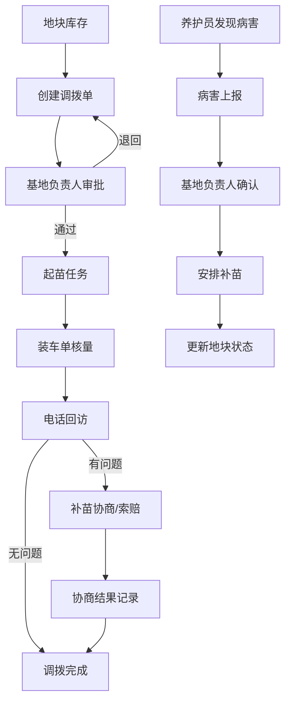

## 1. 产品概述

苗木基地管理系统——围绕地块库存与调拨记录两个核心环节，将起苗、养护、补苗协商、装车单、电话回访等流程统一收口，解决入口散、提醒弱、历史难找的问题。目标用户为基地负责人、养护员和销售跟单。

## 2. 核心功能

### 2.1 用户角色

| 角色 | 进入方式 | 核心权限 |
|------|----------|----------|
| 基地负责人 | 角色切换器选择 | 查看所有地块进度、审批调拨、查看全链路报表 |
| 养护员 | 角色切换器选择 | 处理养护任务、上报病害、确认起苗完成 |
| 销售跟单 | 角色切换器选择 | 创建调拨单、填写装车单、记录回访、处理索赔协商 |

### 2.2 功能模块

1. **仪表盘**：关键指标卡片、待办提醒、近期动态流
2. **地块库存**：地块列表与详情、库存明细、状态时间线
3. **调拨管理**：调拨单创建与审批流、调拨历史与追溯
4. **作业中心**：起苗任务、养护任务、病害上报（三合一）
5. **装车管理**：装车单创建与核量、装车记录与差异标注
6. **回访与协商**：电话回访记录、补苗协商流程、索赔追踪
7. **日历视图**：联动展示所有作业与调拨时间节点，支持筛选与穿透

### 2.3 页面详情

| 页面名称 | 模块名称 | 功能描述 |
|----------|----------|----------|
| 仪表盘 | 指标卡片 | 地块总数/在养/已调出/待处理数量 |
| 仪表盘 | 待办提醒 | 按紧急度排列：病害超时未处理、装车数量差异、回访到期 |
| 仪表盘 | 近期动态 | 状态变更、新增备注、责任人变动的实时流 |
| 地块库存 | 地块列表 | 按品种/状态/面积筛选，支持搜索 |
| 地块库存 | 地块详情 | 库存明细、状态时间线（含备注/责任人）、关联调拨单 |
| 地块库存 | 状态变更 | 记录每次状态变化及原因，可追加备注 |
| 调拨管理 | 调拨列表 | 按状态（待审批/进行中/已完成/已取消）筛选 |
| 调拨管理 | 创建调拨 | 选择地块、品种、数量、目标客户、预计装车日期 |
| 调拨管理 | 调拨详情 | 完整流程记录：创建→审批→起苗→装车→回访，每步含责任人与备注 |
| 调拨管理 | 审批操作 | 基地负责人审批通过或退回，填写审批意见 |
| 作业中心 | 起苗任务 | 任务列表（待起苗/进行中/已完成），关联调拨单，日历联动 |
| 作业中心 | 养护任务 | 按地块分组的养护计划，支持批量标记完成 |
| 作业中心 | 病害上报 | 上报病害类型、严重程度、照片描述，自动关联地块并通知负责人 |
| 作业中心 | 任务详情 | 责任人、时间线、备注历史、状态变更记录 |
| 装车管理 | 装车单列表 | 按日期/客户/状态筛选 |
| 装车管理 | 创建装车单 | 关联调拨单，填写实际装车数量，自动对比差异 |
| 装车管理 | 数量核验 | 调拨数量 vs 实际装车数量，差异高亮并标注原因 |
| 回访与协商 | 回访列表 | 按客户/状态筛选，显示待回访/已完成/需协商 |
| 回访与协商 | 记录回访 | 客户满意度、苗木状态、问题记录 |
| 回访与协商 | 补苗协商 | 从病害上报或回访问题发起，记录协商过程与结果 |
| 回访与协商 | 索赔追踪 | 关联装车差异和病害记录，完整链路可追溯 |
| 日历视图 | 月/周视图 | 展示起苗/养护/装车/回访等时间节点 |
| 日历视图 | 筛选面板 | 按类型筛选显示的日历项 |
| 日历视图 | 穿透详情 | 点击日历项跳转至对应详情页 |

## 3. 核心流程

### 3.1 调拨全流程

基地负责人查看地块库存 → 销售跟单创建调拨单 → 基地负责人审批 → 养护员执行起苗 → 装车单核量 → 电话回访 → 如有问题进入补苗协商/索赔流程

### 3.2 病害处理流程

养护员发现病害 → 上报病害（自动通知基地负责人）→ 基地负责人确认 → 安排补苗协商 → 协商结果记录 → 更新地块状态

### 3.3 流程图

## 4. 用户界面设计

### 4.1 设计风格

- **主色调**：深森林绿 (#1B4332) 为底，琥珀色 (#D97706) 作警示/强调，暖白 (#FAFAF9) 作背景
- **按钮风格**：圆角微弧 (rounded-lg)，主操作实色填充，次要操作描边
- **字体**：标题用 Noto Serif SC（衬线，权威感），正文用 Noto Sans SC（无衬线，清晰）
- **布局风格**：左侧固定导航栏 + 内容区，卡片式信息块，紧凑但留白清晰
- **图标风格**：Lucide 线性图标，统一 20px
- **状态色彩**：绿色=正常/完成，琥珀色=待处理/预警，红色=超时/紧急，灰色=取消/历史

### 4.2 页面设计概览

| 页面名称 | 模块名称 | UI 元素 |
|----------|----------|----------|
| 仪表盘 | 指标卡片 | 四宫格卡片，深绿渐变底色，白色数字+标签 |
| 仪表盘 | 待办提醒 | 竖排列表，左侧色条标识紧急度，右侧跳转箭头 |
| 仪表盘 | 近期动态 | 时间线布局，头像+动作描述+时间戳 |
| 地块库存 | 地块列表 | 表格视图，行悬停展开摘要，顶部筛选栏 |
| 地块库存 | 地块详情 | 左栏库存表+右栏状态时间线，底部关联调拨 |
| 调拨管理 | 调拨列表 | 看板视图（按状态分列）+列表视图切换 |
| 调拨管理 | 调拨详情 | 步骤条展示流程进度，下方分tab显示各阶段详情 |
| 作业中心 | 任务列表 | 紧凑卡片列表，左色条标识类型，右上角状态徽章 |
| 作业中心 | 病害上报 | 表单+图片占位，严重程度用色阶区分 |
| 装车管理 | 装车单列表 | 表格视图，数量差异行标红 |
| 装车管理 | 数量核验 | 左右对比布局：调拨数 vs 实际数，差异居中高亮 |
| 回访与协商 | 回访列表 | 卡片列表，客户名称+上次回访时间+状态 |
| 回访与协商 | 协商流程 | 对话式时间线，每条记录含责任人与结论 |
| 日历视图 | 月视图 | 标准月历网格，不同类型用色点标识，点击穿透 |
| 日历视图 | 筛选面板 | 右侧抽屉，勾选显示类型 |

### 4.3 响应式

桌面优先设计，导航栏在窄屏下折叠为汉堡菜单，表格在小屏下切换为卡片视图。

### 4.4 3D 场景

不适用
