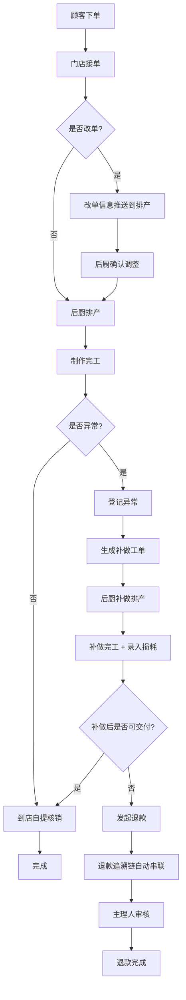

## 1. 产品概述

手作烘焙坊到店自提与异常补做工作面——将接单、排产、自提核销、异常补做、退款追溯统一在同一条链路里，让门店主理人、后厨负责人、客服各角色在同一条工作面上看到自己该处理的那一段，不用跳转页面即可完成处理与回看。

- 解决的核心问题：改单信息漏传、原料损耗无人复盘、退款时找不到前因后果
- 目标用户：手作烘焙坊门店主理人、后厨负责人、客服

## 2. 核心功能

### 2.1 用户角色

| 角色 | 进入系统后默认视角 | 核心权限 |
|------|---------------------|----------|
| 门店主理人 | 全局概览 + 批量复核面板 | 审核改单、确认补做、发起退款、查看损耗复盘 |
| 后厨负责人 | 排产看板 + 补做工单 | 确认排产、标记完工、录入原料损耗 |
| 客服 | 自提核销 + 异常登记 | 核销自提、登记客诉/改单、追踪补做进度 |

### 2.2 功能模块

1. **工作面主页**：角色自适应工作台、批量复核面板、流程接力时间线
2. **订单与排产模块**：预订单管理、产能排期表、改单追踪
3. **自提与核销模块**：到店自提核销、取货状态流转
4. **异常补做模块**：异常登记、补做工单、原料损耗记录
5. **退款与复盘模块**：退款追溯链、损耗复盘报表

### 2.3 页面详情

| 页面名称 | 模块名称 | 功能描述 |
|-----------|-------------|---------------------|
| 工作面主页 | 角色工作台 | 根据当前角色显示待处理事项计数和快捷入口 |
| 工作面主页 | 批量复核面板 | 支持连续勾选、批量审核改单/补做/退款，不跳转页面 |
| 工作面主页 | 流程接力时间线 | 以订单为主轴展示接单→排产→自提/补做→完成/退款的完整链路 |
| 订单与排产 | 预订单管理 | 按日期/状态筛选预订单，展示改单标记 |
| 订单与排产 | 产能排期表 | 可视化后厨产能与已排产订单对照 |
| 订单与排产 | 改单追踪 | 改单信息自动关联到排产和补做，避免漏传 |
| 自提与核销 | 到店自提核销 | 扫码/手动核销，自动关联排产记录 |
| 异常补做 | 异常登记 | 客诉/品控异常登记，自动生成补做工单 |
| 异常补做 | 补做工单 | 补做排产、进度标记、原料损耗录入 |
| 退款与复盘 | 退款追溯链 | 退款关联原始订单→改单→异常→损耗，一键查看前因后果 |
| 退款与复盘 | 损耗复盘报表 | 按时段/品类聚合原料损耗数据 |

## 3. 核心流程

**正常流程**：顾客下单 → 门店接单 → 后厨排产 → 制作完工 → 到店自提核销 → 完成

**改单流程**：顾客改单 → 改单信息推送到排产（标记改单）→ 后厨确认调整 → 继续正常流程

**异常补做流程**：客诉/品控异常 → 登记异常（关联原订单）→ 生成补做工单 → 后厨补做排产 → 补做完工 → 重新核销或退款

**退款流程**：发起退款 → 自动追溯（原订单 + 改单记录 + 异常记录 + 损耗记录）→ 主理人审核 → 退款完成

## 4. 用户界面设计

### 4.1 设计风格

- 主色调：暖烘焙色系（焦糖棕 #A0522D、面粉白 #FAF6F1），强调色用橙红 #E85D3A 标记异常/待处理
- 辅助色：深棕 #3E2723 用于文字，浅灰 #E8E0D8 用于分隔
- 按钮风格：圆角微弧（rounded-lg），主操作实色填充，次操作线框
- 字体：Noto Sans SC 为主，数字和金额用 DM Mono 等宽字体
- 布局：左侧窄导航 + 右侧主工作面，桌面优先
- 图标：Lucide Vue 图标库

### 4.2 页面设计概览

| 页面名称 | 模块名称 | UI 要素 |
|-----------|-------------|-------------|
| 工作面主页 | 角色工作台 | 顶部角色切换标签，卡片式待办计数，暖色背景 |
| 工作面主页 | 批量复核面板 | 右侧抽屉式面板，可连续勾选行项，底部操作栏固定 |
| 工作面主页 | 流程接力时间线 | 纵向时间线，节点用色彩区分角色，当前环节高亮 |
| 订单与排产 | 预订单管理 | 表格布局，改单行标橙色边框 |
| 订单与排产 | 产能排期表 | 甘特图风格横条，产能线用虚线 |
| 自提与核销 | 到店自提核销 | 卡片列表，扫码核销按钮突出 |
| 异常补做 | 补做工单 | 卡片式工单，进度条 + 损耗标记 |
| 退款与复盘 | 退款追溯链 | 折叠式追溯卡片，从退款回溯到订单 |

### 4.3 响应式

桌面优先设计，最小宽度 1280px。在 1024-1280px 之间收窄侧边栏。暂不支持移动端独立适配。

### 4.4 设计理念

工作面=同一条链路不跳转。所有操作围绕订单主轴展开，改单、补做、退款都是同一链条上的分叉，通过批量复核面板实现连续处理，通过接力时间线实现跨角色回看。
