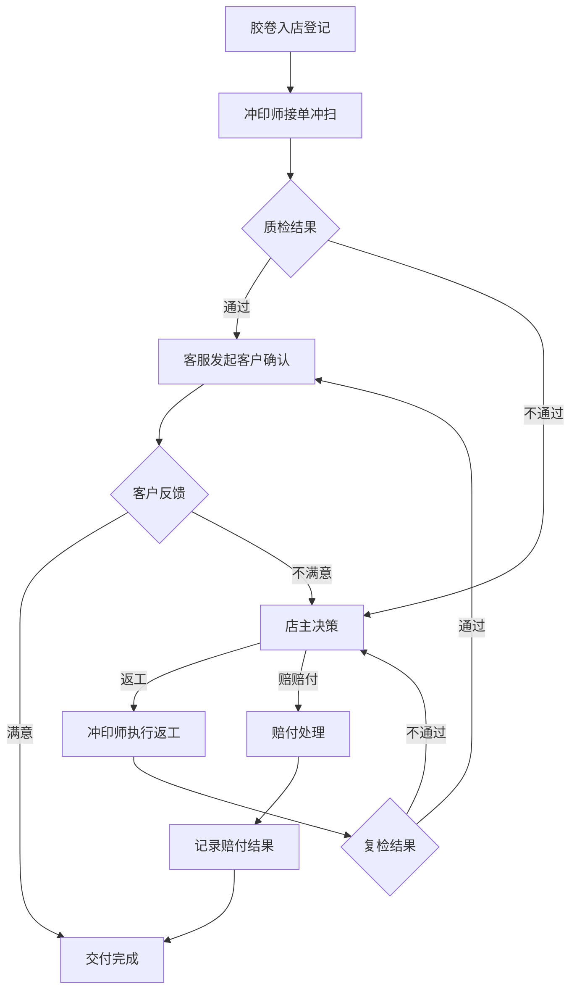

## 1. 产品概述

胶片冲印店全流程协作系统——解决胶卷登记散落在登记本、冲扫队列表和客户私信之间、质检返工和客户确认缺少可回看线索的痛点。以店主判断→冲印师执行→客服复核的协作链路为核心，将胶卷从入店到交付的每一步动作留痕，让"胶卷混号、交付版本错发、赔付时拿不出完整经过"等问题在发生时就能被追踪、处理时全程可回溯。

- 目标用户：小型胶片冲印店的店主、冲印师、客服
- 核心价值：统一入口、强提醒、完整历史，把"散"和"忘"从流程里消除

## 2. 核心功能

### 2.1 用户角色

| 角色 | 进入方式 | 核心权限 |
|------|----------|----------|
| 店主 | 登录选择店主身份 | 查看/操作所有胶卷、发起质检返工决定、审批赔付、查看全局日历 |
| 冲印师 | 登录选择冲印师身份 | 接收冲扫任务、更新冲扫进度、标记质检完成、发起返工备注 |
| 客服 | 登录选择客服身份 | 接收客户确认任务、发起客户沟通记录、标记客户确认完成、查看赔付记录 |

### 2.2 功能模块

1. **工作台**: 当日待办汇总、逾期预警、快捷入口
2. **胶卷登记与管理**: 胶卷入店登记、冲扫进度跟踪、状态流转
3. **质检返工流程**: 质检发现问题→返工决策→返工执行→复检→完成，全流程留痕
4. **客户确认**: 交付确认、问题沟通记录、赔付决策与记录
5. **联动日历视图**: 按日期展示胶卷处理动作时间线，可追溯每条动作链

### 2.3 页面详情

| 页面 | 模块 | 功能说明 |
|------|------|----------|
| 工作台 | 逾期预警卡 | 显示超过承诺时间未完成冲扫、未返工完成、未客户确认的胶卷，按紧急度排序 |
| 工作台 | 今日待办列表 | 按角色过滤：店主看到待决策项，冲印师看到待冲扫/待返工项，客服看到待确认项 |
| 工作台 | 最近动态流 | 全店最近的动作流，点击可跳转到对应胶卷详情 |
| 胶卷列表 | 筛选与搜索 | 按状态(登记/冲扫中/质检/返工/待确认/已完成)、客户名、胶卷编号搜索 |
| 胶卷列表 | 列表项 | 编号、客户、胶卷型号、当前状态、最近动作时间、逾期标记 |
| 胶卷详情 | 基本信息区 | 登记信息、胶卷型号、冲扫参数、客户联系方式 |
| 胶卷详情 | 状态时间线 | 从登记到交付的所有状态变更，含操作人、时间、备注 |
| 胶卷详情 | 质检返工区 | 质检问题描述、返工决定记录、返工执行记录、复检结果 |
| 胶卷详情 | 客户确认区 | 客户沟通记录、确认/拒签结果、赔付记录 |
| 质检返工面板 | 发起质检 | 冲印师标记质检结果（通过/不通过），不通过需填写问题描述和影响范围 |
| 质检返工面板 | 返工决策 | 店主决定：返工/赔赔付/特殊处理，记录决策理由 |
| 质检返工面板 | 返工执行 | 冲印师执行返工，记录返工操作内容和结果 |
| 质检返工面板 | 复检 | 店主或指定人复检返工结果，标记通过/需再返工 |
| 客户确认面板 | 发送确认请求 | 客服发起客户确认，附带交付物说明 |
| 客户确认面板 | 记录客户反馈 | 客户满意/不满意/要求赔付，记录具体反馈内容 |
| 客户确认面板 | 赔付处理 | 店主审批赔付金额和方式，记录赔付结果 |
| 日历视图 | 日历网格 | 按月/周显示，每日格内显示该日发生的胶卷处理动作气泡 |
| 日历视图 | 动作详情抽屉 | 点击某日气泡，展开该日所有动作的时间线，可跳转胶卷详情 |
| 日历视图 | 连续处理链高亮 | 同一胶卷跨多日的处理动作用连线/同色标记，展示连续处理过程 |

## 3. 核心流程

### 3.1 正常流程（胶卷从登记到交付无问题）

胶卷入店登记 → 冲印师接单冲扫 → 冲扫完成质检通过 → 客服发起客户确认 → 客户确认满意 → 交付完成

### 3.2 问题流程（质检不通过触发返工）

胶卷入店登记 → 冲印师接单冲扫 → 冲扫完成质检不通过(记录问题) → 店主决策返工 → 冲印师执行返工 → 复检通过 → 客服发起客户确认 → 客户确认 → 交付完成

### 3.3 赔付流程（客户要求赔付）

客服发起客户确认 → 客户不满意/发现问题(如胶卷混号/版本错发) → 店主审批赔付 → 记录赔付结果 → 关闭

## 4. 用户界面设计

### 4.1 设计风格

- **主色调**: 暖灰色底 (#F5F0EB) + 胶片琥珀色强调 (#C4813D)，暗色模式下用深灰 (#1A1A1A) + 琥珀色
- **按钮风格**: 圆角8px，主操作用琥珀色实底，次操作用描边，危险操作用暖红色
- **字体**: 标题用 Noto Serif SC (衬线体，呼应胶片的经典感)，正文用 Noto Sans SC
- **布局**: 左侧固定导航 + 右侧内容区，卡片式布局，圆角12px
- **图标风格**: Lucide 图标，线宽1.5px，保持与文字大小的协调

### 4.2 页面设计概览

| 页面 | 模块 | UI要素 |
|------|------|--------|
| 工作台 | 逾期预警卡 | 红色左边框卡片，显示胶卷编号+逾期天数+当前卡点，悬停放大 |
| 工作台 | 今日待办 | 分组卡片，按角色tab切换，每项含状态徽章和快捷操作按钮 |
| 工作台 | 最近动态 | 垂直时间线，节点用不同颜色标记动作类型，悬停展开详情 |
| 胶卷列表 | 列表 | 表格+卡片视图切换，状态用彩色圆点标识，支持排序和筛选 |
| 胶卷详情 | 时间线 | 左侧垂直时间线，每个节点含操作人头像、时间、动作描述、备注 |
| 胶卷详情 | 质检返工区 | 步骤条(1-2-3-4) + 当前步骤展开表单，历史步骤只读展示 |
| 日历视图 | 日历网格 | 月历布局，动作气泡用颜色区分类型(冲扫/质检/返工/确认)，同胶卷同色 |
| 日历视图 | 动作抽屉 | 右侧滑出面板，按时间排列动作，含跳转链接 |

### 4.3 响应式

- 桌面优先设计，最小宽度1024px
- 1024-1280px：侧边导航收缩为图标模式
- 1280px+：完整侧边导航 + 内容区

### 4.4 动效

- 页面切换：淡入 + 微上移 (150ms)
- 卡片悬停：微上移 + 阴影加深 (200ms)
- 时间线节点：依次淡入 (stagger 50ms)
- 日历气泡：点击后展开动效 (300ms ease-out)
- 状态变更：颜色渐变过渡 (300ms)
