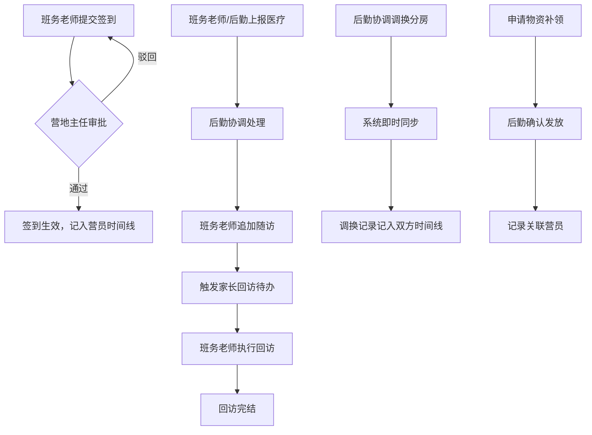

## 1. 产品概述

游学营地导师考勤与家长回访系统——解决营员信息、活动签到、医疗上报无法串联的协作断裂问题。面向营地主任、班务老师、后勤协调三类角色，提供从考勤签到到家长回访的全链路可回看操作台，替代散落在报名表、分房表和微信群中的碎片信息流。

- 目标用户：游学/夏令营运营团队（10-30人协作场景）
- 核心价值：把"缺一条能回看的线"变成一条可在任何节点介入、审批、追踪的操作线

## 2. 核心功能

### 2.1 用户角色

| 角色 | 登录方式 | 核心权限 |
|------|----------|----------|
| 营地主任 | 账号密码登录 | 全部模块读写、审批（考勤/医疗）、驳回、回查 |
| 班务老师 | 账号密码登录 | 考勤录入与修改、营员管理、家长回访、医疗上报 |
| 后勤协调 | 账号密码登录 | 分房管理与同步、物资补领记录、医疗处理完结 |

### 2.2 功能模块

1. **仪表盘**：待处理/已驳回/需回查三类计数卡、最新动态时间线、快捷入口
2. **营员管理**：营员列表 + 双栏详情台，含基本信息、时间线（签到-医疗-回访串联）、快捷动作
3. **考勤签到**：签到记录列表 + 审批流，班务老师提交→营地主任审批/驳回
4. **医疗上报**：上报记录 + 处理流，班务老师/后勤上报→后勤完结→班务老师追加随访
5. **分房管理**：房间列表 + 营员分配/调换，改动即时同步，防止信息不同步
6. **物资补领**：补领申请 + 完结确认，后勤操作有据可查
7. **家长回访**：回访记录列表 + 完结标记，避免回访拖延无人追踪

### 2.3 页面详情

| 页面 | 模块 | 功能说明 |
|------|------|----------|
| 仪表盘 | 统计卡片 | 待处理/已驳回/需回查计数，点击跳转对应列表 |
| 仪表盘 | 动态时间线 | 最近20条操作记录（谁在什么时间做了什么） |
| 仪表盘 | 快捷入口 | 各模块待处理数量与跳转按钮 |
| 营员管理 | 列表栏 | 搜索、按班组/状态筛选，点击即切换右侧详情 |
| 营员管理 | 详情栏 | 基本信息卡 + 时间线 + 关联记录（考勤/医疗/回访），动作按钮直达 |
| 考勤签到 | 列表+详情 | 按日期/班组筛选，提交签到、审批/驳回操作 |
| 医疗上报 | 列表+详情 | 上报、处理完结、追加随访，状态流转清晰 |
| 分房管理 | 列表+详情 | 房间布局、营员分配/调换、同步状态 |
| 物资补领 | 列表+详情 | 补领申请、完结确认 |
| 家长回访 | 列表+详情 | 创建回访、编辑内容、标记完结 |

## 3. 核心流程

### 3.1 考勤审批流
班务老师提交签到记录 → 营地主任审批通过/驳回 → 驳回则班务老师修改后重新提交

### 3.2 医疗处理流
班务老师/后勤上报医疗事件 → 后勤协调处理完结 → 班务老师追加随访记录 → 触发家长回访待办

### 3.3 分房调换流
后勤协调发起调换 → 系统即时同步双方房间信息 → 调换记录记入营员时间线

### 3.4 物资补领流
任意角色申请补领 → 后勤协调确认发放 → 记录关联到营员

### 3.5 家长回访流
医疗完结/考勤异常触发回访待办 → 班务老师执行回访 → 填写回访内容 → 标记完结

## 4. 用户界面设计

### 4.1 设计风格
- 主色调：深青色 (#0F766E) + 琥珀色强调 (#D97706)
- 辅助色：石板灰 (#334155) 用于文本，浅灰 (#F1F5F9) 用于背景
- 按钮风格：圆角8px，主操作实色填充，次操作描边
- 字体：Noto Sans SC（正文）+ DM Sans（数字/英文）
- 布局风格：左侧固定导航 + 主区域双栏（列表40% + 详情60%）
- 图标风格：Lucide线性图标

### 4.2 页面设计概览

| 页面 | 模块 | UI元素 |
|------|------|--------|
| 仪表盘 | 统计卡片 | 3张计数卡（待处理/已驳回/需回查），数字加粗放大，背景渐变 |
| 仪表盘 | 动态时间线 | 竖向时间线，每条含头像、操作描述、时间戳 |
| 仪表盘 | 快捷入口 | 6个图标按钮网格，角标显示待处理数 |
| 列表+详情 | 列表栏 | 搜索框 + 筛选标签 + 可滚动列表项，选中项高亮 |
| 列表+详情 | 详情栏 | 顶部信息卡 + 中部Tab切换（时间线/关联记录）+ 底部动作栏 |
| 登录页 | 登录表单 | 居中卡片，营地名+账号密码输入+角色选择 |

### 4.3 响应式设计
- 桌面优先（1280px+），双栏并排
- 平板（768-1279px），双栏变上下排列
- 手机（<768px），单栏，点击列表项跳转详情页

### 4.4 关键交互
- 列表项点击：右侧详情即时刷新，无需页面跳转
- 动作按钮（审批/驳回/完结）：行内弹出行内确认，操作后列表自动刷新
- 分房拖拽：支持拖拽调换营员房间
- 状态标签：颜色区分（待处理-琥珀/已通过-绿/已驳回-红/已完结-灰）
