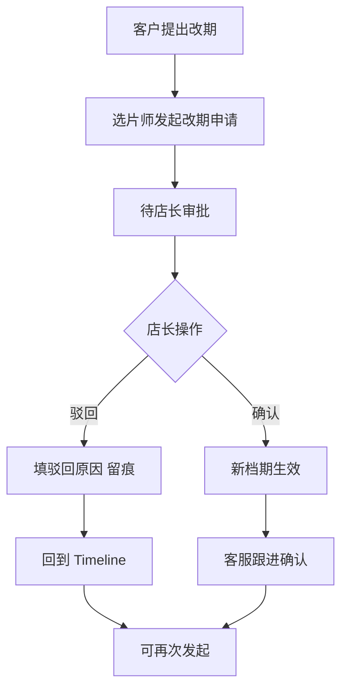
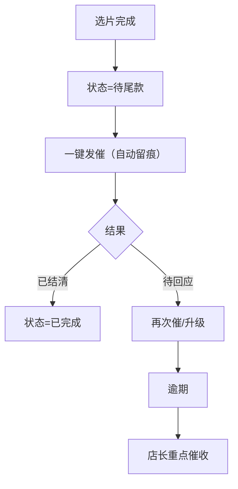

# 《婚纱影楼-尾款催收与改期协商》产品需求文档（PRD）

## 1. 产品概述
面向婚纱影楼门店店长、选片师、客服管家的内部协作系统，围绕"尾款催收"与"档期改期协商"两条主线，把散落在档期表、修片群、聊天记录里的碎片信息沉淀成可回看的留痕链路。
- 解决的核心痛点：改期遗漏、修片版本混乱、客诉来临时缺乏可回溯证据；入口分散、提醒弱、历史难找。
- 价值：用一条"线索 Timeline"把状态变化、责任人、备注串起来，让追问时"翻聊天记录"这件事变成系统内 5 秒可答。

## 2. 核心功能

### 2.1 用户角色
| 角色 | 登录方式 | 核心权限 |
| --- | --- | --- |
| 门店店长 | 账号选择进入 | 查看全部订单、驳回改期申请、升级催收等级、备注 |
| 选片师 | 账号选择进入 | 提交选片完成、登记修片版本、催尾款、发起改期申请、备注 |
| 客服管家 | 账号选择进入 | 跟进客户沟通、确认改期结果、登记催收结果、备注 |

所有角色均可：在同一条订单线索下添加备注、查看历史 Timeline、切换日历/列表视图。

### 2.2 功能模块
1. **联动日历视图（首页）**：按天展示订单档期、改期中、修片完成待尾款、逾期催收等状态；点击日期进入当天的订单 Timeline。
2. **订单线索页（Timeline）**：以时间倒序展示：状态切换、改期申请/驳回/确认、催收提醒、修片版本登记、所有备注；责任人、时间戳不可改。
3. **改期协商面板**：发起改期（选片师/客服）→ 店长驳回/确认 → 新档期生效，全链路留痕。
4. **尾款催收面板**：一键发催（自动留痕）、标记"已沟通/待回应/已结清/逾期"、升级到店长。
5. **角色切换器**：顶部显式切换当前角色，权限即时生效，演示用。

### 2.3 页面详细
| 页面名称 | 模块名称 | 功能描述 |
| --- | --- | --- |
| 联动日历视图 | 日历网格 | 按状态色块展示档期，支持按状态/角色筛选，周/月切换 |
| 联动日历视图 | 右侧详情抽屉 | 展示当日订单列表、点击进入 Timeline |
| 订单线索页 | Timeline 流 | 时间倒序：状态切换、改期、催收、修片、备注 |
| 订单线索页 | 改期协商卡 | 展示当前/建议档期、审批流与责任人 |
| 订单线索页 | 催收卡 | 展示催收等级、最近一次催款、结果、是否逾期 |
| 订单线索页 | 备注区 | 富文本备注，自动记录角色与时间，支持 @角色 |
| 全局头部 | 角色切换器 | 下拉切换：店长/选片师/客服管家，权限即时变化 |

## 3. 核心流程

### 3.1 改期协商流程
客户提出改期 → 选片师在系统发起改期申请（填原因、建议新档期、备注）→ 店长收到提醒 → 店长驳回（填原因）或确认 → 确认后新档期生效并写入 Timeline → 客服管家跟进客户确认。

### 3.2 尾款催收流程
选片完成 → 系统标为"待尾款" → 选片师/客服一键发催（留痕）→ 标记"已沟通/待回应"→ 未结清自动升级逾期 → 店长可升级为"重点催收"→ 结清后状态切换为"已完成"。

## 4. 用户界面设计

### 4.1 设计风格
- 主色：暖金 `#C5A267`（影楼质感）、深墨 `#1A1D23`（稳重）、辅色青灰 `#6B7A89`。
- 强调色：逾期警示红 `#D64545`、进行中蓝 `#3B82F6`、完成绿 `#22C55E`。
- 按钮：扁平带轻投影，圆角 8px；关键操作带金色描边。
- 字体：中文显示用 "Noto Serif SC"，正文 "PingFang SC"；数字日期用 "SF Mono" 等宽。
- 布局：左侧日历主区 70% + 右侧订单 Timeline 抽屉 30%，可全屏展开。
- 图标：线性风格，搭配状态色块圆点。

### 4.2 页面设计概览
| 页面 | 模块 | UI 要点 |
| --- | --- | --- |
| 联动日历视图 | 日历网格 | 深色底 + 金色周标题；日期格内用色块条表示档期状态；hover 出迷你 Timeline 预览 |
| 联动日历视图 | 顶部筛选条 | 角色、状态、客户名/订单号搜索；胶囊标签 |
| 订单线索页 | Timeline 流 | 左轴金色时间线，节点用角色头像；支持按类型过滤（改期/催收/修片/备注） |
| 订单线索页 | 状态徽章 | 胶囊形徽章，色随状态；右上角小标注"逾期 N 天" |
| 全局头部 | 角色切换器 | 右侧下拉，切换时顶部状态条变化，权限变化即时体现 |

### 4.3 响应式
桌面端优先，最小宽度 1200px；1200px 以下日历与抽屉垂直堆叠；不做移动端。
