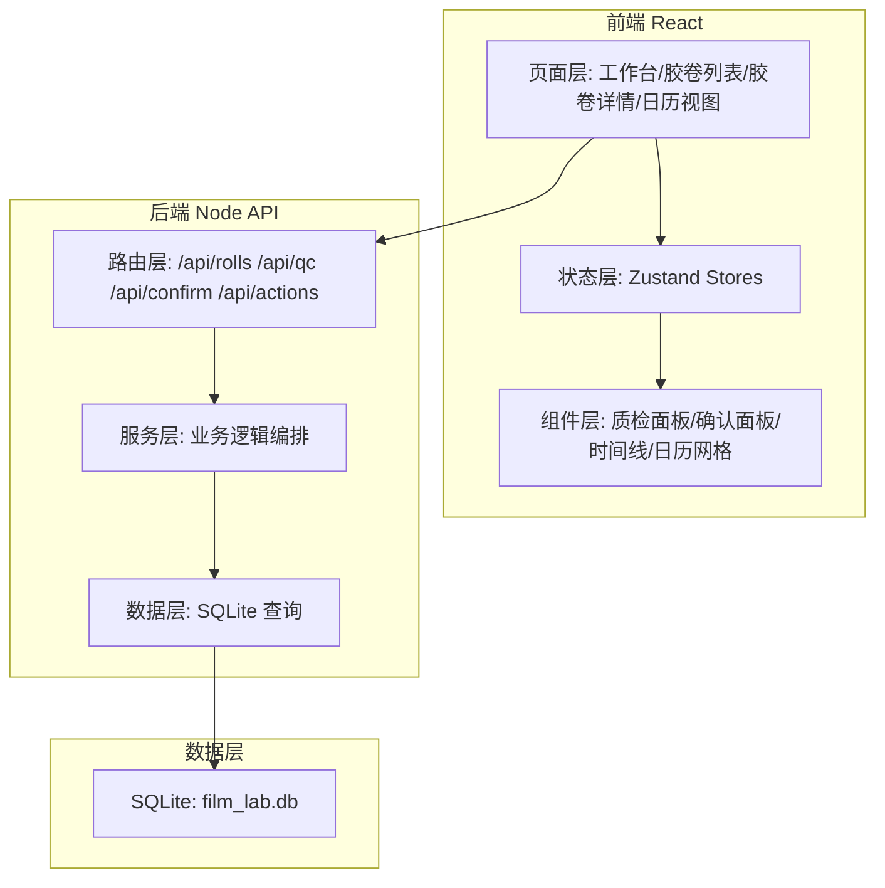
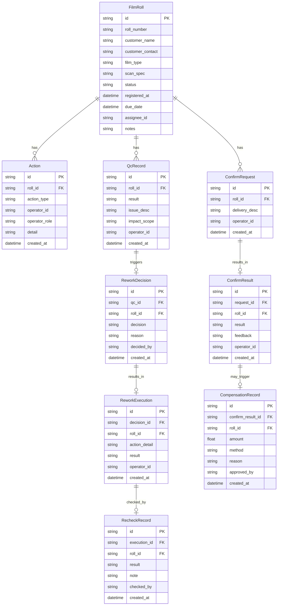

## 1. 架构设计



## 2. 技术说明

- 前端: React@18 + TypeScript + TailwindCSS@3 + Vite
- 状态管理: Zustand
- 后端: Express@4 + TypeScript (ESM)
- 数据库: SQLite (better-sqlite3)，轻量单文件，无需额外服务
- 初始化工具: vite-init (react-express-ts 模板)

## 3. 路由定义

| 路由 | 用途 |
|------|------|
| / | 工作台首页 |
| /rolls | 胶卷列表 |
| /rolls/:id | 胶卷详情 (含质检返工、客户确认) |
| /calendar | 联动日历视图 |

## 4. API 定义

### 4.1 胶卷相关

```typescript
interface FilmRoll {
  id: string
  roll_number: string
  customer_name: string
  customer_contact: string
  film_type: string
  scan_spec: string
  status: "registered" | "developing" | "qc_pending" | "qc_failed" | "reworking" | "recheck" | "confirming" | "compensating" | "completed"
  registered_at: string
  due_date: string
  assignee_id: string | null
  notes: string
}

GET    /api/rolls           → FilmRoll[]
GET    /api/rolls/:id       → FilmRoll & { actions: Action[], qc: QcRecord[], confirm: ConfirmRecord[] }
POST   /api/rolls           → FilmRoll
PATCH  /api/rolls/:id       → FilmRoll
```

### 4.2 动作记录

```typescript
interface Action {
  id: string
  roll_id: string
  action_type: "register" | "assign" | "develop_start" | "develop_complete" | "qc_pass" | "qc_fail" | "rework_decide" | "rework_execute" | "recheck_pass" | "recheck_fail" | "confirm_request" | "confirm_pass" | "confirm_fail" | "compensate_decide" | "compensate_complete" | "complete"
  operator_id: string
  operator_role: "owner" | "developer" | "cs"
  detail: string
  created_at: string
}

GET    /api/actions?roll_id=&date=   → Action[]
POST   /api/actions                   → Action
```

### 4.3 质检返工

```typescript
interface QcRecord {
  id: string
  roll_id: string
  result: "pass" | "fail"
  issue_desc: string
  impact_scope: string
  operator_id: string
  created_at: string
}

interface ReworkDecision {
  id: string
  qc_id: string
  roll_id: string
  decision: "rework" | "compensate" | "special"
  reason: string
  decided_by: string
  created_at: string
}

interface ReworkExecution {
  id: string
  decision_id: string
  roll_id: string
  action_detail: string
  result: "success" | "partial" | "failed"
  operator_id: string
  created_at: string
}

interface RecheckRecord {
  id: string
  execution_id: string
  roll_id: string
  result: "pass" | "fail"
  note: string
  checked_by: string
  created_at: string
}

POST   /api/qc                        → QcRecord
POST   /api/rework/decision           → ReworkDecision
POST   /api/rework/execution          → ReworkExecution
POST   /api/rework/recheck            → RecheckRecord
```

### 4.4 客户确认

```typescript
interface ConfirmRequest {
  id: string
  roll_id: string
  delivery_desc: string
  operator_id: string
  created_at: string
}

interface ConfirmResult {
  id: string
  request_id: string
  roll_id: string
  result: "satisfied" | "unsatisfied" | "compensate_required"
  feedback: string
  operator_id: string
  created_at: string
}

interface CompensationRecord {
  id: string
  confirm_result_id: string
  roll_id: string
  amount: number
  method: string
  reason: string
  approved_by: string
  created_at: string
}

POST   /api/confirm/request           → ConfirmRequest
POST   /api/confirm/result            → ConfirmResult
POST   /api/confirm/compensate        → CompensationRecord
```

### 4.5 日历数据

```typescript
interface CalendarDay {
  date: string
  actions: Action[]
  roll_ids: string[]
}

GET    /api/calendar?year=&month=     → CalendarDay[]
```

## 5. 服务端架构图


## 6. 数据模型

### 6.1 数据模型定义



### 6.2 数据定义语言

```sql
CREATE TABLE film_rolls (
  id TEXT PRIMARY KEY,
  roll_number TEXT NOT NULL UNIQUE,
  customer_name TEXT NOT NULL,
  customer_contact TEXT NOT NULL,
  film_type TEXT NOT NULL,
  scan_spec TEXT NOT NULL DEFAULT '',
  status TEXT NOT NULL DEFAULT 'registered',
  registered_at TEXT NOT NULL,
  due_date TEXT NOT NULL,
  assignee_id TEXT,
  notes TEXT DEFAULT ''
);

CREATE TABLE actions (
  id TEXT PRIMARY KEY,
  roll_id TEXT NOT NULL REFERENCES film_rolls(id),
  action_type TEXT NOT NULL,
  operator_id TEXT NOT NULL,
  operator_role TEXT NOT NULL,
  detail TEXT DEFAULT '',
  created_at TEXT NOT NULL
);

CREATE INDEX idx_actions_roll ON actions(roll_id);
CREATE INDEX idx_actions_date ON actions(created_at);
CREATE INDEX idx_actions_type ON actions(action_type);

CREATE TABLE qc_records (
  id TEXT PRIMARY KEY,
  roll_id TEXT NOT NULL REFERENCES film_rolls(id),
  result TEXT NOT NULL,
  issue_desc TEXT DEFAULT '',
  impact_scope TEXT DEFAULT '',
  operator_id TEXT NOT NULL,
  created_at TEXT NOT NULL
);

CREATE TABLE rework_decisions (
  id TEXT PRIMARY KEY,
  qc_id TEXT NOT NULL REFERENCES qc_records(id),
  roll_id TEXT NOT NULL REFERENCES film_rolls(id),
  decision TEXT NOT NULL,
  reason TEXT DEFAULT '',
  decided_by TEXT NOT NULL,
  created_at TEXT NOT NULL
);

CREATE TABLE rework_executions (
  id TEXT PRIMARY KEY,
  decision_id TEXT NOT NULL REFERENCES rework_decisions(id),
  roll_id TEXT NOT NULL REFERENCES film_rolls(id),
  action_detail TEXT DEFAULT '',
  result TEXT NOT NULL,
  operator_id TEXT NOT NULL,
  created_at TEXT NOT NULL
);

CREATE TABLE recheck_records (
  id TEXT PRIMARY KEY,
  execution_id TEXT NOT NULL REFERENCES rework_executions(id),
  roll_id TEXT NOT NULL REFERENCES film_rolls(id),
  result TEXT NOT NULL,
  note TEXT DEFAULT '',
  checked_by TEXT NOT NULL,
  created_at TEXT NOT NULL
);

CREATE TABLE confirm_requests (
  id TEXT PRIMARY KEY,
  roll_id TEXT NOT NULL REFERENCES film_rolls(id),
  delivery_desc TEXT DEFAULT '',
  operator_id TEXT NOT NULL,
  created_at TEXT NOT NULL
);

CREATE TABLE confirm_results (
  id TEXT PRIMARY KEY,
  request_id TEXT NOT NULL REFERENCES confirm_requests(id),
  roll_id TEXT NOT NULL REFERENCES film_rolls(id),
  result TEXT NOT NULL,
  feedback TEXT DEFAULT '',
  operator_id TEXT NOT NULL,
  created_at TEXT NOT NULL
);

CREATE TABLE compensation_records (
  id TEXT PRIMARY KEY,
  confirm_result_id TEXT NOT NULL REFERENCES confirm_results(id),
  roll_id TEXT NOT NULL REFERENCES film_rolls(id),
  amount REAL NOT NULL,
  method TEXT NOT NULL,
  reason TEXT DEFAULT '',
  approved_by TEXT NOT NULL,
  created_at TEXT NOT NULL
);

CREATE INDEX idx_film_rolls_status ON film_rolls(status);
CREATE INDEX idx_film_rolls_due ON film_rolls(due_date);
```
