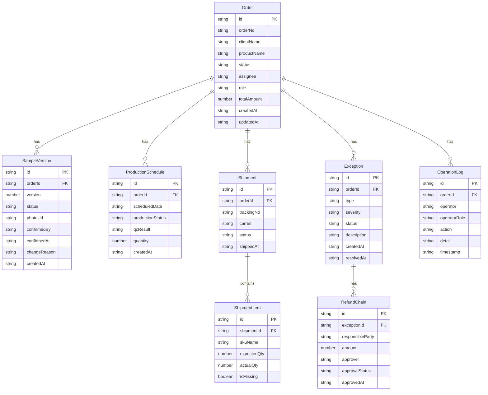

## 1. 架构设计

```mermaid
graph TB
    subgraph "前端层"
        "Vue 3 + Vite + TypeScript"
        "Pinia 状态管理"
        "Vue Router"
        "Tailwind CSS"
    end
    subgraph "数据层"
        "Mock 数据服务"
        "localStorage 持久化"
    end
    "Vue 3 + Vite + TypeScript" --> "Pinia 状态管理"
    "Pinia 状态管理" --> "Mock 数据服务"
    "Pinia 状态管理" --> "localStorage 持久化"
```

## 2. 技术说明

- 前端框架：Vue 3 + Vite + TypeScript
- 初始化工具：vite-init (vue-ts 模板)
- 状态管理：Pinia（Vue 3 官方推荐）
- 路由：Vue Router 4
- 样式：Tailwind CSS 3
- 后端：无（纯前端，Mock 数据 + localStorage 持久化）
- 数据库：无（使用 localStorage 做数据持久化，页面刷新不丢失）

## 3. 路由定义

| 路由 | 用途 |
|------|------|
| / | 工作台总览页，角色适配看板 |
| /order/:id | 订单详情页，打样确认+量产排期双轨视图 |
| /order/:id?exception=version | 订单详情页，自动打开版本覆盖异常抽屉 |
| /order/:id?exception=shipment | 订单详情页，自动打开拆单漏件异常抽屉 |
| /order/:id?exception=refund | 订单详情页，自动打开退款责任链异常抽屉 |

## 4. 数据模型

### 4.1 数据模型定义



### 4.2 状态机定义

**订单状态流转**：

```
draft(草稿) → quoting(报价中) → sampling(打样中) → sample_confirmed(样品确认) → version_locked(版本锁定) → scheduled(已排期) → producing(生产中) → qc_passed(质检通过) → shipping(发货中) → completed(已完成)
```

**异常状态**：任意阶段均可标记异常，异常处理后回到原阶段继续流转。

**异常类型枚举**：
- `version_overwrite`：版本覆盖
- `shipment_missing`：拆单漏件
- `refund_required`：退款处理

**严重程度**：
- `critical`：需立即处理（红色）
- `warning`：需关注（橙色）

## 5. 角色权限矩阵

| 功能 | 项目商务 | 打样跟单 | 仓配协调 |
|------|----------|----------|----------|
| 查看总览看板 | ✅ 全部订单 | ✅ 本人跟单 | ✅ 本人负责 |
| 创建报价单 | ✅ | ❌ | ❌ |
| 安排打样 | ❌ | ✅ | ❌ |
| 确认/锁定版本 | ❌ | ✅ | ❌ |
| 量产排期 | ❌ | ❌ | ✅ |
| 发货管理 | ❌ | ❌ | ✅ |
| 发起退款 | ✅ | ❌ | ❌ |
| 处理异常 | ✅ | ✅(打样类) | ✅(发货类) |
| 查看操作日志 | ✅ | ✅ | ✅ |

## 6. 刻意简化部分

以下功能在本次演示中做简化处理：
1. **用户认证**：不实现完整登录系统，通过页面顶部角色切换器模拟不同角色
2. **文件上传**：样品照片使用占位图而非真实上传
3. **通知推送**：不接入 WebSocket，异常预警通过页面内轮询模拟
4. **数据持久化**：使用 localStorage 而非后端数据库，数据在清除浏览器缓存后丢失
5. **权限控制**：仅做 UI 层面的按钮显隐，不做接口级鉴权
