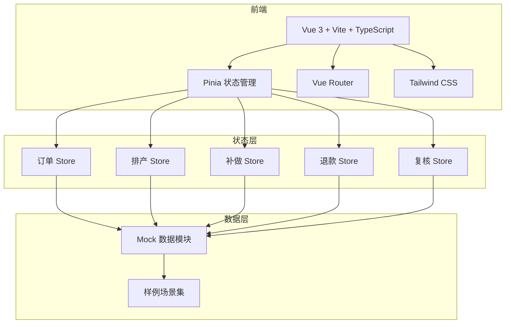
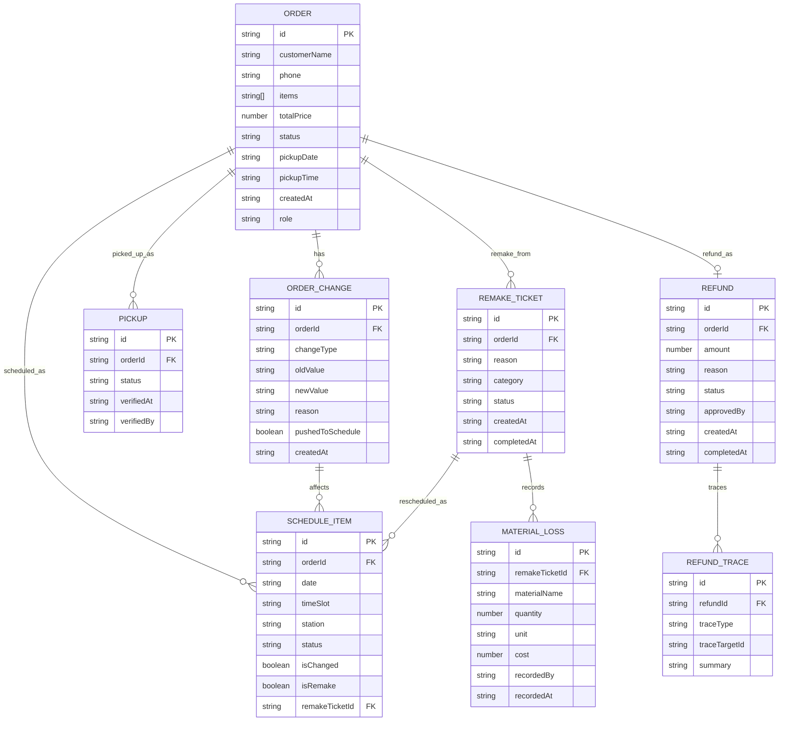

## 1. 架构设计



## 2. 技术说明

- 前端：Vue 3 + Vite + TypeScript + Tailwind CSS
- 初始化工具：vite-init（vue-ts 模板）
- 状态管理：Pinia（Vue 3 官方推荐）
- 路由：Vue Router 4
- 后端：无（纯前端 + Mock 数据）
- 数据库：无（内存数据 + localStorage 持久化）

## 3. 路由定义

| 路由 | 用途 |
|-------|---------|
| / | 工作面主页，角色自适应工作台 |
| /orders | 预订单管理 + 改单追踪 |
| /schedule | 产能排期表 |
| /pickup | 到店自提核销 |
| /remake | 异常补做工单 |
| /refund | 退款追溯 + 损耗复盘 |

## 4. 数据模型

### 4.1 数据模型定义



### 4.2 状态流转定义

**订单状态**：pending → confirmed → scheduled → producing → completed | exception
**自提状态**：waiting → notified → verified → completed
**补做工单状态**：open → scheduled → producing → completed → closed
**退款状态**：requested → tracing → approved → completed | rejected

## 5. 项目目录结构

```
src/
├── stores/           # Pinia stores
│   ├── order.ts
│   ├── schedule.ts
│   ├── remake.ts
│   ├── refund.ts
│   └── review.ts
├── composables/      # 可复用组合式函数
│   ├── useRole.ts
│   └── useFlowLink.ts
├── components/       # 通用组件
│   ├── BatchReviewPanel.vue
│   ├── FlowTimeline.vue
│   ├── RoleHeader.vue
│   ├── StatusBadge.vue
│   └── TraceCard.vue
├── pages/            # 页面组件
│   ├── Workspace.vue
│   ├── Orders.vue
│   ├── ScheduleBoard.vue
│   ├── Pickup.vue
│   ├── Remake.vue
│   └── Refund.vue
├── data/             # Mock 数据与样例
│   ├── mockOrders.ts
│   ├── mockSchedules.ts
│   ├── mockRemakes.ts
│   ├── mockRefunds.ts
│   └── scenarios.ts
├── types/            # TypeScript 类型定义
│   └── index.ts
├── router/
│   └── index.ts
├── App.vue
└── main.ts
```
