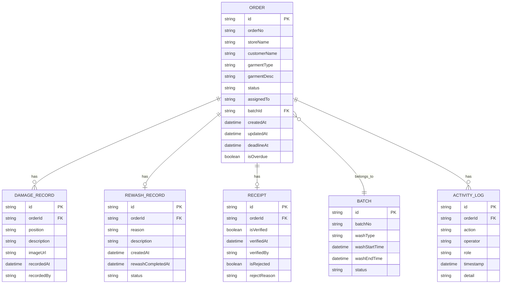

## 1. 架构设计

```mermaid
graph TB
    subgraph "前端应用"
        "React SPA" --> "路由层(React Router)"
        "路由层(React Router)" --> "页面组件"
        "页面组件" --> "业务组件"
        "业务组件" --> "状态管理(Zustand)"
        "状态管理(Zustand)" --> "Mock 数据层"
    end
    subgraph "页面组件"
        "首页仪表盘"
        "订单流水线"
        "批次追踪"
    end
    subgraph "业务组件"
        "侧边处理台"
        "数据卡片"
        "看板列"
        "预警条"
    end
    subgraph "Mock 数据层"
        "订单数据"
        "批次数据"
        "污损记录"
        "返洗记录"
    end
```

## 2. 技术说明

- **前端**：React@18 + TypeScript + TailwindCSS@3 + Vite
- **初始化工具**：Vite (react-ts 模板)
- **后端**：无（纯前端 Mock 数据演示）
- **数据库**：无（使用 localStorage + 内存 Mock 数据）
- **状态管理**：Zustand（轻量、无 Provider）
- **路由**：React Router v6
- **图标**：Lucide React
- **动效**：Framer Motion
- **字体**：Noto Sans SC + JetBrains Mono

## 3. 路由定义

| 路由 | 用途 |
|------|------|
| `/` | 首页仪表盘，按角色显示待处理/已驳回/需回查 |
| `/pipeline` | 订单流水线看板视图 |
| `/batch` | 批次追踪页面 |
| `/batch/:batchId` | 批次详情页 |

## 4. 数据模型

### 4.1 数据模型定义



### 4.2 数据定义

**Order 状态枚举**：
- `collected` - 已收衣
- `sorting` - 分拣中
- `washing` - 洗涤中
- `inspecting` - 质检中
- `handover` - 待交接
- `verifying` - 核验中
- `completed` - 已完成
- `rejected` - 已驳回
- `rewashing` - 返洗中
- `damage_claim` - 污损赔付中

**角色枚举**：
- `factory_manager` - 厂长
- `inspector` - 质检员
- `store_handler` - 门店交接

## 5. 项目结构

```
src/
├── main.tsx
├── App.tsx
├── index.css
├── types/
│   └── index.ts
├── store/
│   ├── useOrderStore.ts
│   ├── useBatchStore.ts
│   └── useRoleStore.ts
├── data/
│   └── mockData.ts
├── components/
│   ├── Layout/
│   │   ├── Sidebar.tsx
│   │   ├── Header.tsx
│   │   └── MainLayout.tsx
│   ├── Dashboard/
│   │   ├── StatCards.tsx
│   │   ├── OverdueAlert.tsx
│   │   ├── TodayTasks.tsx
│   │   └── RecentActivity.tsx
│   ├── Pipeline/
│   │   ├── PipelineBoard.tsx
│   │   ├── PipelineColumn.tsx
│   │   └── OrderCard.tsx
│   ├── ProcessingDesk/
│   │   ├── ProcessingPanel.tsx
│   │   ├── DamageRecorder.tsx
│   │   ├── RewashForm.tsx
│   │   └── HandoverVerify.tsx
│   ├── Batch/
│   │   ├── BatchList.tsx
│   │   └── BatchDetail.tsx
│   └── RoleSwitcher.tsx
├── pages/
│   ├── DashboardPage.tsx
│   ├── PipelinePage.tsx
│   └── BatchPage.tsx
└── utils/
    └── helpers.ts
```
