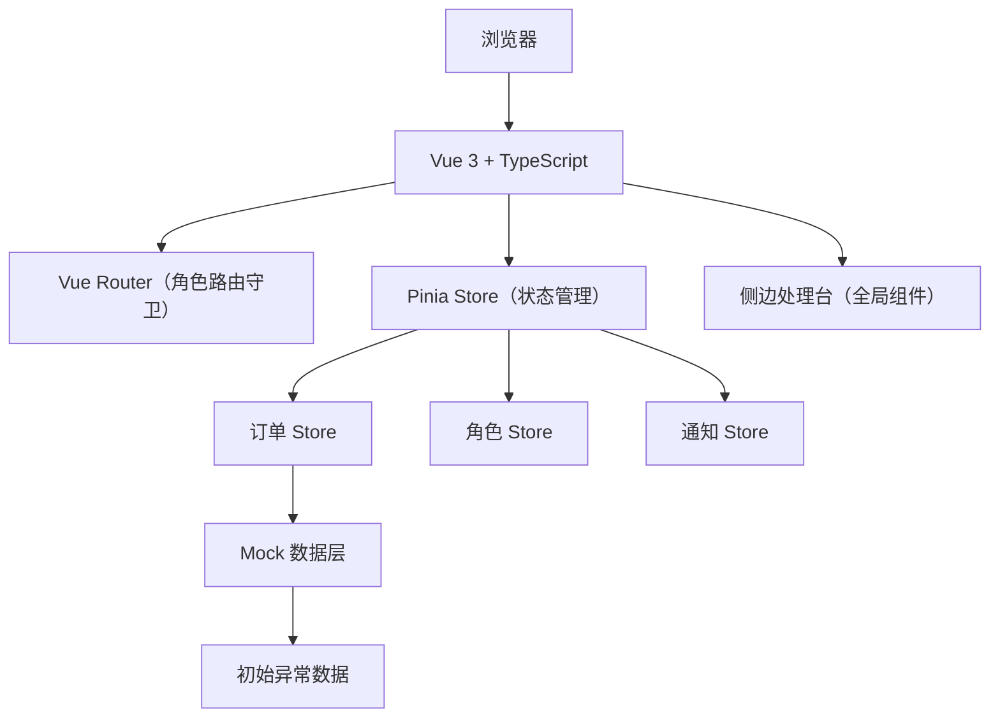
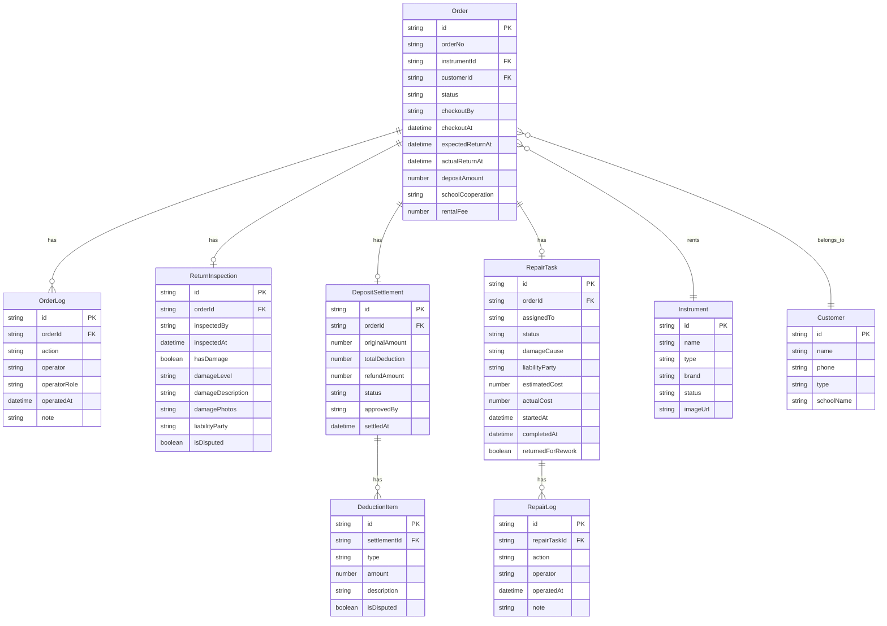

## 1. 架构设计

纯前端 Vue + TypeScript 项目，使用 Mock 数据模拟后端。数据层使用 Pinia 状态管理，所有订单数据、操作日志在内存中维护，刷新后重置为初始 Mock 数据。



## 2. 技术说明

- **前端**：Vue 3 + TypeScript + Vite
- **样式**：Tailwind CSS 3
- **路由**：Vue Router 4
- **状态管理**：Pinia
- **图标**：Lucide Vue Next
- **初始化工具**：vite-init (vue-ts 模板)
- **后端**：无（纯前端 Mock 数据）
- **数据库**：无（Pinia 内存状态）

## 3. 路由定义

| 路由 | 用途 | 角色权限 |
|------|------|----------|
| /login | 登录页，选择角色 | 全部 |
| /dashboard | 工作台，角色感知看板 | 全部（内容不同） |
| /orders | 订单链路追踪列表 | 全部 |
| /orders/:id | 订单链路详情 | 全部 |
| /checkout | 租出办理 | 顾问、老板 |
| /return | 归还验收列表 | 顾问、老板 |
| /return/:id | 归还验收详情 | 顾问、老板 |
| /repair | 维修管理看板 | 师傅、老板 |
| /deposit | 押金结算列表 | 老板 |
| /deposit/:id | 押金结算详情 | 老板 |

## 4. API 定义

无后端 API，所有数据通过 Pinia Store 的方法操作：

### 订单 Store 方法
- `fetchOrders()` - 获取订单列表
- `fetchOrderById(id)` - 获取订单详情
- `createOrder(data)` - 创建租出订单
- `processReturn(id, data)` - 处理归还验收
- `updateOrderStatus(id, status)` - 更新订单状态
- `addOrderLog(id, log)` - 添加操作日志

### 角色 Store 方法
- `login(role)` - 角色登录
- `logout()` - 登出
- `currentRole` - 当前角色（getter）

### 通知 Store 方法
- `fetchAlerts()` - 获取异常预警
- `dismissAlert(id)` - 忽略预警
- `addNotification(notif)` - 添加通知

## 5. 数据模型

### 5.1 数据模型定义



### 5.2 订单状态机

```
checkout_pending → checked_out → return_pending → inspecting → 
  → (无损坏) settling → completed
  → (有损坏) damage_assessing → repairing → repair_reviewing → 
    → (合格) settling → completed
    → (不合格) repairing (退回重修)
  → (争议) disputed → settling → completed
```

订单状态枚举：
- `checkout_pending` - 待租出
- `checked_out` - 已租出（使用中）
- `overdue` - 超时未还
- `return_pending` - 待归还
- `inspecting` - 验收中
- `damage_assessing` - 损坏判定中
- `repairing` - 维修中
- `repair_reviewing` - 维修复检中
- `settling` - 结算中
- `disputed` - 争议中
- `completed` - 已完成

### 5.3 Mock 异常数据设计

刻意制造以下异常案例：

1. **ORD-2024-0015** - 超时 7 天未还的大提琴订单，学校客户，应触发超时预警
2. **ORD-2024-0018** - 归还时发现严重损坏（琴弓断裂），损坏等级"严重"，需要判责
3. **ORD-2024-0020** - 维修退回案例，首次维修后复检不合格退回重修
4. **ORD-2024-0022** - 押金争议订单，客户对损坏扣款有异议，进入争议流程
5. **ORD-2024-0025** - 学校合作批量订单，回款逾期，老板需跟进
6. **ORD-2024-0028** - 轻微损坏但客户拒不承认，需老板裁定
