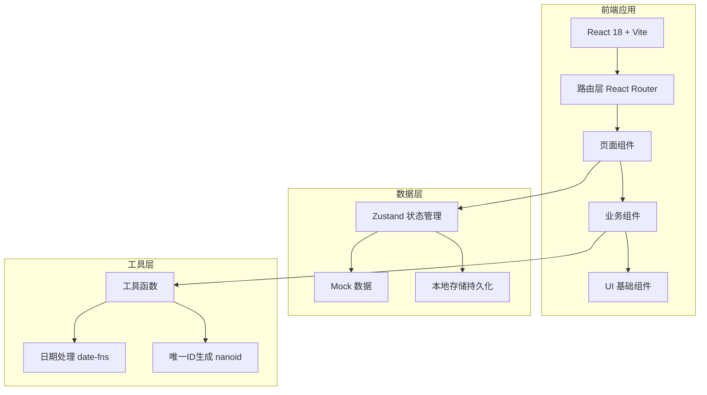
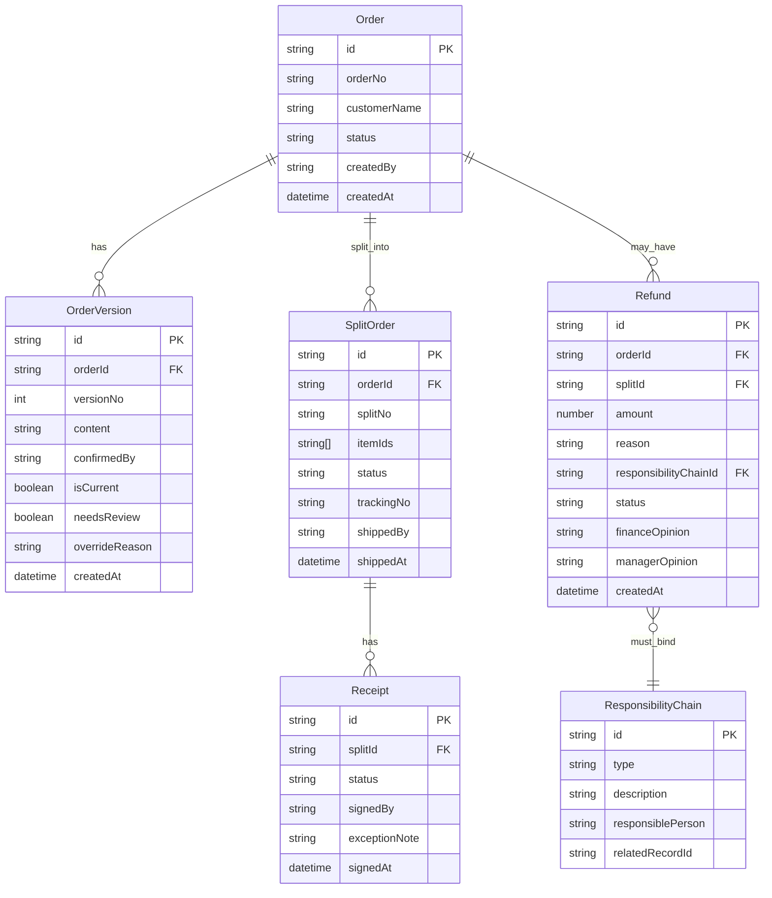

## 1. 架构设计



## 2. 技术说明

- 前端：React 18 + TypeScript + Tailwind CSS 3 + Vite
- 初始化工具：Vite (react-ts 模板)
- 状态管理：Zustand（轻量、无 boilerplate）
- 路由：React Router v6
- 后端：无，纯客户端，数据存储在 localStorage + Zustand
- 数据库：无，使用内存 Mock 数据 + localStorage 持久化

## 3. 路由定义

| 路由 | 用途 |
|------|------|
| / | 首页仪表盘，展示待处理/已驳回/需回查数据 |
| /orders | 订单列表页 |
| /orders/:id | 订单详情页，含版本时间线 |
| /split/:orderId | 发货拆单操作页 |
| /receipts | 回执汇总列表页 |
| /review | 回查面板，连续回查时间线 |
| /refunds | 退款处理列表页 |
| /refunds/new | 新建退款申请（含责任链绑定） |

## 4. API 定义

无后端 API，所有数据通过 Zustand store 管理。以下为数据操作接口：

```typescript
interface OrderStore {
  orders: Order[]
  addOrder: (order: Omit<Order, 'id' | 'createdAt' | 'versions'>) => void
  updateOrder: (id: string, patch: Partial<Order>) => void
  addVersion: (orderId: string, version: Omit<OrderVersion, 'id' | 'createdAt'>) => void
}

interface SplitStore {
  splits: SplitOrder[]
  createSplit: (orderId: string, items: SplitItem[]) => void
  detectMissing: (orderId: string) => OrderItem[]
}

interface ReceiptStore {
  receipts: Receipt[]
  addReceipt: (splitId: string, receipt: Omit<Receipt, 'id' | 'createdAt'>) => void
}

interface RefundStore {
  refunds: Refund[]
  createRefund: (refund: Omit<Refund, 'id' | 'createdAt' | 'status'>) => void
  approveRefund: (id: string, level: 'finance' | 'manager', opinion: string) => void
}

interface RoleStore {
  currentRole: Role
  setRole: (role: Role) => void
}
```

## 5. 数据模型

### 5.1 数据模型定义



### 5.2 数据定义

所有数据存储在 Zustand store 中，通过 localStorage 持久化。初始化时注入演示数据，包含各状态下的订单、拆单、回执和退款记录。
