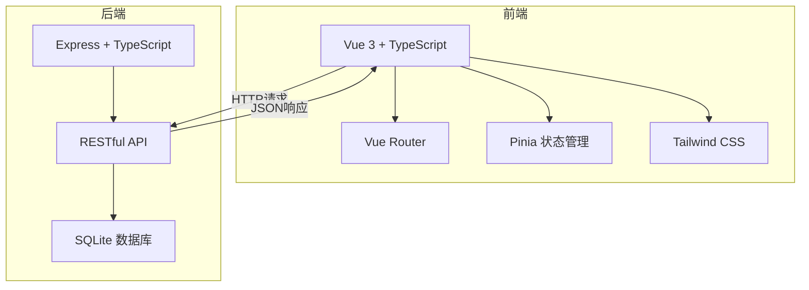
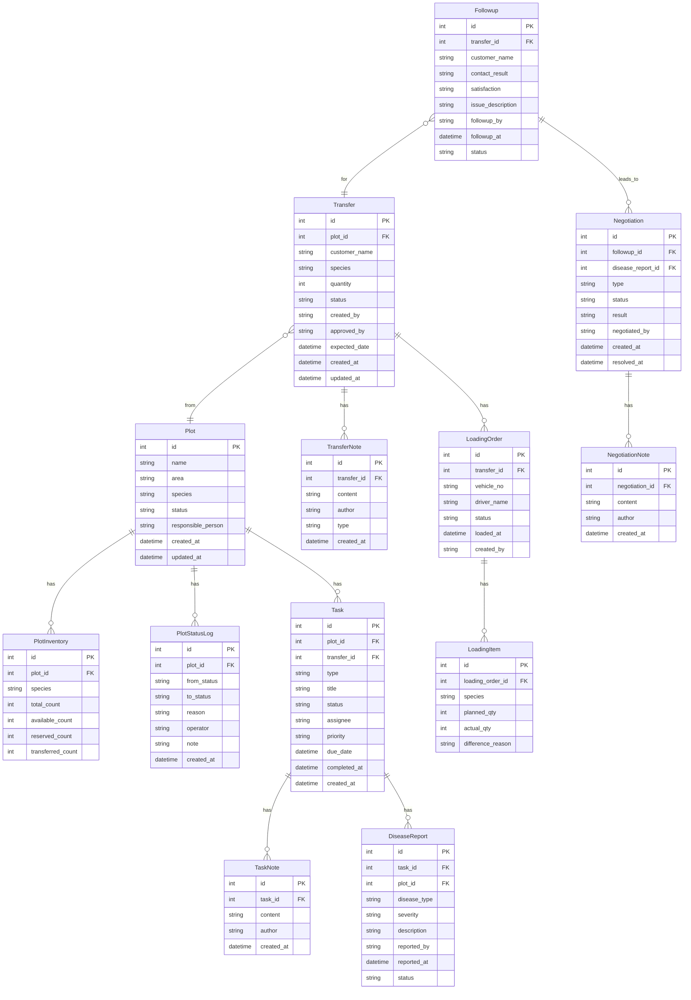

## 1. 架构设计



## 2. 技术说明

- **前端**：Vue 3 + TypeScript + Tailwind CSS + Vue Router + Pinia
- **初始化工具**：vite-init (vue-express-ts 模板)
- **后端**：Express 4 + TypeScript (ESM)
- **数据库**：SQLite (better-sqlite3)，演示数据内置
- **日期处理**：dayjs
- **图标库**：lucide-vue-next

## 3. 路由定义

| 路由 | 用途 |
|------|------|
| / | 仪表盘 - 总览与待办 |
| /plots | 地块库存列表 |
| /plots/:id | 地块详情 |
| /transfers | 调拨管理列表 |
| /transfers/:id | 调拨详情 |
| /operations | 作业中心（起苗+养护+病害） |
| /loading | 装车管理列表 |
| /loading/:id | 装车单详情 |
| /followup | 回访与协商 |
| /calendar | 联动日历视图 |

## 4. API 定义

### 4.1 地块 API

```
GET    /api/plots          - 获取地块列表（支持筛选）
GET    /api/plots/:id      - 获取地块详情（含库存、状态历史）
POST   /api/plots          - 创建地块
PUT    /api/plots/:id      - 更新地块
POST   /api/plots/:id/status - 变更地块状态（含备注和责任人）
```

### 4.2 调拨 API

```
GET    /api/transfers        - 获取调拨列表（支持状态筛选）
GET    /api/transfers/:id    - 获取调拨详情（含完整流程记录）
POST   /api/transfers        - 创建调拨单
PUT    /api/transfers/:id    - 更新调拨单
POST   /api/transfers/:id/approve - 审批调拨
POST   /api/transfers/:id/notes   - 添加备注
```

### 4.3 作业 API

```
GET    /api/tasks            - 获取任务列表（类型：lifting/maintenance/disease）
GET    /api/tasks/:id        - 获取任务详情
POST   /api/tasks            - 创建任务
PUT    /api/tasks/:id        - 更新任务
POST   /api/tasks/:id/status - 变更任务状态
POST   /api/tasks/:id/notes  - 添加备注
```

### 4.4 装车 API

```
GET    /api/loading-orders       - 获取装车单列表
GET    /api/loading-orders/:id   - 获取装车单详情
POST   /api/loading-orders       - 创建装车单
PUT    /api/loading-orders/:id   - 更新装车单
```

### 4.5 回访与协商 API

```
GET    /api/followups            - 获取回访列表
POST   /api/followups            - 创建回访记录
GET    /api/negotiations         - 获取协商列表
POST   /api/negotiations         - 创建协商
PUT    /api/negotiations/:id     - 更新协商
POST   /api/negotiations/:id/notes - 添加协商备注
```

### 4.6 日历 API

```
GET    /api/calendar?month=YYYY-MM&type=lifting,maintenance,loading - 获取日历事件
```

### 4.7 仪表盘 API

```
GET    /api/dashboard/stats      - 获取统计指标
GET    /api/dashboard/alerts     - 获取待办提醒
GET    /api/dashboard/activities - 获取近期动态
```

## 5. 服务器架构图


## 6. 数据模型

### 6.1 数据模型定义



### 6.2 数据定义

SQLite 建表语句在项目初始化后由后端服务自动创建，演示数据通过 seed 脚本写入，包含：
- 8 个地块（不同品种/状态/负责人）
- 6 笔调拨单（覆盖待审批→已完成全状态）
- 10+ 起苗/养护/病害任务
- 4 张装车单（含 2 张数量差异）
- 5 条回访记录（含 2 条需协商）
- 3 条补苗协商（含完整沟通记录）
- 每条记录均附带状态变更日志、备注和责任人信息
