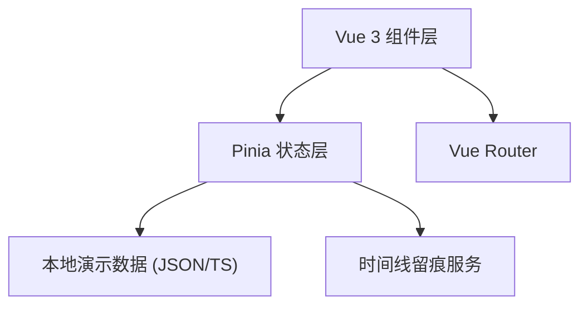
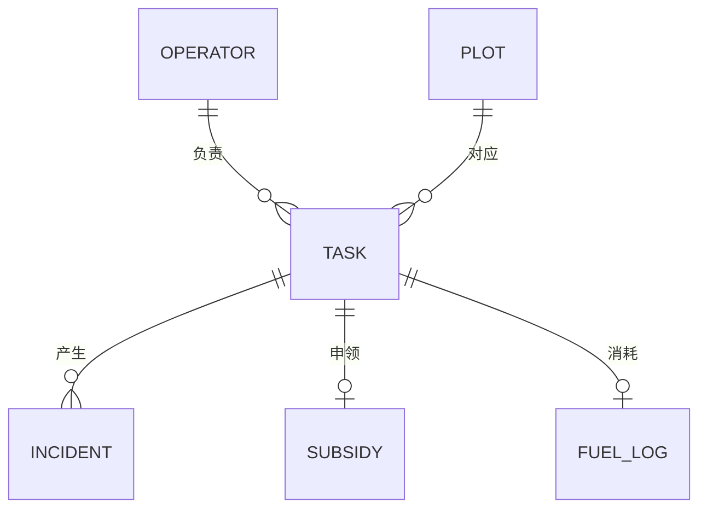

## 1. 架构设计


## 2. 技术说明
- 前端：Vue 3 + TypeScript + Vite 5
- 状态管理：Pinia
- 路由：Vue Router 4
- 样式：Tailwind CSS 3
- 图标：lucide-vue-next
- 构建：Vite（含 @vitejs/plugin-vue）
- 后端：无（纯前端演示，数据在 src/mock 内）
- 数据库：无（内存数据，刷新重置）

## 3. 路由定义
| 路由 | 用途 |
|------|------|
| /login | 演示账号登录（选择角色） |
| / | 首页概览（异常汇总、今日排班、待确认） |
| /bookings | 作业预约列表 |
| /bookings/new | 新建作业预约 |
| /schedules | 机手排班看板 |
| /tasks | 机手我的任务 |

## 4. 数据模型


## 5. 状态组织
- `useAuthStore`：当前角色、用户信息
- `useTaskStore`：作业预约与任务 CRUD、冲突检测
- `useOperatorStore`：机手与机具
- `useIncidentStore`：异常事件、处理留痕

## 6. 目录结构
```
src/
  components/     通用 UI 组件（卡片、计数、抽屉、时间线）
  views/          页面级组件（Overview / Bookings / Schedule / Tasks / Login）
  stores/         Pinia stores
  composables/    useRole、useTimeline
  mock/           演示数据（operator、plot、task、incident）
  types/          TypeScript 类型定义
  router/         路由定义
  App.vue
  main.ts
```

## 7. 测试账号
| 角色 | 账号 | 密码 |
|------|------|------|
| 理事 | director | 123456 |
| 调度员 | dispatcher | 123456 |
| 机手 | operator | 123456 |

## 8. 启动方式
```
pnpm install
pnpm dev
```
访问 http://localhost:5173 ，先选角色登录。

## 9. 刻意简化说明
- 所有数据在前端内存中，刷新即重置；无持久化。
- 时间冲突判断仅基于当日时间段，不考虑跨日。
- 补贴材料与维修记录仅以字符串附件模拟。
- 无通知推送、无短信、无地图。
