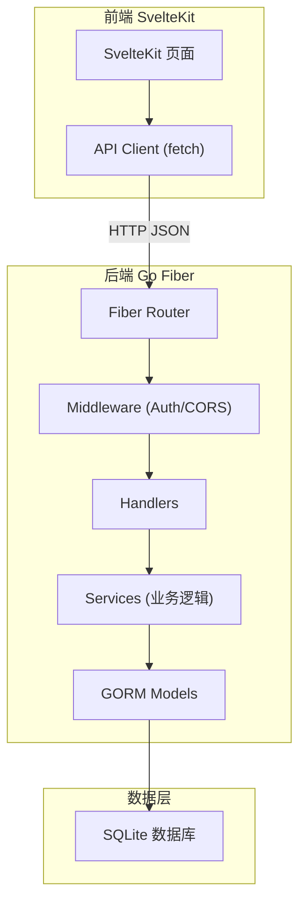
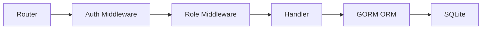
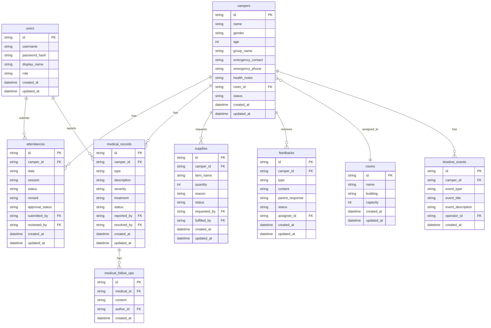

## 1. 架构设计



前后端严格分离：
- 前端只负责UI渲染与用户交互，所有业务逻辑在后端
- 后端只暴露RESTful JSON API，不渲染任何页面
- 认证通过JWT Token，前端存储在localStorage，每次请求携带Authorization头

## 2. 技术说明

- 前端：SvelteKit + Svelte 4 + TailwindCSS 3 + Vite
- 初始化工具：npm create svelte@latest
- 后端：Go 1.21 + Fiber v2 + GORM
- 数据库：SQLite（开发/演示用，零配置启动）
- 认证：JWT (HS256)，角色嵌入token claims

## 3. 路由定义

### 前端路由

| 路由 | 用途 |
|------|------|
| /login | 登录页 |
| / | 仪表盘首页 |
| /campers | 营员管理（双栏） |
| /attendance | 考勤签到（双栏） |
| /medical | 医疗上报（双栏） |
| /rooms | 分房管理（双栏） |
| /supplies | 物资补领（双栏） |
| /feedback | 家长回访（双栏） |

### 后端API路由

| 路由 | 方法 | 用途 |
|------|------|------|
| /api/auth/login | POST | 登录获取Token |
| /api/auth/me | GET | 获取当前用户信息 |
| /api/dashboard/stats | GET | 仪表盘统计数据 |
| /api/dashboard/todo | GET | 仪表盘待办列表 |
| /api/campers | GET | 营员列表 |
| /api/campers/:id | GET | 营员详情 |
| /api/campers | POST | 创建营员 |
| /api/campers/:id | PUT | 更新营员 |
| /api/campers/:id | DELETE | 删除营员 |
| /api/campers/:id/timeline | GET | 营员时间线 |
| /api/attendance | GET | 考勤列表 |
| /api/attendance/:id | GET | 考勤详情 |
| /api/attendance | POST | 创建考勤 |
| /api/attendance/:id | PUT | 更新考勤 |
| /api/attendance/:id/approve | POST | 审批通过 |
| /api/attendance/:id/reject | POST | 驳回 |
| /api/medical | GET | 医疗列表 |
| /api/medical/:id | GET | 医疗详情 |
| /api/medical | POST | 创建医疗记录 |
| /api/medical/:id | PUT | 更新医疗记录 |
| /api/medical/:id/resolve | POST | 医疗完结 |
| /api/medical/:id/followup | POST | 追加随访 |
| /api/rooms | GET | 房间列表 |
| /api/rooms/:id | GET | 房间详情 |
| /api/rooms | POST | 创建房间 |
| /api/rooms/:id | PUT | 更新房间 |
| /api/rooms/assign | POST | 分配营员到房间 |
| /api/rooms/unassign | POST | 从房间移除营员 |
| /api/supplies | GET | 物资列表 |
| /api/supplies/:id | GET | 物资详情 |
| /api/supplies | POST | 创建物资申请 |
| /api/supplies/:id | PUT | 更新物资申请 |
| /api/supplies/:id/fulfill | POST | 物资发放确认 |
| /api/feedback | GET | 回访列表 |
| /api/feedback/:id | GET | 回访详情 |
| /api/feedback | POST | 创建回访 |
| /api/feedback/:id | PUT | 更新回访 |
| /api/feedback/:id/complete | POST | 回访完结 |

## 4. API定义

### 通用响应格式

```typescript
interface ApiResponse<T> {
  data: T
  message?: string
}

interface PaginatedResponse<T> {
  data: T[]
  total: number
  page: number
  pageSize: number
}
```

### 认证

```typescript
interface LoginRequest {
  username: string
  password: string
}

interface LoginResponse {
  token: string
  user: User
}

interface User {
  id: string
  username: string
  displayName: string
  role: "director" | "teacher" | "logistics"
}
```

### 营员

```typescript
interface Camper {
  id: string
  name: string
  gender: "male" | "female"
  age: number
  groupName: string
  emergencyContact: string
  emergencyPhone: string
  healthNotes: string
  roomId: string | null
  status: "active" | "checked_out" | "transferred"
  createdAt: string
  updatedAt: string
}

interface TimelineEvent {
  id: string
  camperId: string
  eventType: "attendance" | "medical" | "room_change" | "supply" | "feedback"
  eventTitle: string
  eventDescription: string
  operatorName: string
  createdAt: string
}
```

### 考勤

```typescript
interface Attendance {
  id: string
  camperId: string
  camperName: string
  date: string
  session: "morning" | "afternoon" | "evening"
  status: "present" | "absent" | "late" | "excused"
  remark: string
  approvalStatus: "pending" | "approved" | "rejected"
  submittedBy: string
  reviewedBy: string | null
  createdAt: string
  updatedAt: string
}
```

### 医疗

```typescript
interface MedicalRecord {
  id: string
  camperId: string
  camperName: string
  type: "injury" | "illness" | "allergy" | "other"
  description: string
  severity: "mild" | "moderate" | "severe"
  treatment: string
  status: "reported" | "treating" | "resolved"
  reportedBy: string
  resolvedBy: string | null
  followUps: FollowUp[]
  createdAt: string
  updatedAt: string
}

interface FollowUp {
  id: string
  content: string
  authorName: string
  createdAt: string
}
```

### 房间

```typescript
interface Room {
  id: string
  name: string
  building: string
  capacity: number
  campers: Camper[]
  createdAt: string
  updatedAt: string
}
```

### 物资

```typescript
interface Supply {
  id: string
  camperId: string
  camperName: string
  itemName: string
  quantity: number
  reason: string
  status: "requested" | "fulfilled"
  requestedBy: string
  fulfilledBy: string | null
  createdAt: string
  updatedAt: string
}
```

### 家长回访

```typescript
interface Feedback {
  id: string
  camperId: string
  camperName: string
  type: "routine" | "medical" | "attendance" | "complaint"
  content: string
  parentResponse: string
  status: "pending" | "in_progress" | "completed"
  assigneeName: string
  createdAt: string
  updatedAt: string
}
```

### 仪表盘

```typescript
interface DashboardStats {
  pendingCount: number
  rejectedCount: number
  reviewNeededCount: number
  totalCampers: number
  activeCampers: number
  todayAttendanceRate: number
}

interface TodoItem {
  id: string
  module: "attendance" | "medical" | "room" | "supply" | "feedback"
  type: string
  description: string
  createdAt: string
}
```

## 5. 服务端架构图



## 6. 数据模型

### 6.1 数据模型定义



### 6.2 数据定义语言

```sql
CREATE TABLE users (
    id TEXT PRIMARY KEY,
    username TEXT UNIQUE NOT NULL,
    password_hash TEXT NOT NULL,
    display_name TEXT NOT NULL,
    role TEXT NOT NULL CHECK(role IN ('director','teacher','logistics')),
    created_at DATETIME DEFAULT CURRENT_TIMESTAMP,
    updated_at DATETIME DEFAULT CURRENT_TIMESTAMP
);

CREATE TABLE rooms (
    id TEXT PRIMARY KEY,
    name TEXT NOT NULL,
    building TEXT NOT NULL,
    capacity INTEGER NOT NULL DEFAULT 4,
    created_at DATETIME DEFAULT CURRENT_TIMESTAMP,
    updated_at DATETIME DEFAULT CURRENT_TIMESTAMP
);

CREATE TABLE campers (
    id TEXT PRIMARY KEY,
    name TEXT NOT NULL,
    gender TEXT NOT NULL CHECK(gender IN ('male','female')),
    age INTEGER NOT NULL,
    group_name TEXT NOT NULL,
    emergency_contact TEXT DEFAULT '',
    emergency_phone TEXT DEFAULT '',
    health_notes TEXT DEFAULT '',
    room_id TEXT REFERENCES rooms(id),
    status TEXT NOT NULL DEFAULT 'active' CHECK(status IN ('active','checked_out','transferred')),
    created_at DATETIME DEFAULT CURRENT_TIMESTAMP,
    updated_at DATETIME DEFAULT CURRENT_TIMESTAMP
);

CREATE TABLE attendances (
    id TEXT PRIMARY KEY,
    camper_id TEXT NOT NULL REFERENCES campers(id),
    date TEXT NOT NULL,
    session TEXT NOT NULL CHECK(session IN ('morning','afternoon','evening')),
    status TEXT NOT NULL CHECK(status IN ('present','absent','late','excused')),
    remark TEXT DEFAULT '',
    approval_status TEXT NOT NULL DEFAULT 'pending' CHECK(approval_status IN ('pending','approved','rejected')),
    submitted_by TEXT NOT NULL REFERENCES users(id),
    reviewed_by TEXT REFERENCES users(id),
    created_at DATETIME DEFAULT CURRENT_TIMESTAMP,
    updated_at DATETIME DEFAULT CURRENT_TIMESTAMP
);

CREATE TABLE medical_records (
    id TEXT PRIMARY KEY,
    camper_id TEXT NOT NULL REFERENCES campers(id),
    type TEXT NOT NULL CHECK(type IN ('injury','illness','allergy','other')),
    description TEXT NOT NULL,
    severity TEXT NOT NULL CHECK(severity IN ('mild','moderate','severe')),
    treatment TEXT DEFAULT '',
    status TEXT NOT NULL DEFAULT 'reported' CHECK(status IN ('reported','treating','resolved')),
    reported_by TEXT NOT NULL REFERENCES users(id),
    resolved_by TEXT REFERENCES users(id),
    created_at DATETIME DEFAULT CURRENT_TIMESTAMP,
    updated_at DATETIME DEFAULT CURRENT_TIMESTAMP
);

CREATE TABLE medical_follow_ups (
    id TEXT PRIMARY KEY,
    medical_id TEXT NOT NULL REFERENCES medical_records(id),
    content TEXT NOT NULL,
    author_id TEXT NOT NULL REFERENCES users(id),
    created_at DATETIME DEFAULT CURRENT_TIMESTAMP
);

CREATE TABLE supplies (
    id TEXT PRIMARY KEY,
    camper_id TEXT NOT NULL REFERENCES campers(id),
    item_name TEXT NOT NULL,
    quantity INTEGER NOT NULL DEFAULT 1,
    reason TEXT DEFAULT '',
    status TEXT NOT NULL DEFAULT 'requested' CHECK(status IN ('requested','fulfilled')),
    requested_by TEXT NOT NULL REFERENCES users(id),
    fulfilled_by TEXT REFERENCES users(id),
    created_at DATETIME DEFAULT CURRENT_TIMESTAMP,
    updated_at DATETIME DEFAULT CURRENT_TIMESTAMP
);

CREATE TABLE feedbacks (
    id TEXT PRIMARY KEY,
    camper_id TEXT NOT NULL REFERENCES campers(id),
    type TEXT NOT NULL CHECK(type IN ('routine','medical','attendance','complaint')),
    content TEXT NOT NULL,
    parent_response TEXT DEFAULT '',
    status TEXT NOT NULL DEFAULT 'pending' CHECK(status IN ('pending','in_progress','completed')),
    assignee_id TEXT NOT NULL REFERENCES users(id),
    created_at DATETIME DEFAULT CURRENT_TIMESTAMP,
    updated_at DATETIME DEFAULT CURRENT_TIMESTAMP
);

CREATE TABLE timeline_events (
    id TEXT PRIMARY KEY,
    camper_id TEXT NOT NULL REFERENCES campers(id),
    event_type TEXT NOT NULL CHECK(event_type IN ('attendance','medical','room_change','supply','feedback')),
    event_title TEXT NOT NULL,
    event_description TEXT DEFAULT '',
    operator_id TEXT NOT NULL REFERENCES users(id),
    created_at DATETIME DEFAULT CURRENT_TIMESTAMP
);

CREATE INDEX idx_campers_room ON campers(room_id);
CREATE INDEX idx_campers_group ON campers(group_name);
CREATE INDEX idx_attendances_camper ON attendances(camper_id);
CREATE INDEX idx_attendances_date ON attendances(date);
CREATE INDEX idx_attendances_approval ON attendances(approval_status);
CREATE INDEX idx_medical_camper ON medical_records(camper_id);
CREATE INDEX idx_medical_status ON medical_records(status);
CREATE INDEX idx_supplies_camper ON supplies(camper_id);
CREATE INDEX idx_supplies_status ON supplies(status);
CREATE INDEX idx_feedbacks_camper ON feedbacks(camper_id);
CREATE INDEX idx_feedbacks_status ON feedbacks(status);
CREATE INDEX idx_timeline_camper ON timeline_events(camper_id);
```
