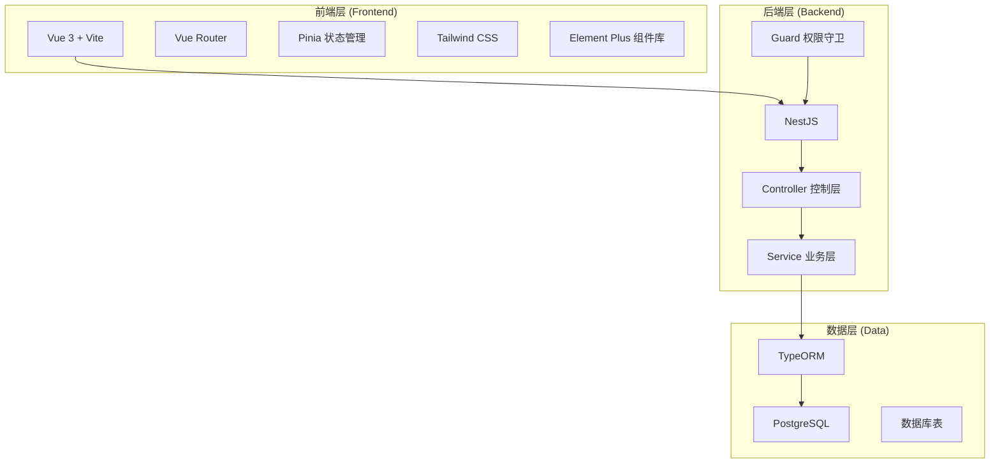
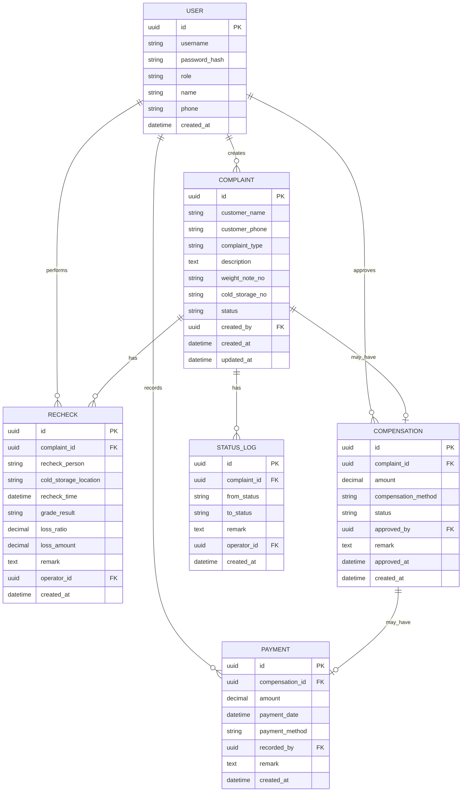

# 水果批发客诉赔付与复检登记系统 - 技术架构文档

## 1. 架构设计



## 2. 技术栈说明

- **前端**: Vue 3 + TypeScript + Vite + Vue Router + Pinia + Tailwind CSS + Element Plus
- **后端**: NestJS + TypeScript + TypeORM
- **数据库**: PostgreSQL 14+
- **初始化工具**: Vite (前端) + Nest CLI (后端)
- **认证**: JWT Token 基于角色的权限控制

## 3. 目录结构

```
trae-test-1/
├── frontend/                 # Vue 3 前端项目
│   ├── src/
│   │   ├── api/             # API 接口封装
│   │   ├── components/      # 公共组件
│   │   ├── views/           # 页面组件
│   │   ├── stores/          # Pinia 状态管理
│   │   ├── router/          # 路由配置
│   │   ├── types/           # TypeScript 类型定义
│   │   ├── utils/           # 工具函数
│   │   └── App.vue
│   ├── package.json
│   └── vite.config.ts
├── backend/                  # NestJS 后端项目
│   ├── src/
│   │   ├── modules/         # 业务模块
│   │   │   ├── complaint/   # 客诉模块
│   │   │   ├── recheck/     # 复检模块
│   │   │   ├── compensation/# 赔付模块
│   │   │   ├── payment/     # 回款模块
│   │   │   └── auth/        # 认证模块
│   │   ├── common/          # 公共模块
│   │   └── main.ts
│   ├── package.json
│   └── ormconfig.ts
├── docker/                   # Docker 配置
│   ├── docker-compose.yml
│   └── init.sql             # 数据库初始化脚本
└── README.md                # 项目说明
```

## 4. 路由定义

| 路由 | 页面 | 权限要求 |
|------|------|---------|
| /login | 登录页 | 公开 |
| /dashboard | 批量复核面板(首页) | 已登录 |
| /complaint/new | 新建客诉 | 档口负责人/配货员 |
| /complaint/:id | 客诉详情 | 已登录 |
| /recheck/new | 新建复检 | 配货员/档口负责人 |
| /compensation | 赔付审批 | 档口负责人 |
| /payment | 回款跟踪 | 财务记账 |
| /history | 历史记录 | 已登录 |

## 5. API 定义

### 5.1 认证模块

```typescript
// 登录
POST /api/auth/login
Request: { username: string, password: string }
Response: { token: string, user: User, role: string }

// 当前用户信息
GET /api/auth/me
Response: User
```

### 5.2 客诉模块

```typescript
// 客诉列表
GET /api/complaints?status=&page=&pageSize=
Response: { list: Complaint[], total: number }

// 创建客诉
POST /api/complaints
Request: ComplaintCreateDto
Response: Complaint

// 更新客诉
PUT /api/complaints/:id
Request: ComplaintUpdateDto
Response: Complaint

// 批量操作
POST /api/complaints/batch
Request: { ids: string[], action: string, payload?: any }
Response: { success: number, failed: number }
```

### 5.3 复检模块

```typescript
// 创建复检记录
POST /api/rechecks
Request: RecheckCreateDto
Response: Recheck

// 获取复检详情
GET /api/rechecks/:id
Response: RecheckWithRelation
```

### 5.4 赔付模块

```typescript
// 赔付审批
POST /api/compensations/:id/approve
Request: { amount: number, remark: string }
Response: Compensation
```

### 5.5 回款模块

```typescript
// 登记回款
POST /api/payments
Request: PaymentCreateDto
Response: Payment
```

## 6. 数据模型

### 6.1 ER 图



### 6.2 状态定义

**客诉状态流转:**
- `pending` - 待处理
- `rechecking` - 复检中
- `compensating` - 赔付审批中
- `payment_pending` - 待回款
- `completed` - 已完成
- `rejected` - 已驳回

### 6.3 数据库初始化脚本

SQL文件位置: `docker/init.sql`

包含内容:
- 扩展启用 (uuid-ossp)
- 所有表结构创建
- 索引创建
- 初始用户数据 (三个角色各一个演示账号)
- 演示数据 (10-20条客诉记录，包含不同状态)
- 状态变更历史演示数据
