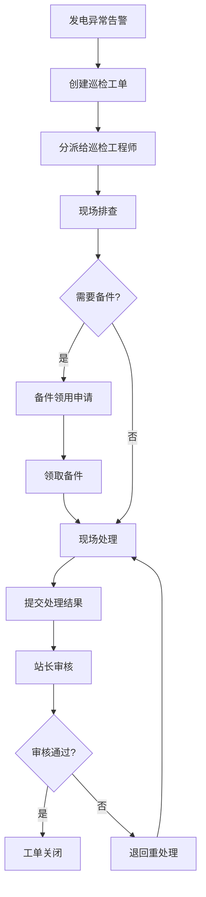

# 光伏运维巡检工单与发电预警系统 - PRD

## 1. 产品概述

光伏电站运维管理系统，解决巡检工单与发电预警数据割裂问题，实现发电异常告警、备件领用、工单处理全流程闭环管理。

- 解决问题：Excel发电表、告警截图、微信群接力的低效协作模式
- 目标用户：站长、巡检工程师、运维内勤
- 核心价值：工单全链路可视化，异常处理可追溯，备件去向清晰化

## 2. 核心功能

### 2.1 用户角色

| 角色 | 登录方式 | 核心权限 |
|------|----------|----------|
| 站长 | 账号密码 | 全局视图、超时监控、工单审核、数据复盘 |
| 巡检工程师 | 账号密码 | 工单接收、现场处理、备件领用、结果上传 |
| 运维内勤 | 账号密码 | 工单创建、备件管理、数据统计、工单关闭 |

### 2.2 功能模块

1. **工作台概览**：待办事项、超时预警、今日统计
2. **工单管理**：工单列表、详情查看、状态流转、处理记录
3. **发电预警**：告警列表、异常详情、自动关联工单
4. **备件管理**：领用记录、库存查询、备件追踪
5. **侧边处理台**：快速处理、备注添加、状态变更

### 2.3 页面详情

| 页面名称 | 模块名称 | 功能描述 |
|----------|----------|----------|
| 工作台 | 待办卡片 | 按角色展示待处理工单、超时告警、待审核事项 |
| 工作台 | 统计概览 | 今日工单、异常数量、停机时长、处理率 |
| 工单列表 | 筛选查询 | 按状态、时间、负责人、电站筛选 |
| 工单列表 | 批量操作 | 批量分配、批量导出 |
| 工单详情 | 信息展示 | 基本信息、处理历史、关联预警、备件领用 |
| 工单详情 | 处理操作 | 状态变更、添加备注、上传附件 |
| 发电预警 | 告警列表 | 异常类型、发生时间、关联工单、处理状态 |
| 发电预警 | 异常详情 | 发电数据对比、影响范围、建议处理方案 |
| 备件管理 | 领用记录 | 领用人、时间、用途、关联工单 |
| 侧边处理台 | 快速操作 | 状态流转、添加备注、提交处理结果 |

## 3. 核心流程

### 发电异常处理流程

1. 系统检测到发电数据异常，自动生成发电预警
2. 运维内勤收到预警，创建巡检工单并分派给巡检工程师
3. 巡检工程师接收工单，现场排查问题
4. 如需备件，提交领用申请，工单状态变更为"待备件"
5. 备件领取后，工单状态恢复为"处理中"
6. 问题处理完成，工程师提交处理结果和现场照片
7. 站长审核处理结果，确认无误后工单关闭
8. 系统自动记录停机时长，生成处理报告

### 流程图

## 4. 用户界面设计

### 4.1 设计风格

- **主色调**：深工业蓝 (#165DFF) - 体现专业性和科技感
- **辅助色**：警示橙 (#FF7D00)、成功绿 (#00B42A)、危险红 (#F53F3F)
- **中性色**：深灰 (#1D2129)、中灰 (#4E5969)、浅灰 (#C9CDD4)
- **按钮风格**：直角微圆角 (4px)、扁平化设计、明确的状态反馈
- **字体**：思源黑体 - 清晰易读，适合数据密集型界面
- **布局风格**：左侧导航 + 主内容区 + 右侧处理台的三栏布局
- **图标风格**：线性图标，统一24px尺寸，颜色与功能状态对应

### 4.2 页面设计概览

| 页面名称 | 模块名称 | UI元素 |
|----------|----------|--------|
| 工作台 | 统计卡片 | 渐变背景、大号数字、趋势箭头、动画计数 |
| 工单列表 | 数据表格 | 斑马纹、状态标签、悬停高亮、行内操作 |
| 工单详情 | 时间线 | 垂直时间轴、节点状态、处理人头像、时间戳 |
| 发电预警 | 告警卡片 | 红色边框闪烁动画、异常数值高亮 |
| 侧边处理台 | 操作面板 | 固定悬浮、快捷按钮、实时预览 |

### 4.3 响应式

- Desktop-first 设计，主适配1440px及以上分辨率
- 侧边处理台在小屏幕下转为底部抽屉模式
- 表格支持水平滚动，确保数据完整展示

### 4.4 交互细节

- 状态变更时的平滑过渡动画
- 超时工单的脉冲提醒效果
- 侧边处理台展开/收起的滑入动画
- 表单提交的加载状态和成功反馈
