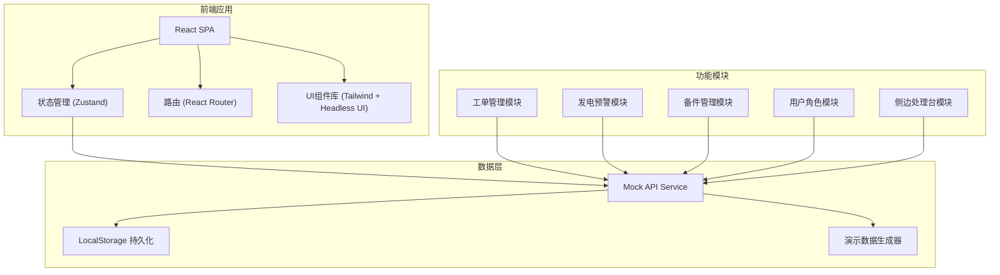
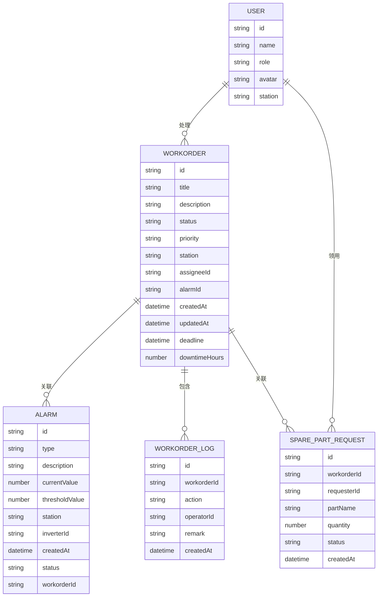

# 光伏运维巡检工单与发电预警系统 - 技术架构

## 1. 架构设计



## 2. 技术描述

- **前端框架**: React@18 + TypeScript
- **构建工具**: Vite@5
- **样式方案**: TailwindCSS@3
- **状态管理**: Zustand (轻量级，适合中小型应用)
- **路由管理**: React Router@6
- **UI组件**: HeadlessUI (无样式组件) + Heroicons
- **日期处理**: date-fns
- **图表库**: Recharts (发电数据可视化)
- **后端**: 无后端，使用Mock数据 + LocalStorage持久化
- **数据库**: LocalStorage (浏览器本地存储)

## 3. 路由定义

| Route | 页面 | 说明 |
|-------|------|------|
| /login | 登录页 | 角色选择登录 |
| /dashboard | 工作台 | 概览统计、待办事项 |
| /workorders | 工单列表 | 工单查询、筛选、批量操作 |
| /workorders/:id | 工单详情 | 工单信息、处理记录、操作面板 |
| /alarms | 发电预警 | 告警列表、异常详情 |
| /spareparts | 备件管理 | 领用记录、库存查询 |

## 4. 数据模型

### 4.1 数据模型定义



### 4.2 演示数据说明

**用户账号**:
- 站长: admin / admin123
- 巡检工程师: engineer / engineer123
- 运维内勤: staff / staff123

**工单数据 (5条)**:
1. 待处理 - 逆变器A3发电量异常下降
2. 处理中 - 组串C2通讯中断 (超时)
3. 待备件 - 汇流箱B1熔断器损坏
4. 待审核 - 光伏板清洁完成
5. 已退回 - 温控系统异常 (需要重新处理)

**发电预警数据 (8条)**:
- 3条严重告警 (红色)
- 2条重要告警 (橙色)
- 3条一般告警 (黄色)

**备件领用数据 (6条)**:
- 3条已领用
- 2条待审批
- 1条已归还

## 5. 核心模块设计

### 5.1 状态管理 Store

```typescript
// useStore.ts
interface AppState {
  currentUser: User | null;
  workorders: WorkOrder[];
  alarms: Alarm[];
  spareParts: SparePartRequest[];
  selectedWorkorder: WorkOrder | null;
  sidebarOpen: boolean;
  
  login: (username: string, password: string) => boolean;
  logout: () => void;
  selectWorkorder: (id: string) => void;
  updateWorkorderStatus: (id: string, status: string, remark: string) => void;
  requestSparePart: (data: SparePartRequestData) => void;
  toggleSidebar: () => void;
}
```

### 5.2 侧边处理台组件

位置：页面右侧固定悬浮，支持展开/收起

功能：
- 工单基本信息预览
- 状态流转按钮组
- 备注输入框
- 快捷操作（领用备件、上传照片等）
- 处理历史时间线

### 5.3 刻意简化的部分

1. **后端服务**: 使用Mock数据 + LocalStorage，不搭建真实后端
2. **权限控制**: 前端模拟角色权限，无后端鉴权
3. **文件上传**: 模拟上传，不实际存储文件
4. **实时推送**: 定时刷新模拟，无WebSocket
5. **多电站**: 单电站数据，不做多租户
6. **数据导出**: 前端模拟导出，不生成真实文件
