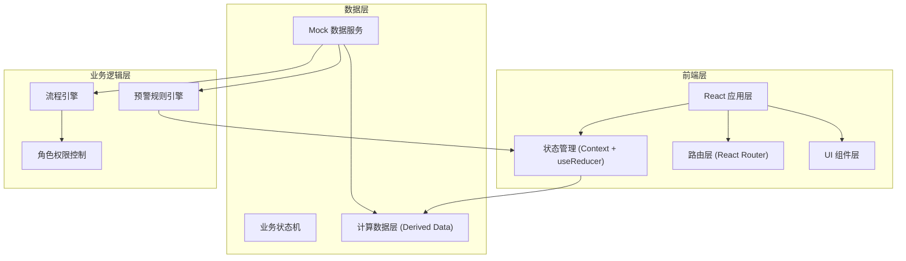
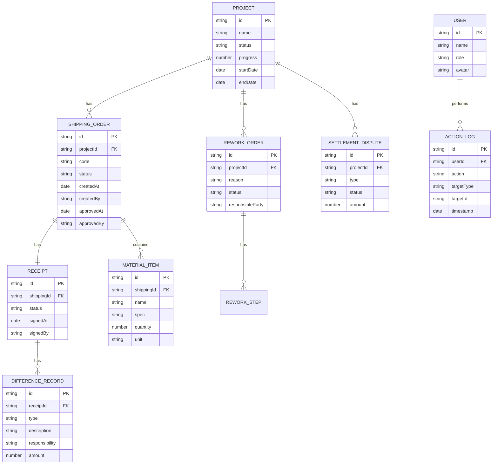
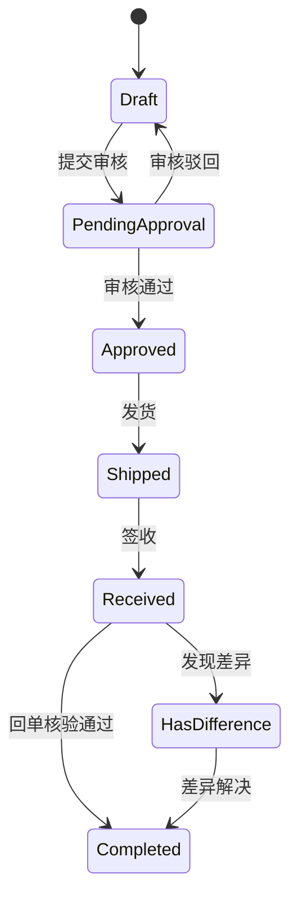
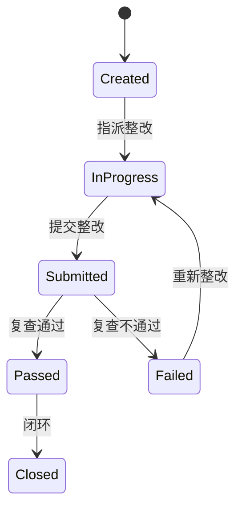

# 地坪施工-材料发货与回单核验系统 技术架构

## 1. 架构设计



## 2. 技术栈说明

- **前端框架**: React@18 + TypeScript@5
- **构建工具**: Vite@5
- **样式方案**: TailwindCSS@3 + PostCSS
- **路由管理**: React Router@6
- **状态管理**: React Context + useReducer (轻量级业务状态机)
- **图表库**: Recharts (数据可视化)
- **图标库**: Lucide React (线性图标)
- **日期处理**: date-fns
- **Mock 数据**: 本地 TypeScript 数据文件 + 工具函数

## 3. 目录结构

```
src/
├── types/              # 类型定义
│   ├── index.ts       # 核心业务类型
│   └── state.ts       # 状态类型
├── data/               # 模拟数据
│   ├── mock.ts        # 基础数据
│   ├── samples.ts     # 样例数据（正常流+问题流）
│   └── computed.ts    # 计算数据
├── store/              # 状态管理
│   ├── AppContext.tsx # 全局上下文
│   ├── reducer.ts     # Reducer 逻辑
│   └── actions.ts     # Action 定义
├── hooks/              # 自定义 Hooks
│   ├── useRole.ts     # 角色权限 Hook
│   ├── useWorkflow.ts # 工作流 Hook
│   └── useAlert.ts    # 预警 Hook
├── components/         # 组件
│   ├── layout/        # 布局组件
│   ├── dashboard/     # 看板组件
│   ├── shipping/      # 发货管理组件
│   ├── receipt/       # 回单核验组件
│   ├── rework/        # 返工追踪组件
│   ├── settlement/    # 结算组件
│   └── shared/        # 通用组件
├── pages/              # 页面组件
├── utils/              # 工具函数
│   ├── workflow.ts    # 流程引擎
│   ├── permission.ts  # 权限判断
│   └── alert.ts       # 预警规则
├── App.tsx
└── main.tsx
```

## 4. 路由定义

| 路由路径 | 页面名称 | 说明 |
|---------|----------|------|
| `/` | 总览看板 | 默认首页，汇总仪表盘 |
| `/shipping` | 材料发货 | 发货单列表 |
| `/shipping/:id` | 发货单详情 | 发货单详情页 |
| `/receipt` | 回单核验 | 回单列表 |
| `/receipt/:id` | 回单详情 | 回单详情&处理 |
| `/rework` | 返工追踪 | 返工单列表 |
| `/rework/:id` | 返工详情 | 返工处理详情 |
| `/settlement` | 结算中心 | 争议预警&处理 |

## 5. 核心数据模型

### 5.1 实体关系图



### 5.2 核心枚举类型

```typescript
// 角色类型
type Role = 'project_manager' | 'quality_engineer' | 'team_leader';

// 发货单状态
type ShippingStatus = 'draft' | 'pending_approval' | 'approved' | 'shipped' | 'received' | 'completed' | 'rejected';

// 回单状态
type ReceiptStatus = 'pending' | 'signed' | 'has_difference' | 'verified' | 'disputed';

// 返工状态
type ReworkStatus = 'created' | 'in_progress' | 'submitted' | 'passed' | 'failed' | 'closed';

// 争议状态
type DisputeStatus = 'pending' | 'negotiating' | 'ruled' | 'resolved' | 'appealed';

// 责任方
type Responsibility = 'logistics' | 'warehouse' | 'construction_team' | 'supplier' | 'other';
```

## 6. 状态机设计

### 6.1 发货单状态机



### 6.2 返工单状态机



## 7. 权限矩阵

| 功能模块 | 项目负责人 | 质检工程师 | 班组长 |
|---------|-----------|-----------|--------|
| 查看汇总看板 | ✅ | ✅ | ✅ (受限) |
| 创建发货单 | ❌ | ✅ | ❌ |
| 审核发货单 | ✅ | ❌ | ❌ |
| 发货操作 | ❌ | ✅ | ❌ |
| 签收回单 | ❌ | ❌ | ✅ |
| 回单核验 | ❌ | ✅ | ❌ |
| 记录差异 | ❌ | ✅ | ✅ |
| 责任判定 | ✅ | ✅ | ❌ |
| 创建返工单 | ❌ | ✅ | ❌ |
| 执行整改 | ❌ | ❌ | ✅ |
| 返工复查 | ❌ | ✅ | ❌ |
| 裁定争议 | ✅ | ❌ | ❌ |

## 8. 预警规则引擎

| 预警类型 | 触发条件 | 通知对象 | 优先级 |
|---------|---------|---------|--------|
| 材料差异 | 回单数量与发货单差异 > 5% | 质检、项目负责人 | 高 |
| 返工超期 | 整改截止时间已过 | 班组长、质检 | 高 |
| 结算风险 | 累计争议金额 > 合同额 3% | 项目负责人 | 中 |
| 发货延迟 | 批准后 24 小时未发货 | 质检 | 低 |
| 回单延迟 | 发货后 48 小时未签收 | 班组长、质检 | 中 |
