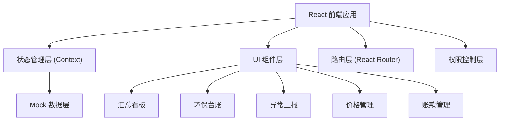
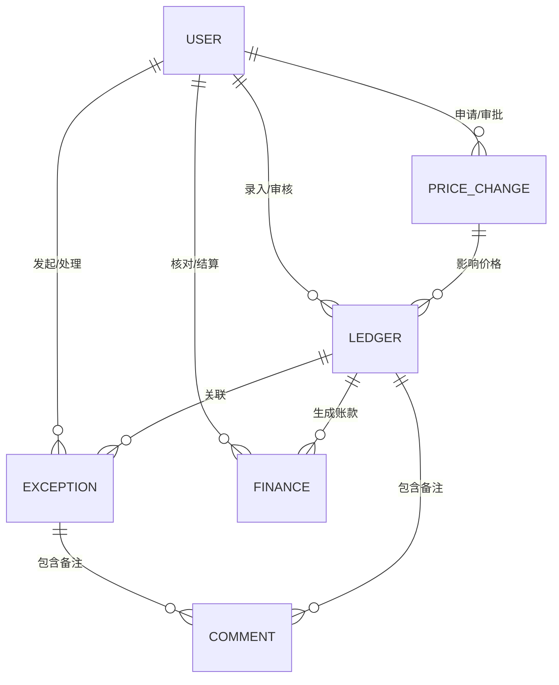

## 1. 架构设计



## 2. 技术描述

- **前端框架**：React@18 + TypeScript + Vite@5
- **路由管理**：React Router@6
- **状态管理**：React Context + useReducer
- **样式方案**：Tailwind CSS@3 + CSS 变量
- **图表库**：Recharts（趋势图、饼图、柱状图）
- **图标库**：Lucide React
- **数据模拟**：TypeScript Mock 数据
- **日期处理**：date-fns

## 3. 路由定义

| 路由 | 页面 | 访问角色 | 说明 |
|------|------|----------|------|
| /dashboard | 汇总看板 | 全部 | 根据角色显示不同数据范围 |
| /ledger | 环保台账 | 全部 | 过磅员仅看自己，老板/财务看全部 |
| /ledger/new | 新建台账 | 过磅员 | 过磅员录入回收记录 |
| /ledger/:id | 台账详情 | 全部 | 可下钻查看完整信息和操作日志 |
| /exceptions | 异常列表 | 全部 | 按角色过滤可见范围 |
| /exceptions/new | 发起异常 | 过磅员 | 过磅员上报异常 |
| /exceptions/:id | 异常详情 | 全部 | 审批流程、备注、状态流转 |
| /prices | 价格管理 | 老板/财务 | 价格列表和调整记录 |
| /finances | 账款管理 | 老板/财务 | 应收应付、对账记录 |
| /settings | 系统设置 | 老板 | 基础配置 |

## 4. 数据模型

### 4.1 实体关系图



### 4.2 核心数据类型定义

```typescript
// 用户角色
type UserRole = 'owner' | 'weigher' | 'accountant';

// 用户
interface User {
  id: string;
  name: string;
  role: UserRole;
  avatar: string;
}

// 回收品类
type Category = 'paper' | 'plastic' | 'metal' | 'glass' | 'electronics';

// 台账记录
interface LedgerRecord {
  id: string;
  recordNo: string;
  category: Category;
  weight: number;
  unitPrice: number;
  totalAmount: number;
  weigherId: string;
  weigherName: string;
  supplier: string;
  weightPhoto: string;
  yardPhoto?: string;
  status: 'pending' | 'verified' | 'reconciled' | 'settled';
  createdAt: string;
  verifiedAt?: string;
  reconciledAt?: string;
  settledAt?: string;
  remarks: Comment[];
  operationLogs: OperationLog[];
}

// 异常状态
type ExceptionStatus = 'pending' | 'processing' | 'resolved' | 'rejected' | 'closed';

// 异常类型
type ExceptionType = 'environment' | 'equipment' | 'quality' | 'safety';

// 异常记录
interface ExceptionRecord {
  id: string;
  exceptionNo: string;
  type: ExceptionType;
  title: string;
  description: string;
  photos: string[];
  reporterId: string;
  reporterName: string;
  handlerId?: string;
  handlerName?: string;
  status: ExceptionStatus;
  relatedLedgerId?: string;
  createdAt: string;
  updatedAt: string;
  resolvedAt?: string;
  comments: Comment[];
  operationLogs: OperationLog[];
}

// 价格调整
interface PriceChange {
  id: string;
  category: Category;
  oldPrice: number;
  newPrice: number;
  effectiveDate: string;
  reason: string;
  applicantId: string;
  applicantName: string;
  approverId?: string;
  approverName?: string;
  status: 'pending' | 'approved' | 'rejected';
  createdAt: string;
  approvedAt?: string;
  comments: Comment[];
}

// 账款记录
interface FinanceRecord {
  id: string;
  ledgerId: string;
  recordNo: string;
  amount: number;
  type: 'receivable' | 'payable';
  party: string;
  status: 'pending' | 'reconciled' | 'settled';
  reconciledBy?: string;
  reconciledAt?: string;
  settledAt?: string;
  difference?: number;
  differenceNote?: string;
  remarks: string;
}

// 备注
interface Comment {
  id: string;
  userId: string;
  userName: string;
  content: string;
  createdAt: string;
}

// 操作日志
interface OperationLog {
  id: string;
  action: string;
  userId: string;
  userName: string;
  oldValue?: string;
  newValue?: string;
  createdAt: string;
}
```

## 5. 权限控制

### 5.1 角色权限矩阵

| 功能 | 站点老板 | 过磅员 | 财务 |
|------|----------|--------|------|
| 查看汇总看板 | ✅ 全局 | ✅ 个人 | ✅ 财务 |
| 新建台账记录 | ❌ | ✅ | ❌ |
| 编辑台账记录 | ✅ | ✅ 本人 | ❌ |
| 删除台账记录 | ✅ | ❌ | ❌ |
| 发起异常上报 | ✅ | ✅ | ✅ |
| 审批异常 | ✅ | ❌ | ❌ |
| 申请价格调整 | ❌ | ❌ | ✅ |
| 审批价格调整 | ✅ | ❌ | ❌ |
| 账款核对 | ✅ | ❌ | ✅ |
| 结算确认 | ✅ | ❌ | ✅ |
| 导出报表 | ✅ | ❌ | ✅ |

### 5.2 权限实现方式

1. 路由守卫：通过 React Router 的 loader 检查权限
2. 组件级权限：自定义 `usePermission` hook
3. 操作按钮权限：根据角色条件渲染

## 6. 状态管理架构

```typescript
// 全局状态
interface AppState {
  currentUser: User | null;
  currentRole: UserRole;
  ledger: LedgerState;
  exceptions: ExceptionState;
  prices: PriceState;
  finances: FinanceState;
}

// 使用 React Context + useReducer 实现
// 每个模块独立的 reducer 和 action
```

## 7. 目录结构

```
src/
├── components/          # 通用组件
│   ├── Layout/         # 布局组件
│   ├── Table/          # 表格组件
│   ├── Modal/          # 模态框
│   ├── StatusBadge/    # 状态标签
│   └── Timeline/       # 时间线
├── pages/              # 页面组件
│   ├── Dashboard/
│   ├── Ledger/
│   ├── Exception/
│   ├── Price/
│   └── Finance/
├── context/            # 状态管理
│   ├── AppContext.tsx
│   ├── AuthContext.tsx
│   └── reducers/
├── types/              # TypeScript 类型
│   └── index.ts
├── data/               # Mock 数据
│   ├── mockUsers.ts
│   ├── mockLedger.ts
│   ├── mockExceptions.ts
│   ├── mockPrices.ts
│   └── mockFinances.ts
├── hooks/              # 自定义 Hooks
│   ├── usePermission.ts
│   ├── useLedger.ts
│   └── useException.ts
├── utils/              # 工具函数
│   ├── format.ts
│   └── date.ts
└── router/             # 路由配置
    └── index.tsx
```
