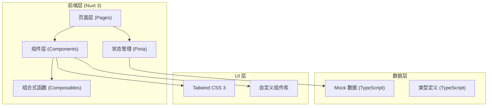

## 1. 架构设计



## 2. 技术描述

- **前端框架**：Nuxt 3 (Vue 3 + TypeScript)
- **状态管理**：Pinia
- **样式方案**：Tailwind CSS 3 + SCSS 变量
- **图标库**：Lucide Vue
- **构建工具**：Vite
- **数据方案**：TypeScript Mock 数据（无后端）
- **日期处理**：date-fns
- **初始化方式**：npx nuxi init

## 3. 路由定义

| 路由 | 用途 |
|------|------|
| / | 仪表盘 - 数据概览和待办事项 |
| /orders | 订单列表 - 多维度筛选和双栏详情 |
| /orders/:id | 订单详情 - 完整信息和时间线 |
| /abnormal | 异常处理中心 |
| /handover | 交接管理 |

## 4. 核心类型定义

```typescript
// 订单类型
interface Order {
  id: string
  orderNo: string
  customer: Customer
  type: 'custom' | 'repair' | 'remodel' | 'transfer'
  status: 'pending' | 'preparing' | 'processing' | 'quality_check' | 'completed' | 'abnormal'
  jewelry: Jewelry
  requirements: string
  price: PriceInfo
  progress: ProgressNode[]
  createdAt: Date
  estimatedDelivery: Date
  actualDelivery?: Date
  operator: string
  notes: Note[]
  handoverRecords: HandoverRecord[]
}

// 客户信息
interface Customer {
  id: string
  name: string
  phone: string
  wechat?: string
  memberLevel?: string
}

// 珠宝信息
interface Jewelry {
  category: 'ring' | 'necklace' | 'bracelet' | 'earring' | 'pendant'
  material: string
  mainStone?: Stone
  sideStones?: Stone[]
  size?: string
  weight?: number
}

// 进度节点
interface ProgressNode {
  id: string
  step: string
  status: 'pending' | 'in_progress' | 'completed' | 'skipped' | 'abnormal'
  startTime?: Date
  endTime?: Date
  operator?: string
  remark?: string
  photos?: string[]
}

// 异常记录
interface AbnormalRecord {
  id: string
  orderId: string
  type: 'stone_shortage' | 'craft_issue' | 'customer_change' | 'quality_issue' | 'damage' | 'other'
  level: 'low' | 'medium' | 'high' | 'critical'
  status: 'pending' | 'processing' | 'resolved' | 'closed'
  description: string
  cause?: string
  solution?: string
  compensation?: number
  createdAt: Date
  operator: string
  history: AbnormalHistory[]
}

// 交接记录
interface HandoverRecord {
  id: string
  orderId: string
  type: 'receive' | 'transfer' | 'deliver' | 'return'
  fromParty: string
  toParty: string
  items: HandoverItem[]
  photos: string[]
  signature?: string
  timestamp: Date
  remark?: string
}
```

## 5. 状态管理设计

### 5.1 orders Store
- orders: Order[] - 订单列表
- filters: FilterOptions - 筛选条件
- selectedOrder: Order | null - 当前选中订单
- loading: boolean - 加载状态

### 5.2 abnormal Store
- abnormalRecords: AbnormalRecord[] - 异常记录列表
- currentAbnormal: AbnormalRecord | null - 当前处理的异常
- statistics: AbnormalStats - 异常统计数据

### 5.3 dashboard Store
- overviewStats: OverviewStats - 概览统计
- trendData: TrendData[] - 趋势数据
- todos: TodoItem[] - 待办事项

## 6. Mock 数据设计

### 6.1 演示数据规划
- 15 条订单数据，覆盖所有订单类型和状态
- 5 条异常订单，包含：
  - 石缺货异常（高优先级）
  - 工艺问题（中优先级）
  - 客户改款（涉及价格变动）
  - 质检不通过（需要返修）
  - 货品损坏（涉及赔付）
- 8 条交接记录，包含照片和签名留痕
- 3 个测试账号：店长、导购、售后专员

### 6.2 测试账号
| 角色 | 用户名 | 密码 |
|------|--------|------|
| 店长 | manager | 123456 |
| 导购 | sales | 123456 |
| 售后专员 | service | 123456 |

## 7. 简化说明

- 无真实后端，所有数据使用 Mock 数据
- 登录功能简化为模拟登录（实际项目需接入真实认证）
- 文件上传功能使用占位图片（实际项目需接入 OSS）
- 推送通知功能未实现
- 权限控制为前端模拟（实际项目需后端校验）
- 打印功能未实现
