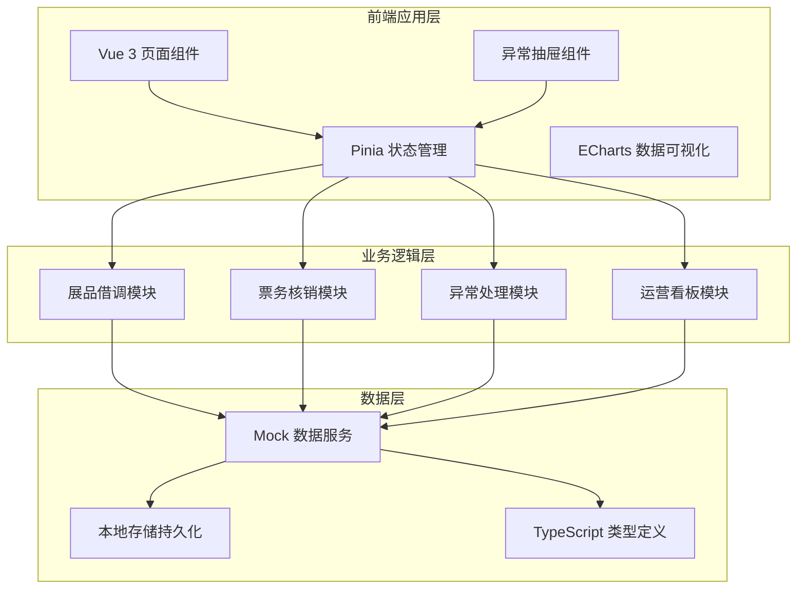
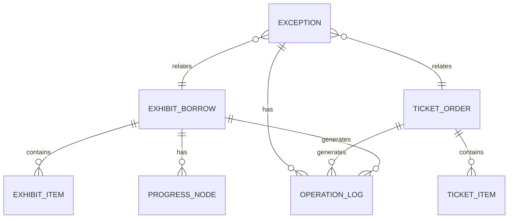

# 美术馆运营管理系统 技术架构文档

## 1. 架构设计



## 2. 技术描述

- **前端框架**：Vue@3.4 + Vite@5.0
- **状态管理**：Pinia@2.1
- **UI 框架**：TailwindCSS@3.4
- **路由**：Vue Router@4.3
- **图表库**：ECharts@5.5
- **图标库**：Lucide Vue Next@0.3
- **语言**：TypeScript@5.4
- **数据模拟**：前端 Mock 数据 + localStorage 持久化
- **构建工具**：Vite

## 3. 路由定义

| 路由 | 页面名称 | 用途 |
|-------|---------|---------|
| /dashboard | 运营看板 | 全局概览、KPI指标、异常队列 |
| /borrow | 展品借调 | 借调列表、布展进度、流转确认 |
| /ticket | 票务核销 | 核销工作台、票务明细、异常核销 |
| /trace | 追溯回查 | 全链路日志、关联单据查询 |

## 4. 状态管理设计

### 4.1 Store 划分

| Store 名称 | 职责 | 核心 State |
|-----------|------|-----------|
| useAppStore | 应用全局 | 当前角色、侧边栏状态、全局配置 |
| useExhibitStore | 展品借调 | 借调单列表、展品台账、布展进度 |
| useTicketStore | 票务核销 | 票务列表、核销记录、核销统计 |
| useExceptionStore | 异常管理 | 异常列表、当前处理异常、处理记录 |

## 5. 数据模型

### 5.1 ER 图



### 5.2 核心数据类型定义

```typescript
// 借调单状态
type BorrowStatus = 'pending' | 'transferring' | 'installing' | 'completed' | 'exception';

// 借调单
interface ExhibitBorrow {
  id: string;
  orderNo: string;
  exhibitName: string;
  source: string;
  destination: string;
  applicant: string;
  applyTime: string;
  expectCompleteTime: string;
  actualCompleteTime?: string;
  status: BorrowStatus;
  priority: 'high' | 'medium' | 'low';
  items: ExhibitItem[];
  progress: ProgressNode[];
  hasException: boolean;
}

// 展品项
interface ExhibitItem {
  id: string;
  name: string;
  code: string;
  category: string;
  status: 'in_stock' | 'borrowed' | 'installing' | 'returned';
  location: string;
}

// 进度节点
interface ProgressNode {
  id: string;
  name: string;
  status: 'pending' | 'processing' | 'completed';
  operator?: string;
  operateTime?: string;
  remark?: string;
}

// 票务订单
interface TicketOrder {
  id: string;
  orderNo: string;
  activityName: string;
  ticketType: string;
  totalCount: number;
  verifiedCount: number;
  exceptionCount: number;
  verifyTime: string;
  operator: string;
  status: 'pending' | 'verifying' | 'completed' | 'exception';
  items: TicketItem[];
}

// 票单项
interface TicketItem {
  id: string;
  ticketNo: string;
  visitorName: string;
  visitorPhone: string;
  status: 'unused' | 'verified' | 'expired' | 'exception';
  verifyTime?: string;
  operator?: string;
}

// 异常类型
type ExceptionType = 'overdue' | 'mismatch' | 'low_checkin' | 'location_mismatch' | 'schedule_conflict';

// 异常记录
interface ExceptionRecord {
  id: string;
  exceptionNo: string;
  type: ExceptionType;
  title: string;
  description: string;
  relatedOrderId: string;
  relatedOrderType: 'borrow' | 'ticket';
  relatedOrderNo: string;
  status: 'pending' | 'processing' | 'resolved' | 'closed';
  priority: 'urgent' | 'high' | 'medium' | 'low';
  reporter: string;
  reportTime: string;
  handler?: string;
  handleTime?: string;
  resolveTime?: string;
  handleRecords: HandleRecord[];
}

// 处理记录
interface HandleRecord {
  id: string;
  operator: string;
  operateTime: string;
  action: string;
  remark: string;
}

// 操作日志
interface OperationLog {
  id: string;
  operator: string;
  operateTime: string;
  module: string;
  action: string;
  targetId: string;
  targetType: string;
  beforeChange?: string;
  afterChange?: string;
  remark?: string;
}
```

## 6. 核心组件结构

```
src/
├── components/
│   ├── layout/
│   │   ├── AppSidebar.vue      # 侧边导航
│   │   ├── AppHeader.vue       # 顶部栏（角色切换）
│   │   └── RoleSwitcher.vue    # 角色切换器
│   ├── exception/
│   │   ├── ExceptionDrawer.vue      # 异常处理抽屉（核心）
│   │   ├── ExceptionCard.vue        # 异常卡片
│   │   ├── HandleTimeline.vue       # 处理时间线
│   │   └── HandleRecordItem.vue     # 处理记录项
│   ├── exhibit/
│   │   ├── BorrowCard.vue           # 借调单卡片
│   │   ├── ProgressTimeline.vue     # 布展进度时间线
│   │   └── ExhibitTable.vue         # 展品台账表格
│   ├── ticket/
│   │   ├── VerifyWorkbench.vue      # 核销工作台
│   │   └── TicketBatchModal.vue     # 批量核销弹窗
│   ├── dashboard/
│   │   ├── StatCard.vue             # 统计卡片
│   │   ├── StatusChart.vue          # 状态分布图
│   │   └── ExceptionQueue.vue       # 异常队列
│   └── common/
│       ├── StatusTag.vue            # 状态标签
│       ├── PriorityTag.vue          # 优先级标签
│       └── ActionButton.vue         # 操作按钮
├── stores/
│   ├── app.ts
│   ├── exhibit.ts
│   ├── ticket.ts
│   └── exception.ts
├── types/
│   └── index.ts
├── mock/
│   ├── exhibit.ts
│   ├── ticket.ts
│   └── exception.ts
├── utils/
│   └── storage.ts
└── views/
    ├── Dashboard.vue
    ├── ExhibitBorrow.vue
    ├── TicketVerify.vue
    └── TraceBack.vue
```

## 7. 测试账号

| 角色 | 账号 | 密码 | 说明 |
|------|------|------|------|
| 馆务经理 | manager | 123456 | 全局查看权限、统计分析 |
| 票务专员 | ticket | 123456 | 核销操作、票务明细处理 |
| 活动执行 | executor | 123456 | 异常处理、追溯回查 |
