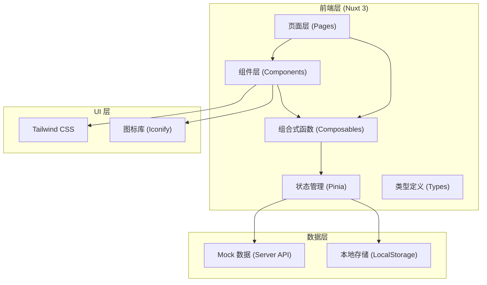
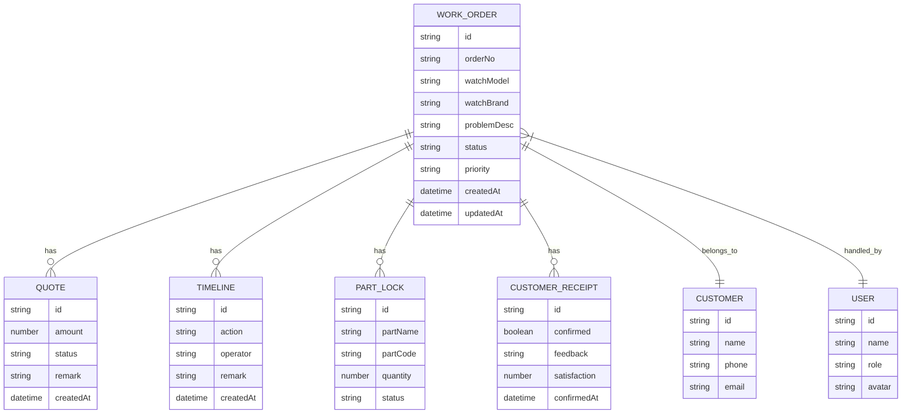

## 1. 架构设计



## 2. 技术描述

- **前端框架**：Nuxt 3 (Vue 3 + TypeScript)
- **状态管理**：Pinia
- **样式方案**：Tailwind CSS 3
- **图标方案**：Iconify (Vue component)
- **初始化工具**：npx nuxi init
- **数据方案**：Nuxt Server API + Mock 数据
- **构建工具**：Vite (Nuxt 3 内置)

## 3. 目录结构

```
watch-service-system/
├── .trae/documents/          # 文档目录
├── assets/                   # 静态资源
│   ├── css/
│   │   └── main.css          # 全局样式
│   └── icons/
├── components/               # 组件
│   ├── common/               # 通用组件
│   │   ├── EmptyState.vue
│   │   ├── ErrorState.vue
│   │   ├── LoadingState.vue
│   │   ├── StatusBadge.vue
│   │   └── RoleSwitcher.vue
│   ├── dashboard/            # 仪表盘组件
│   │   ├── StatCard.vue
│   │   └── TaskList.vue
│   ├── workorder/            # 工单组件
│   │   ├── WorkOrderList.vue
│   │   ├── WorkOrderDetail.vue
│   │   ├── WorkOrderFilter.vue
│   │   └── Timeline.vue
│   └── layout/               # 布局组件
│       ├── AppHeader.vue
│       └── AppSidebar.vue
├── composables/              # 组合式函数
│   ├── useRole.ts
│   ├── useWorkOrder.ts
│   └── useFilter.ts
├── pages/                    # 页面
│   ├── index.vue             # 首页仪表盘
│   └── workorders/
│       ├── index.vue         # 工单列表页（双栏）
│       └── [id].vue          # 工单详情
├── server/                   # 服务端 API
│   └── api/
│       ├── workorders.get.ts
│       ├── workorders/[id].get.ts
│       ├── workorders/[id].patch.ts
│       └── stats.get.ts
├── stores/                   # Pinia stores
│   ├── workorder.ts
│   └── user.ts
├── types/                    # 类型定义
│   ├── workorder.ts
│   └── user.ts
├── utils/                    # 工具函数
│   ├── format.ts
│   └── constants.ts
├── nuxt.config.ts
├── tailwind.config.js
├── tsconfig.json
└── README.md
```

## 4. 路由定义

| 路由 | 页面 | 用途 |
|------|------|------|
| `/` | pages/index.vue | 首页仪表盘 - 待处理/已驳回/需回查统计 |
| `/workorders` | pages/workorders/index.vue | 工单列表 - 双栏详情台 |
| `/workorders/:id` | pages/workorders/[id].vue | 工单详情（备用路由） |

## 5. 数据模型

### 5.1 实体关系图



### 5.2 工单状态枚举

| 状态值 | 显示名称 | 颜色 |
|--------|----------|------|
| `pending_review` | 待检测 | amber |
| `quoting` | 报价中 | blue |
| `pending_approval` | 待审批 | orange |
| `rejected` | 已驳回 | red |
| `pending_confirm` | 待客户确认 | purple |
| `customer_rejected` | 客户驳回 | red |
| `repairing` | 维修中 | cyan |
| `completed` | 已完成 | green |
| `picked_up` | 已取件 | gray |

### 5.3 TypeScript 类型定义

```typescript
// types/workorder.ts
export type UserRole = 'manager' | 'consultant' | 'technician';

export interface User {
  id: string;
  name: string;
  role: UserRole;
  avatar: string;
}

export type WorkOrderStatus = 
  | 'pending_review'
  | 'quoting'
  | 'pending_approval'
  | 'rejected'
  | 'pending_confirm'
  | 'customer_rejected'
  | 'repairing'
  | 'completed'
  | 'picked_up';

export type Priority = 'low' | 'medium' | 'high' | 'urgent';

export interface Customer {
  id: string;
  name: string;
  phone: string;
  email?: string;
}

export interface Quote {
  id: string;
  workOrderId: string;
  amount: number;
  partsCost: number;
  laborCost: number;
  status: 'draft' | 'submitted' | 'approved' | 'rejected';
  remark?: string;
  createdAt: string;
  approvedAt?: string;
}

export interface PartLock {
  id: string;
  partName: string;
  partCode: string;
  quantity: number;
  status: 'locked' | 'released' | 'used';
  lockedBy: string;
  lockedAt: string;
}

export interface TimelineEntry {
  id: string;
  action: string;
  operator: string;
  operatorRole: UserRole;
  remark?: string;
  createdAt: string;
}

export interface WorkOrder {
  id: string;
  orderNo: string;
  customer: Customer;
  watchBrand: string;
  watchModel: string;
  watchSerial?: string;
  problemDesc: string;
  status: WorkOrderStatus;
  priority: Priority;
  receivedAt: string;
  expectedDate?: string;
  quote?: Quote;
  parts: PartLock[];
  timeline: TimelineEntry[];
  assignedTo?: string;
  createdBy: string;
  createdAt: string;
  updatedAt: string;
}

export interface DashboardStats {
  pending: number;
  rejected: number;
  needReview: number;
  todayNew: number;
  completedThisWeek: number;
  avgProcessTime: number;
}
```

## 6. 核心技术决策

1. **Nuxt 3 服务端 API**：使用 `server/api` 目录模拟后端接口，便于后续对接真实后端
2. **Pinia 状态管理**：集中管理工单数据和用户状态，支持多组件共享
3. **组合式函数封装**：`useRole`、`useWorkOrder` 等 composables 封装业务逻辑
4. **角色权限控制**：基于当前角色动态显示操作按钮和数据范围
5. **双栏布局实现**：使用 CSS Grid 实现左侧列表 + 右侧详情的联动布局
6. **Mock 数据策略**：预置 15+ 条工单数据，覆盖各种状态和场景
7. **本地存储**：用户偏好设置（角色、筛选条件）持久化到 LocalStorage
